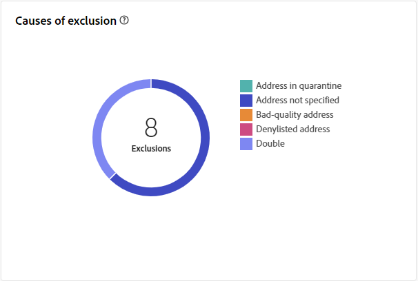

# Relatório de entrega de correspondência direta {#direct-mail-report}

A variável **Relatório de entrega por correspondência direta** O oferece insights abrangentes e dados específicos para a entrega de correspondência direta. Ele fornece informações detalhadas sobre o desempenho, a eficácia e os resultados de suas entregas individuais, fornecendo uma visão geral abrangente.

## Resumo da entrega {#delivery-summary-direct-mail}

### Visão geral da entrega {#delivery-overview-direct-mail}

>[!CONTEXTUALHELP]
>id="acw_delivery_reporting_delivery_overview_direct_mail"
>title="Visão geral da entrega"
>abstract="A **Visão geral da entrega** apresenta métricas principais de desempenho (KPIs) com informações detalhadas sobre as interações de visitantes com cada entrega de correspondência direta. As métricas estão descritas abaixo."

A variável **[!UICONTROL Visão geral da entrega]** O fornece insights detalhados sobre como seus visitantes interagem com cada delivery de correspondência direta, apresentando métricas essenciais de desempenho (KPIs).  As métricas estão descritas abaixo.

{zoomable=&quot;yes&quot;}{align="center"}

+++Saiba mais sobre Métricas de visão geral de delivery.

* **[!UICONTROL Mensagens a entregar]**: Número total de mensagens processadas durante a preparação do delivery.

* **[!UICONTROL Direcionado]**: Número de perfis de usuário qualificados como perfis de público alvo para suas mensagens de correspondência direta.

* **[!UICONTROL Para excluir]**: Número de perfis de usuário, excluídos dos perfis direcionados, que não receberão suas mensagens de correspondência direta.
+++

### População inicial de público-alvo {#direct-mail-delivery-targeted-population}

>[!CONTEXTUALHELP]
>id="acw_delivery_reporting_initial_target_direct_mail"
>title="População inicial de público-alvo"
>abstract="O gráfico **População inicial de público-alvo** exibe dados relativos a destinatários e mensagens, com base nos resultados da preparação da entrega."

A variável **[!UICONTROL População de público alvo inicial]** O gráfico exibe dados relativos aos recipients. As métricas são calculadas durante a preparação do delivery e mostram: o público inicial, o número de mensagens a serem enviadas e o número de recipients excluídos.

{zoomable=&quot;yes&quot;}

Passe o mouse sobre uma parte do gráfico para exibir o número exato.

{zoomable=&quot;yes&quot;}

+++Saiba mais sobre Métricas de relatório de delivery de correspondência direta.

* **[!UICONTROL Público inicial]**: Número total de recipients alvos.

* **[!UICONTROL Para entregar]**: Número total de mensagens a serem entregues após a preparação do delivery.

* **[!UICONTROL Exclusão]**: número total de recipients excluídos da população do target.
+++

### Estatísticas de entrega {#direct-mail-delivery-stats}

>[!CONTEXTUALHELP]
>id="acw_delivery_reporting_delivery_statistics_summary_direct_mail"
>title="Estatísticas de entrega"
>abstract="O gráfico **Estatísticas de entrega** detalha o sucesso da entrega de correspondência direta e os erros que ocorreram."

A variável **[!UICONTROL Estatísticas de entrega]** O gráfico fornece uma visão geral abrangente do desempenho do delivery, oferecendo métricas detalhadas para medir o sucesso e a eficácia.

{zoomable=&quot;yes&quot;}

+++Saiba mais sobre métricas de relatório da campanha de correspondência direta.

* **[!UICONTROL Mensagem enviada]**: Número total de mensagens a serem entregues após a preparação do delivery.

* **[!UICONTROL Sucesso]**: Número de mensagens processadas com êxito em relação ao número de mensagens a serem entregues.

* **[!UICONTROL Erros]**: Número total de erros acumulados durante os deliveries e o processamento automático de reassociação em relação ao número de mensagens a serem entregues.

* **[!UICONTROL Novos em quarentena]**: Número total de endereços colocados em quarentena após um delivery com falha (usuário desconhecido, domínio inválido) em relação ao número de mensagens a serem entregues.

+++

### Causas de exclusão {#direct-mail-delivery-exclusions}

>[!CONTEXTUALHELP]
>id="acw_delivery_reporting_causes_exclusion_direct_mail"
>title="Causas de exclusão de entrega"
>abstract="O gráfico **Causas de exclusão** ilustra a distribuição de mensagens rejeitadas durante a preparação para a entrega, categorizada por cada regra."

A variável **[!UICONTROL Causas de exclusão]** O gráfico fornece um detalhamento dos motivos por trás das mensagens que são rejeitadas durante o processo de preparação do delivery. Esse detalhamento é organizado de acordo com várias regras, oferecendo uma visão abrangente dos fatores que contribuem para a exclusão de mensagens. As regras de exclusão são detalhadas na seção [Documentação do Campaign v8 (console)](https://experienceleague.adobe.com/docs/campaign/campaign-v8/send/failures/delivery-failures.html#email-error-types){_blank}.

{zoomable=&quot;yes&quot;}{align="center" zoomable="yes"}

+++Saiba mais sobre Causas de métricas de exclusão.

* **[!UICONTROL Endereço em quarentena]**: Tipo de erro gerado quando o endereço é colocado em quarentena.

* **[!UICONTROL Endereço não especificado]**: Tipo de erro gerado ao enviar um delivery para indicar que o endereço não existe.

* **[!UICONTROL Endereço de má qualidade]**: Tipo de erro gerado quando a classificação de qualidade do endereço postal é muito baixa.

* **[!UICONTROL Incluir na lista de bloqueios endereço ➡ alterado]** incluir na lista de bloqueios : Tipo de erro gerado quando o recipient foi atualizado quando o delivery foi executado.

* **[!UICONTROL Duplo]**: Tipo de erro gerado quando o destinatário foi excluído porque seus valores de chaves não eram exclusivos.

* **[!UICONTROL Grupo de controle]**: o endereço do recipient faz parte do grupo de controle.

* **[!UICONTROL Tamanho do público alvo limitado]**: o tamanho máximo de delivery foi atingido para o recipient.

+++

### Exclusões {#direct-mail-exclusions}

>[!CONTEXTUALHELP]
>id="acw_delivery_reporting_exclusions_direct_mail"
>title="Exclusões"
>abstract="A tabela **[!UICONTROL Exclusões]** exibe um detalhamento por regra das mensagens que foram rejeitadas durante o processo de preparação da entrega."

A variável **[!UICONTROL Exclusões]** A tabela fornece um detalhamento detalhado, categorizado por regras específicas, das mensagens que foram rejeitadas durante a fase de preparação do delivery. Essa análise abrangente permite compreender claramente os motivos por trás da exclusão dessas mensagens do processo de delivery.

{zoomable=&quot;yes&quot;}{align="center" zoomable="yes"}

As métricas disponíveis são as mesmas que para o [Causas de exclusão](#direct-mail-delivery-exclusions) acima descritas.
