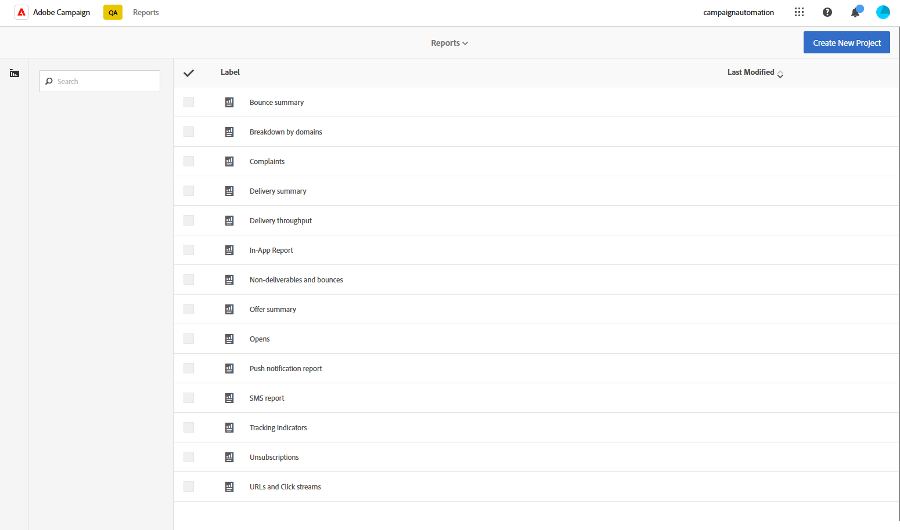

# Introdução a relatórios dinâmicos {#about-dynamic-reports}

O Dynamic Reporting fornece relatórios totalmente personalizáveis e em tempo real. Eles adicionam acesso aos dados do perfil, permitindo análises demográficas por dimensões do perfil, como gênero, cidade e idade, além de dados funcionais de campanha de email, como aberturas e cliques. Com a interface de arrastar e soltar, você pode explorar dados, determinar o desempenho de suas campanhas de email em relação aos segmentos de clientes mais importantes e medir seu impacto nos recipients.

## Acesso aos relatórios dinâmicos {#accessing-dynamic-reports}

Os relatórios podem ser acessados em cada campanha e delivery clicando em **Relatórios**. Uma janela pop-up será exibida, informando que você será redirecionado para a página **Relatório dinâmico** em uma nova guia do navegador.

Alguns relatórios não podem estar disponíveis imediatamente após um delivery, dependendo do tempo necessário para coletar e processar informações.

Os relatórios dinâmicos são divididos em duas categorias:

* **Modelos**, que podem ser modificados copiando-os com a opção **Salvar como** (**Projeto > Salvar como..**) no modelo.
* **Relatórios personalizados** (identificados em azul), que podem ser criados diretamente clicando no botão **Criar novo projeto** na página inicial de **Relatórios**.

