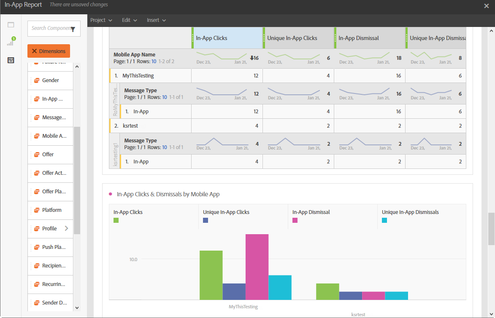

# Relatório no aplicativo{#in-app-report}

>[!CAUTION]
>
>Observe que você deve arrastar e soltar as métricas **[!UICONTROL Tipo de mensagem]** nas tabelas para dividir os dados, dependendo dos tipos de entrega, neste caso, Entregas no aplicativo.

O relatório **No aplicativo** fornece detalhes relacionados às entregas no aplicativo.

Cada tabela é representada por números de resumo e gráficos. É possível alterar como os detalhes são mostrados nas respectivas configurações de visualização.

A primeira tabela **Resumo do Envolvimento no Aplicativo** é dividida em três categorias: por dia, por aplicativo móvel e por entrega. Ele contém os dados disponíveis para a reatividade do recipient ao delivery:

* **[!UICONTROL Processado/enviado]**: número total de envios para a entrega no aplicativo.
* **[!UICONTROL Entregues]**: número de mensagens no aplicativo enviadas com êxito em relação ao número total de mensagens enviadas.
* **[!UICONTROL Impressões]**: total de mensagens no aplicativo vistas pelos destinatários, dependendo se o critério de acionador foi atendido.
* **[!UICONTROL Impressões exclusivas]**: número de impressões por destinatário.
* **[!UICONTROL Taxa de cliques no aplicativo]**: Porcentagem de usuários que clicaram no Botão 1 ou no Botão 2 em comparação aos usuários que viram a mensagem.
* **[!UICONTROL Taxa de descarte no aplicativo]**: porcentagem de mensagens no aplicativo que os destinatários rejeitaram.

A segunda tabela **Cliques no Aplicativo e Descartes** é dividida em três categorias: por dia, por aplicativo móvel e por entrega. Ele contém os dados disponíveis para o comportamento do recipient por delivery:

* **[!UICONTROL Cliques no aplicativo]**: número total de destinatários que clicaram no Botão 1 ou no Botão 2.
* **[!UICONTROL Cliques únicos no aplicativo]**: número de vezes que os destinatários clicaram no Botão 1 ou no Botão 2.
* **[!UICONTROL Rejeição no aplicativo]**: número total de mensagens que os destinatários rejeitaram ao clicar no botão Fechar ou ao fechar automaticamente.
* **[!UICONTROL Descarte exclusivo no aplicativo]**: Número de vezes que os destinatários rejeitaram uma mensagem no aplicativo.
