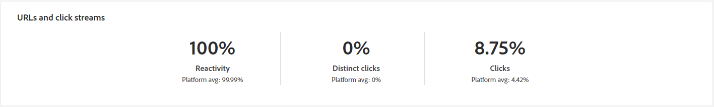
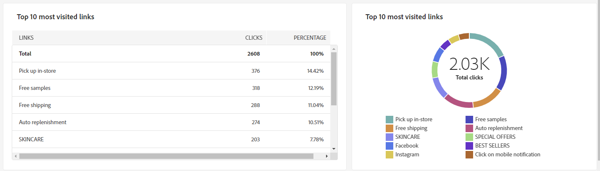
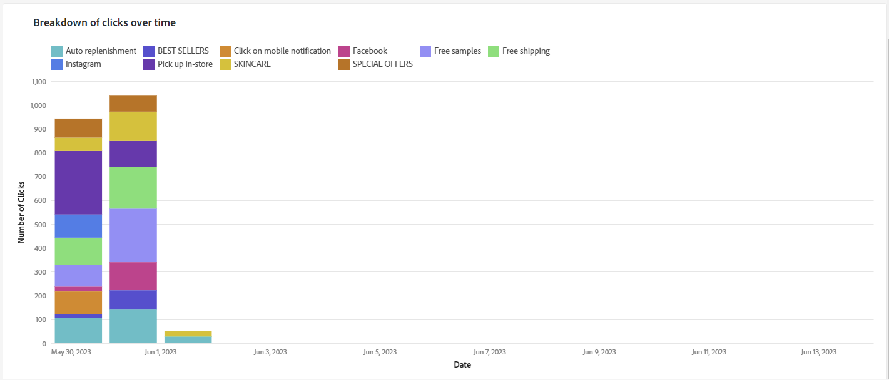
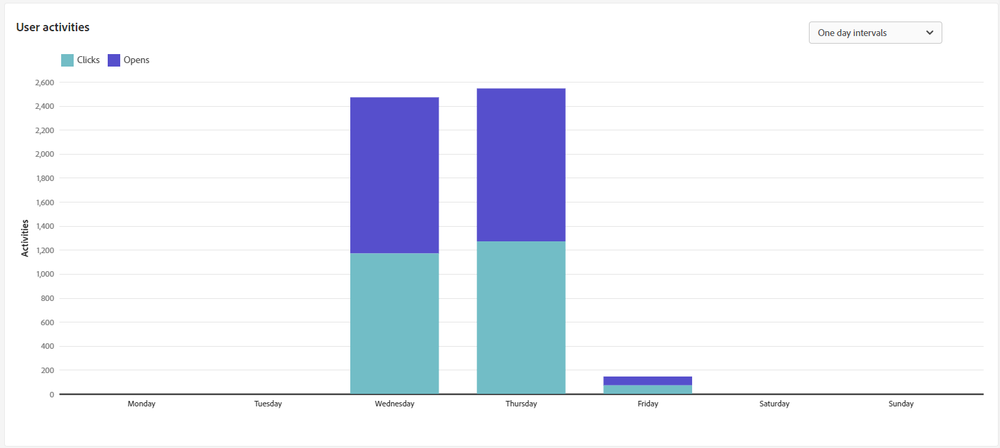

# Relatório de entrega de email {#email-report}

A variável **Relatório de entrega de email** O oferece insights e dados abrangentes específicos para o canal de email. Ele fornece informações detalhadas sobre o desempenho, a eficácia e os resultados de seus deliveries individuais, fornecendo uma visão geral abrangente.

## Resumo da entrega {#delivery-summary-email}

* **[!UICONTROL Estatísticas iniciais do público-alvo]** A tabela exibe dados relativos aos seus destinatários:

  {align="left" zoomable="yes"}

  +++Saiba mais sobre Métricas de relatório de delivery de email.

   * **[!UICONTROL Público inicial]**: Número total de recipients alvos.

   * **[!UICONTROL Para entregar]**: Número total de mensagens a serem entregues após a análise de delivery.

   * **[!UICONTROL Exclusão]**: Número total de mensagens excluídas do público-alvo enviado.
+++

* **[!UICONTROL Estatísticas de entrega]** A tabela detalha o sucesso do delivery.

  {align="left"}

  +++Saiba mais sobre Métricas de relatório da campanha de email.

   * **[!UICONTROL Mensagem enviada]**: Número total de mensagens a serem entregues após a análise de delivery.

   * **[!UICONTROL Sucesso]**: Número de mensagens processadas com êxito em relação ao número de mensagens a serem entregues.

   * **[!UICONTROL Erros]**: Número total de erros acumulados durante os deliveries e o processamento automático de reassociação em relação ao número de mensagens a serem entregues.

   * **[!UICONTROL Novos em quarentena]**: Número total de endereços colocados em quarentena após um delivery com falha (usuário desconhecido, domínio inválido) em relação ao número de mensagens a serem entregues.

+++

* **[!UICONTROL Causas de exclusão]** o gráfico e a tabela mostram o detalhamento por regra de mensagens rejeitadas durante a análise.

  {align="center"}

  +++Saiba mais sobre Métricas de relatório de delivery de email.

   * **[!UICONTROL User unknown]** : Tipo de erro gerado durante o delivery para indicar que o endereço de email é inválido.

   * **[!UICONTROL invalid domain]** : Tipo de erro gerado ao enviar um delivery para indicar que o domínio do endereço de email está errado ou não existe.

   * **[!UICONTROL Caixa de entrada cheia]**: Tipo de erro gerado após cinco tentativas de delivery para indicar que a caixa de entrada dos recipients contém muitas mensagens.

   * **[!UICONTROL Account disabled]** : Tipo de erro gerado ao enviar um delivery para indicar que o endereço não existe mais.

   * **[!UICONTROL Recusado]**: Tipo de erro gerado quando um endereço é rejeitado pelo IAP (Provedor de Acesso à Internet), por exemplo, ao seguir uma regra de segurança da aplicação (software antispam).

   * **[!UICONTROL Unreachable]** : Tipo de erro que ocorre na string de distribuição de mensagens: incidente na retransmissão SMTP, domínio temporariamente inacessível, etc

   * **[!UICONTROL Não conectado]**: Tipo de erro para indicar que o celular do recipient está desligado ou sem rede no momento do envio.

+++

## Taxa de transferência de delivery {#delivery-throughtput}

Este relatório apresenta informações detalhadas sobre a taxa de transferência de delivery de toda a plataforma em um período especificado. A métrica primária usada para medir a velocidade de entrega de mensagens é o número de mensagens enviadas por hora.

## Estatísticas de transmissão {#broadcast-statistics}

* **[!UICONTROL Estatísticas de transmissão]** A tabela contém os dados disponíveis para possíveis erros encontrados com cada domínio.

  {align="center"}

  +++Saiba mais sobre Métricas de relatório de delivery de email.

   * **[!UICONTROL Emails processados]**: número total de mensagens processadas pelo servidor de delivery.

   * **[!UICONTROL Entregue]**: Porcentagem do número de mensagens processadas com êxito em comparação ao número total de mensagens processadas.

   * **[!UICONTROL Devoluções permanentes]**: porcentagem do número de devoluções permanentes, erros permanentes, como um endereço de email errado, em comparação ao número total de mensagens processadas.

   * **[!UICONTROL Rejeições temporárias]**: Porcentagem do número de devoluções temporárias, como uma caixa de entrada cheia, em comparação ao número total de mensagens processadas

   * **[!UICONTROL Aberturas]**: Porcentagem do número de recipients alvos que abriram uma mensagem pelo menos uma vez em comparação ao número de mensagens processadas com êxito.

   * **[!UICONTROL Cliques]**: Porcentagem do número de pessoas que clicaram em um delivery pelo menos uma vez em comparação ao número de mensagens processadas com êxito.

   * **[!UICONTROL Cancelamentos de assinatura]**: Porcentagem do número de cliques em um link de cancelamento de subscrição em comparação ao número de mensagens processadas com êxito.
+++

## Não entregues e devolvidos {#non-deliverables-email}

* **[!UICONTROL Detalhamento de erros por tipo]** e **[!UICONTROL Detalhamento de erros por domínio]** tabelas e gráficos contêm os dados disponíveis para possíveis erros encontrados com cada domínio.

  Os erros exibidos nesse relatório acionam o processo de quarentena. Para obter mais informações sobre a gestão de quarentena, consulte [Gestão de Quarentena](https://experienceleague.adobe.com/docs/campaign/campaign-v8/campaigns/send/failures/delivery-failures.html?lang=pt-BR)

  

  +++Saiba mais sobre Métricas de relatório de delivery de email.

   * **[!UICONTROL User unknown]** : Tipo de erro gerado durante o delivery para indicar que o endereço de email é inválido.

   * **[!UICONTROL invalid domain]** : Tipo de erro gerado ao enviar um delivery para indicar que o domínio do endereço de email está errado ou não existe.

   * **[!UICONTROL Caixa de entrada cheia]**: Tipo de erro gerado após cinco tentativas de delivery para indicar que a caixa de entrada dos recipients contém muitas mensagens.

   * **[!UICONTROL Account disabled]** : Tipo de erro gerado ao enviar um delivery para indicar que o endereço não existe mais.

   * **[!UICONTROL Recusado]**: Tipo de erro gerado quando um endereço é rejeitado pelo IAP (Provedor de Acesso à Internet), por exemplo, ao seguir uma regra de segurança da aplicação (software antispam).

   * **[!UICONTROL Unreachable]** : Tipo de erro que ocorre na string de distribuição de mensagens: incidente na retransmissão SMTP, domínio temporariamente inacessível, etc

   * **[!UICONTROL Não conectado]**: Tipo de erro para indicar que o celular do recipient está desligado ou sem rede no momento do envio.

+++

## Indicadores de rastreamento {#tracking-indicators-email}

* **[!UICONTROL Estatísticas de entrega]** O fornece indicadores principais de desempenho (KPIs) que fornecem informações detalhadas sobre os dados disponíveis para emails enviados.

  {align="center"}

  +++Saiba mais sobre Métricas de relatório de delivery de email.

   * **[!UICONTROL Sucesso]**: Número de mensagens processadas com êxito em relação ao número de mensagens a serem entregues.

   * **[!UICONTROL Aberturas distintas]**: número total de recipients alvos que abriram uma mensagem pelo menos uma vez.

   * **[!UICONTROL Opens]**: Número de recipients alvos distintos para este domínio que abriram uma mensagem pelo menos uma vez.

   * **[!UICONTROL Cliques no link para opção de não participação]**: Número de cliques no link unsubscription.

   * **[!UICONTROL Clicks on the mirror link]**: Número de cliques no link para a mirror page.

   * **[!UICONTROL Estimation of forwards]**: Estimativa do número de emails encaminhados pelos recipients alvos.
+++

* **[!UICONTROL Índice de click-through e aberturas]** A tabela exibe dados relativos aos recipients.

  {align="center"}

  +++Saiba mais sobre Métricas de relatório de delivery de email.

   * **[!UICONTROL Enviado]**: Número total de mensagens enviadas.

   * **[!UICONTROL Complaints]**: Número de mensagens deste domínio relatadas como indesejáveis pelo recipient.

   * **[!UICONTROL Opens]**: Número de recipients alvos distintos para este domínio que abriram uma mensagem pelo menos uma vez.

   * **[!UICONTROL Clicks]**: Número de recipients alvos distintos que clicaram no mesmo delivery pelo menos uma vez.

   * **[!UICONTROL Raw reactivity]**: Porcentagem do número de recipients que clicaram em um delivery pelo menos uma vez em comparação ao número de recipients que abriram um delivery pelo menos uma vez.
+++

## Fluxos de clique e URLs {#url-email}

* **[!UICONTROL Fluxos de clique e URLs]** O fornece indicadores chave de desempenho (KPIs) que fornecem informações detalhadas sobre os URLs que foram mais clicados durante um delivery.

  {align="center"}

  +++Saiba mais sobre Métricas de relatório de delivery de email.

   * **[!UICONTROL Reactivity]**: Taxa do número de recipients alvos que clicaram em um delivery em relação ao número estimado de recipients alvos que abriram um delivery.

   * **[!UICONTROL Cliques distintos]**: Número total de recipients distintos que clicaram em um delivery pelo menos uma vez.

   * **[!UICONTROL Clicks]** : Número total de cliques nos links nos deliveries.

   * **[!UICONTROL Platform average]**: Essa taxa média, exibida em cada taxa (reatividade, cliques distintos e cliques acumulados), é calculada para deliveries enviados nos seis meses anteriores. Somente os deliveries com a mesma tipologia e no mesmo canal são considerados. Provas são excluídas.

+++

* **[!UICONTROL Os 10 links mais visitados]** o gráfico e a tabela contêm os dados disponíveis para o comportamento do recipient por link.

  {align="center"}

  +++Saiba mais sobre Métricas de relatório de delivery de email.

   * **[!UICONTROL Clicks]** : Número total de cliques nos links nos deliveries.

   * **[!UICONTROL Porcentagem]**: Porcentagem de usuários que interagiram com o delivery.

+++

* **[!UICONTROL Detalhamento dos cliques ao longo do tempo]** o gráfico contém os dados disponíveis para o comportamento do recipient por link.

  {align="center"}

## Atividades do usuário {#user-activities-email}

* **[!UICONTROL Atividades do usuário]** mostra o detalhamento de aberturas e cliques no formulário de um gráfico. Você pode escolher o período para direcionar dados: último dia ou hora ou 30 minutos.

  {align="center"}

  +++Saiba mais sobre Métricas de relatório de delivery de email.

   * **[!UICONTROL Clicks]** : Número total de cliques nos links nos deliveries.

   * **[!UICONTROL Opens]**: Número de recipients alvos distintos para este domínio que abriram uma mensagem pelo menos uma vez.

+++

## Estatísticas de rastreamento {#tracking-statistics}

* **[!UICONTROL Estatísticas de rastreamento]** O gráfico fornece estatísticas sobre aberturas e cliques. Você tem a opção de selecionar o intervalo de tempo específico para direcionar dados.

  {align="center"}

  +++Saiba mais sobre Métricas de relatório de delivery de email.

   * **[!UICONTROL Clicks]** : Número total de cliques nos links nos deliveries.

   * **[!UICONTROL Opens]**: Número de recipients alvos distintos para este domínio que abriram uma mensagem pelo menos uma vez.

+++

## Detalhamento de aberturas {#breakdown-opens}

Este relatório mostra o detalhamento de aberturas por sistema operacional, dispositivo e navegador para o período relacionado. Para cada categoria, dois gráficos são usados. O primeiro exibe estatísticas referentes a aberturas em um computador e dispositivos móveis. O segundo exibe estatísticas relacionadas apenas a aberturas em dispositivos móveis.
Você tem flexibilidade para mudar de **[!UICONTROL Fixo e dispositivos móveis]** para direcionar exclusivamente **[!UICONTROL Somente dispositivos móveis]** para direcionamento mais preciso.

{align="center"}

## Hotclicks {#hotclicks}

Este relatório mostra o conteúdo da mensagem (HTML e/ou texto) com a porcentagem de cliques nos links, em cada link. Links de unsubscription de blocos de personalização, links de mirror pages e links de ofertas são considerados no total de cliques acumulados, mas não são exibidos no relatório.

