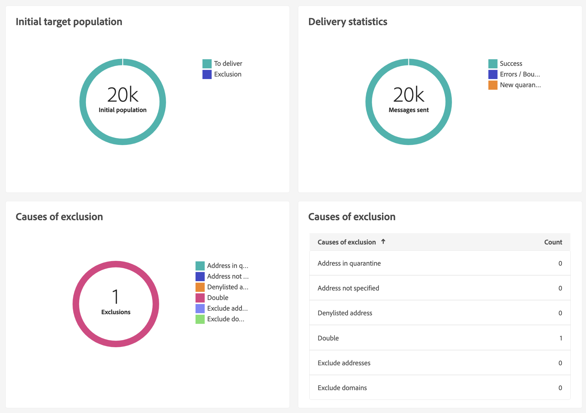
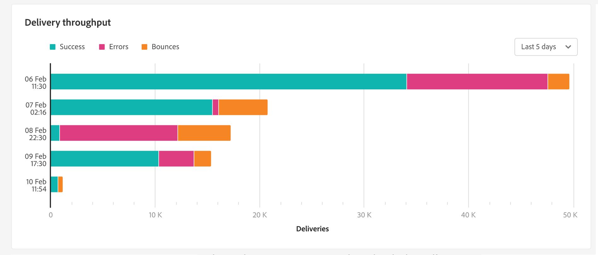

# Relatório de entrega de email {#email-report}

## Envio

* **Resumo da entrega**: esse relatório fornece todas as informações principais sobre a entrega. População do público-alvo, causas de exclusão, estatísticas da entrega.

  +++Defina as seguintes configurações com base nos seus requisitos.
Teste
+++

  

* **Taxa de transferência da entrega**: este relatório contém informações sobre a taxa de transferência da entrega de um dado período. Para medir a velocidade em que as mensagens são entregues, os critérios são o número de mensagens enviadas por hora e o tamanho das mensagens (em bits por segundo). No exemplo abaixo, o primeiro gráfico mostra as entregas bem-sucedidas em azul e o número de deliveires incorretos em laranja.

  

* **Estatísticas de transmissão**; este relatório mostra o detalhamento por domínio de Internet, de todas as mensagens processadas e enviadas, de devoluções permanentes e temporárias, aberturas, cliques e cancelamentos de inscrição.

  

* **Não entregues e recusados**: este relatório mostra o detalhamento de não entregues e de devoluções por domínio de Internet.

  

## Rastreamento

* **Indicadores de rastreamento**: este relatório combina os indicadores principais para rastrear o comportamento dos destinatários ao receber a entrega. Ele oferece acesso a estatísticas de entrega e recebimento, taxas de abertura e cliques, fluxos de cliques gerados, rastreamento Web e atividades de compartilhamento em redes sociais.

  

* **URLs e fluxos de cliques**: este relatório mostra a lista de páginas visitadas após uma entrega.

  

* **Atividades do usuário**: este relatório mostra o detalhamento de aberturas e cliques por dia, por hora ou meia hora, no formato de um gráfico.

  

* **Estatísticas de rastreamento**: este relatório fornece estatísticas sobre aberturas e cliques.

  

* **Detalhamento de aberturas**: este relatório mostra o detalhamento de aberturas por sistema operacional, dispositivo e navegador pelo período relacionado. Para cada categoria, dois gráficos são usados. O primeiro exibe estatísticas referentes a aberturas em um computador e dispositivos móveis. O segundo exibe estatísticas relacionadas apenas a aberturas em dispositivos móveis.

  

## Hotclicks

Este relatório mostra o conteúdo da mensagem (HTML e/ou texto) com a porcentagem de cliques nos links, em cada link. Links de unsubscription de blocos de personalização, links de mirror pages e links de ofertas são considerados no total de cliques acumulados, mas não são exibidos no relatório.

