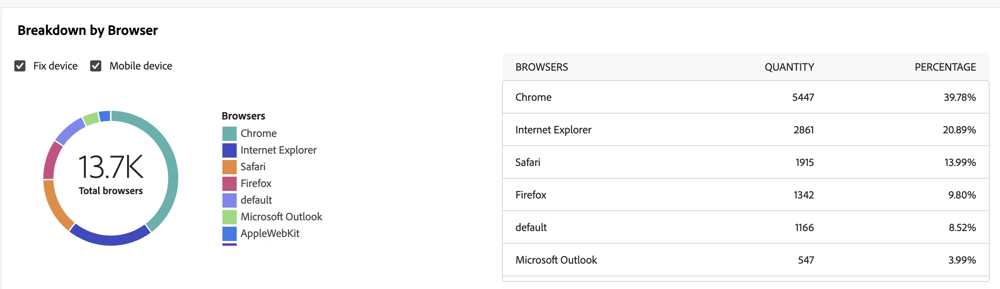

# Relatório de entrega de emails {#email-report}

O **Relatório de entrega de email** oferece insights abrangentes e dados específicos do canal de email. Ele fornece informações detalhadas sobre o desempenho, a eficácia e os resultados de suas entregas individuais, fornecendo uma visão geral abrangente.

## Resumo da entrega {#delivery-summary-email}

>[!CONTEXTUALHELP]
>id="acw_delivery_reporting_sending_email"
>title="Envio de relatórios"
>abstract="A guia **Envio** no relatório fornece insights aprofundados sobre as interações dos visitantes com as suas entregas e os possíveis erros que possam ter encontrado."

### População inicial de público-alvo {#email-delivery-targeted-population}

>[!CONTEXTUALHELP]
>id="acw_delivery_reporting_initial_target"
>title="População inicial de público-alvo"
>abstract="O gráfico **População inicial de público-alvo** exibe dados relativos a destinatários e mensagens, com base nos resultados da preparação da entrega."

O gráfico **[!UICONTROL População inicial do público-alvo]** exibe os dados relativos aos seus destinatários. As métricas são calculadas durante a preparação do delivery e mostram: o público inicial, o número de mensagens a serem enviadas e o número de recipients excluídos.

{zoomable="yes"}

Passe o mouse sobre uma parte do gráfico para exibir o número exato.

{zoomable="yes"}

+++Saiba mais sobre Métricas de relatório de delivery de email.

* **[!UICONTROL Público-alvo inicial]**: número total de destinatários direcionados.

* **[!UICONTROL Para entregar]**: Número total de mensagens a serem entregues após a preparação da entrega.

* **[!UICONTROL Exclusão]**: número total de destinatários excluídos da população do público-alvo.
+++

### Estatísticas de entrega {#email-delivery-stats}

>[!CONTEXTUALHELP]
>id="acw_delivery_reporting_delivery_statistics_summary"
>title="Estatísticas de entrega"
>abstract="O gráfico **Estatísticas de entrega** detalha o sucesso da entrega e os erros que ocorreram."

O gráfico **[!UICONTROL Estatísticas de entrega]** detalha o sucesso da sua entrega. As métricas estão detalhadas abaixo.

{zoomable="yes"}

+++Saiba mais sobre Métricas de relatório de campanha de email.

* **[!UICONTROL Mensagem enviada]**: Número total de mensagens a serem entregues após a preparação da entrega.

* **[!UICONTROL Success]**: Número de mensagens processadas com êxito em relação ao número de mensagens a serem entregues.

* **[!UICONTROL Erros]**: Número total de erros acumulados durante as entregas e o processamento automático de reassociação em relação ao número de mensagens a serem entregues.

* **[!UICONTROL Novas quarentenas]**: Número total de endereços colocados em quarentena após uma entrega com falha (usuário desconhecido, domínio inválido) em relação ao número de mensagens a serem entregues.

+++

### Causas da exclusão  {#email-delivery-exclusions}

>[!CONTEXTUALHELP]
>id="acw_delivery_reporting_exclusion"
>title="Causas de exclusão de entrega"
>abstract="O gráfico e a tabela **Causas de exclusão** mostram o detalhamento por regra das mensagens rejeitadas durante a preparação da entrega."

O gráfico e a tabela **[!UICONTROL Causas da exclusão]** mostram o detalhamento por regra de mensagens rejeitadas durante a preparação da entrega. As regras de exclusão são detalhadas na [documentação do Campaign v8 (console)](https://experienceleague.adobe.com/docs/campaign/campaign-v8/send/failures/delivery-failures.html#email-error-types){_blank}.

{zoomable="yes"}{align="center" zoomable="yes"}

+++Saiba mais sobre Métricas de relatório de delivery de email.

* **[!UICONTROL Usuário desconhecido]**: Tipo de erro gerado durante a entrega para indicar que o endereço de email é inválido.

* **[!UICONTROL Domínio inválido]**: Tipo de erro gerado ao enviar uma entrega para indicar que o domínio do endereço de email está errado ou não existe.

* **[!UICONTROL Caixa de correio cheia]**: Tipo de erro gerado após cinco tentativas de entrega para indicar que a caixa de entrada dos destinatários contém muitas mensagens.

* **[!UICONTROL Conta desabilitada]**: Tipo de erro gerado ao enviar uma entrega para indicar que o endereço não existe mais.

* **[!UICONTROL Recusado]**: Tipo de erro gerado quando um endereço é rejeitado pelo IAP (Provedor de Acesso à Internet), por exemplo, ao seguir uma regra de segurança da aplicação (software antispam).

* **[!UICONTROL Inacessível]**: Tipo de erro que ocorre na cadeia de caracteres de distribuição de mensagens: incidente na retransmissão SMTP, domínio temporariamente inacessível, etc

* **[!UICONTROL Não conectado]**: Tipo de erro para indicar que o celular do recipient está desligado ou sem rede no momento do envio.

+++

## Taxa de transferência de entrega {#delivery-throughtput}

>[!CONTEXTUALHELP]
>id="acw_delivery_reporting_throughput_email"
>title="Taxa de transferência de entrega"
>abstract="O relatório **Taxa de transferência de entrega** apresenta informações detalhadas sobre a taxa de transferência de entrega de toda a plataforma em um período especificado."

Este relatório apresenta informações detalhadas sobre a taxa de transferência de delivery de toda a plataforma em um período especificado. A principal métrica usada para medir a velocidade de entrega de mensagens é o número de mensagens enviadas por hora.

{zoomable="yes"}{align="center" zoomable="yes"}

## Estatísticas de transmissão {#broadcast-statistics}

>[!CONTEXTUALHELP]
>id="acw_delivery_reporting_broadcast_statistics"
>title="Estatísticas de transmissão"
>abstract="O relatório **Estatísticas de transmissão** contém os dados disponíveis de possíveis erros encontrados em cada domínio."

A tabela **[!UICONTROL Estatísticas de transmissão]** contém os dados disponíveis para possíveis erros encontrados com cada domínio. As métricas estão detalhadas abaixo.

{zoomable="yes"}{align="center" zoomable="yes"}

+++Saiba mais sobre Métricas de relatório de delivery de email.

* **[!UICONTROL Emails processados]**: número total de mensagens processadas pelo servidor de entrega.

* **[!UICONTROL Entregues]**: porcentagem do número de mensagens processadas com êxito em comparação ao número total de mensagens processadas.

* **[!UICONTROL Devoluções permanentes]**: porcentagem do número de devoluções permanentes, erros como endereços de email errados, em comparação ao número total de mensagens processadas.

* **[!UICONTROL Devoluções temporárias]**: porcentagem do número de devoluções temporárias, como uma caixa de entrada cheia, em comparação ao número total de mensagens processadas

* **[!UICONTROL Aberturas]**: porcentagem do número de destinatários direcionados que abriram uma mensagem pelo menos uma vez em comparação ao número de mensagens processadas com êxito.

* **[!UICONTROL Cliques]**: porcentagem do número de pessoas que clicaram em um delivery pelo menos uma vez em comparação ao número de mensagens processadas com êxito.

* **[!UICONTROL Cancelamentos de assinatura]**: Porcentagem do número de cliques em um link de cancelamento de assinatura em comparação ao número de mensagens processadas com êxito.
+++

## Não entregues {#non-deliverables-email}

### Detalhamento de erros por tipo {#email-delivery-breakdown-type}

>[!CONTEXTUALHELP]
>id="acw_delivery_reporting_error_type"
>title="Detalhamento de erros por tipo"
>abstract="O gráfico **Detalhamento de erros por tipo** contêm os dados disponíveis para cada tipo de erro encontrado: usuário desconhecido, caixa de entrada cheia, domínio inválido e outros."

>[!CONTEXTUALHELP]
>id="acw_delivery_reporting_error_type_table"
>title="Detalhamento de erros por tipo"
>abstract="A tabela **Detalhamento de erros por tipo** fornece um detalhamento abrangente da ocorrência de cada tipo de erro."

A tabela e o gráfico **[!UICONTROL Detalhamento de erros por tipo]** contêm os dados disponíveis para o tipo de erro. As métricas estão detalhadas abaixo.

Os erros exibidos nesse relatório acionam o processo de quarentena. Para obter mais informações sobre o gerenciamento de quarentena, consulte a [documentação do Campaign v8 (console do cliente)](https://experienceleague.adobe.com/docs/campaign/campaign-v8/campaigns/send/failures/delivery-failures.html){target="_blank"}.

{zoomable="yes"}{align="left" zoomable="yes"}

+++Saiba mais sobre Métricas de relatório de delivery de email.

* **[!UICONTROL Usuário desconhecido]**: Tipo de erro gerado durante a entrega para indicar que o endereço de email é inválido.

* **[!UICONTROL Domínio inválido]**: Tipo de erro gerado ao enviar uma entrega para indicar que o domínio do endereço de email está errado ou não existe.

* **[!UICONTROL Caixa de correio cheia]**: Tipo de erro gerado após cinco tentativas de entrega para indicar que a caixa de entrada dos destinatários contém muitas mensagens.

* **[!UICONTROL Conta desabilitada]**: Tipo de erro gerado ao enviar uma entrega para indicar que o endereço não existe mais.

* **[!UICONTROL Recusado]**: Tipo de erro gerado quando um endereço é rejeitado pelo IAP (Provedor de Acesso à Internet), por exemplo, ao seguir uma regra de segurança da aplicação (software antispam).

* **[!UICONTROL Inacessível]**: Tipo de erro que ocorre na cadeia de caracteres de distribuição de mensagens: incidente na retransmissão SMTP, domínio temporariamente inacessível, etc

* **[!UICONTROL Não conectado]**: Tipo de erro para indicar que o celular do recipient está desligado ou sem rede no momento do envio.

+++

### Detalhamento de erros por domínio {#email-delivery-breakdown-domain}

>[!CONTEXTUALHELP]
>id="acw_delivery_reporting_error_domain"
>title="Detalhamento de erros por domínio"
>abstract="O gráfico **Detalhamento de erros por domínio** exibe os dados disponíveis para cada tipo de erro encontrado dependendo de cada domínio."

>[!CONTEXTUALHELP]
>id="acw_delivery_reporting_error_domain_table"
>title="Detalhamento de erros por domínio"
>abstract="A tabela **Detalhamento de erros por domínio** fornece um detalhamento abrangente da ocorrência de cada erro dependendo do domínio usado."

A tabela e o gráfico **[!UICONTROL Breakdown of errors per domain]** exibem os dados disponíveis para possíveis erros encontrados em cada domínio.

{zoomable="yes"}{align="left" zoomable="yes"}

Clique no ícone ao lado do nome de cada domínio para ver os detalhes.

{zoomable="yes"}{align="left" zoomable="yes"}

As métricas disponíveis são as mesmas do [Detalhamento de erros por tipo](#email-delivery-breakdown-type) descrito acima.

## Indicadores de rastreamento {#tracking-indicators-email}

>[!CONTEXTUALHELP]
>id="acw_delivery_reporting_tracking_email"
>title="Rastreamento de relatórios"
>abstract="A guia **Rastreamento** no relatório oferece dados valiosos, incluindo o comportamento de destinatários por link, detalhamento de aberturas e cliques além de informações detalhadas sobre os URLs clicados com mais frequência durante uma entrega."

### Estatísticas de entrega  {#email-tracking-delivery-stats}

>[!CONTEXTUALHELP]
>id="acw_delivery_reporting_delivery_statistics_indicators"
>title=" Estatísticas de entrega"
>abstract="O relatório **Estatísticas de entrega** fornece indicadores principais de desempenho (KPIs) com informações detalhadas sobre os dados disponíveis de emails enviados: sucesso, aberturas, cliques e muito mais."

O relatório **[!UICONTROL Estatísticas de entrega]** fornece KPIs (indicadores-chave de desempenho) que fornecem informações detalhadas sobre os dados disponíveis para emails enviados. As métricas estão detalhadas abaixo.

{zoomable="yes"}{align="center"}

+++Saiba mais sobre Métricas de relatório de delivery de email.

* **[!UICONTROL Success]**: Número de mensagens processadas com êxito em relação ao número de mensagens a serem entregues.

* **[!UICONTROL Aberturas distintas]**: número total de recipients alvos que abriram uma mensagem pelo menos uma vez.

* **[!UICONTROL Aberturas]**: Número de destinatários de destino distintos para este domínio que abriram uma mensagem pelo menos uma vez.

* **[!UICONTROL Cliques no link para opção de não participação]**: Número de cliques no link para cancelamento de inscrição.

* **[!UICONTROL Clicks on the mirror link]**: Número de cliques no link para a mirror page.

* **[!UICONTROL Estimativa de encaminhamentos]**: Estimativa do número de emails encaminhados pelos destinatários direcionados.
+++

### Índice de abertura e click-through {#email-tracking-click-through}

>[!CONTEXTUALHELP]
>id="acw_delivery_reporting_open_clickthrough"
>title="Índice de abertura e click-through"
>abstract="A tabela **Índice de abertura e click through** exibe dados relativos ao engajamento dos recipients com a entrega."

A tabela **[!UICONTROL Taxa de abertura e de click-through]** exibe os dados relativos aos seus destinatários. As métricas estão detalhadas abaixo.

{zoomable="yes"}{align="center"}

+++Saiba mais sobre Métricas de relatório de delivery de email.

* **[!UICONTROL Enviado]**: Número total de mensagens enviadas.

* **[!UICONTROL Reclamações]**: Número de mensagens deste domínio relatadas como indesejáveis pelo destinatário.

* **[!UICONTROL Aberturas]**: Número de destinatários de destino distintos para este domínio que abriram uma mensagem pelo menos uma vez.

* **[!UICONTROL Cliques]**: número de recipients alvos distintos que clicaram no mesmo delivery pelo menos uma vez.

* **[!UICONTROL Reatividade bruta]**: porcentagem do número de recipients que clicaram em uma entrega pelo menos uma vez em comparação ao número de recipients que abriram uma entrega pelo menos uma vez.
+++

## Fluxos de clique e URLs {#url-email}

>[!CONTEXTUALHELP]
>id="acw_delivery_reporting_urls_clickstreams"
>title="Fluxos de clique e URLs"
>abstract="O relatório **Fluxos de clique e URLs** fornece indicadores principais de desempenho (KPIs) com informações detalhadas sobre os URLs mais clicados durante uma entrega."

O relatório **[!UICONTROL Fluxos de clique e URLs]** fornece indicadores principais de desempenho (KPIs) com informações detalhadas sobre os URLs mais clicados durante uma entrega.

{zoomable="yes"}{align="center"}

+++Saiba mais sobre Métricas de relatório de delivery de email.

* **[!UICONTROL Reatividade]**: taxa do número de recipients alvos que clicaram em uma entrega em relação ao número estimado de recipients alvos que abriram uma entrega.

* **[!UICONTROL Distinct clicks]**: Número total de recipients distintos que clicaram em um delivery pelo menos uma vez.

* **[!UICONTROL Cliques]**: número total de cliques nos links nas entregas.

* **[!UICONTROL Média da plataforma]**: essa taxa média, exibida em cada taxa (reatividade, cliques distintos e cliques acumulados), é calculada para deliveries enviados nos seis meses anteriores. Somente as entregas com a mesma tipologia e no mesmo canal são consideradas. Provas são excluídas.

+++

### Os 10 links mais visitados {#email-tracking-top10}

>[!CONTEXTUALHELP]
>id="acw_delivery_reporting_urls_clickstreams_top10"
>title="Os 10 links mais visitados"
>abstract="O gráfico e a tabela **Os 10 links mais visitados** contêm os dados disponíveis sobre o comportamento do destinatário em cada link."

O gráfico e a tabela **[!UICONTROL Os 10 links mais visitados]** contêm os dados disponíveis sobre o comportamento do destinatário em cada link.

{zoomable="yes"}{align="center"}

+++Saiba mais sobre Métricas de relatório de delivery de email.

* **[!UICONTROL Cliques]**: número total de cliques nos links nas entregas.

* **[!UICONTROL Porcentagem]**: porcentagem de usuários que interagiram com a entrega.

+++

### Detalhamento dos cliques ao longo do tempo {#email-tracking-breakdown-over-time}

>[!CONTEXTUALHELP]
>id="acw_delivery_reporting_urls_click_breakdown"
>title="Detalhamento dos cliques ao longo do tempo"
>abstract="O gráfico **Detalhamento dos cliques ao longo do tempo** mostra os dados disponíveis relativos ao comportamento do recipient em cada link."

O gráfico **[!UICONTROL Breakdown of clicks over time]** contém os dados disponíveis para o comportamento do recipient por link.

{zoomable="yes"}{align="center"}

## Atividades do usuário {#user-activities-email}

>[!CONTEXTUALHELP]
>id="acw_delivery_reporting_user_activities"
>title="Atividades do usuário"
>abstract="O gráfico **Atividades do usuário** mostra o detalhamento de aberturas e cliques na forma de um gráfico. Você pode escolher o período para direcionar os dados: último dia ou hora ou 30 minutos."

O relatório **[!UICONTROL Atividades do usuário]** mostra o detalhamento de aberturas e cliques no formato de um gráfico. Você pode escolher o período para direcionar os dados: último dia ou hora ou 30 minutos.

{zoomable="yes"}{align="center"}

+++Saiba mais sobre Métricas de relatório de delivery de email.

* **[!UICONTROL Cliques]**: número total de cliques nos links nas entregas.

* **[!UICONTROL Aberturas]**: Número de destinatários de destino distintos para este domínio que abriram uma mensagem pelo menos uma vez.

+++

## Estatísticas de rastreamento {#tracking-statistics}

>[!CONTEXTUALHELP]
>id="acw_delivery_reporting_statistics"
>title="Estatísticas de rastreamento"
>abstract="O gráfico **Estatísticas de rastreamento** fornece estatísticas sobre aberturas e cliques. Você tem a opção de selecionar o intervalo de tempo específico para direcionar os dados."

O gráfico **[!UICONTROL Estatísticas de rastreamento]** fornece estatísticas sobre aberturas e cliques. Você tem a opção de selecionar o intervalo de tempo específico para direcionar os dados.

{zoomable="yes"}{align="center"}

+++Saiba mais sobre Métricas de relatório de delivery de email.

* **[!UICONTROL Cliques]**: número total de cliques nos links nas entregas.

* **[!UICONTROL Aberturas]**: Número de destinatários de destino distintos para este domínio que abriram uma mensagem pelo menos uma vez.

+++

## Detalhamento de aberturas {#breakdown-opens}

### Detalhamento de aberturas por dispositivo {#breakdown-opens-devices}

>[!CONTEXTUALHELP]
>id="acw_delivery_reporting_breakdown_device"
>title="Detalhamento por dispositivo"
>abstract="O relatório **Detalhamento por dispositivo** mostra o detalhamento de aberturas por dispositivo no período em questão. Para cada categoria, dois gráficos são usados. O primeiro exibe estatísticas referentes a aberturas em um computador e dispositivos móveis. O segundo exibe o número exato e a porcentagem de cada tipo de dispositivo."

O relatório **Detalhamento por dispositivo** mostra o detalhamento de aberturas por dispositivo para o período: computadores pessoais, dispositivos Android, dispositivos Apple ou outros.

Para cada categoria, dois gráficos são usados. O primeiro exibe estatísticas referentes a aberturas em um computador e dispositivos móveis. O segundo exibe o número exato e a porcentagem de cada tipo de dispositivo.

{zoomable="yes"}{align="center"}

### Detalhamento de aberturas por sistema operacional {#breakdown-opens-os}

>[!CONTEXTUALHELP]
>id="acw_delivery_reporting_breakdown_os"
>title="Detalhamento por sistema operacional"
>abstract="O relatório **Detalhamento por sistema operacional** mostra o detalhamento de aberturas por sistema operacional no período em questão. O primeiro gráfico exibe estatísticas referentes a aberturas em um computador e em dispositivos móveis. O segundo exibe o número e a porcentagem exatos de cada sistema operacional."

O relatório **Detalhamento por SO** mostra o detalhamento de aberturas por sistema operacional para o período: sistemas Windows, sistemas Android, sistemas iOS ou outros.

Para cada categoria, dois gráficos são usados. O primeiro exibe estatísticas referentes a aberturas em um computador e sistemas operacionais móveis. O segundo exibe o número e a porcentagem exatos de cada sistema operacional.

{zoomable="yes"}{align="center"}

### Detalhamento de aberturas por navegador {#breakdown-opens-browser}

>[!CONTEXTUALHELP]
>id="acw_delivery_reporting_breakdown_browser"
>title="Detalhamento por navegador"
>abstract="O **Detalhamento por navegador** mostra o detalhamento de aberturas por navegador no período em questão. O primeiro gráfico exibe estatísticas referentes a aberturas em um computador e em dispositivos móveis. O segundo exibe o número e a porcentagem exatos de cada navegador."

O relatório **Detalhamento por navegador** mostra o detalhamento de aberturas por navegador: Chrome, Safari, Internet Explorer e muito mais.

Para cada categoria, dois gráficos são usados. O primeiro exibe estatísticas referentes a aberturas em um computador e sistemas operacionais móveis. O segundo exibe o número e a porcentagem exatos de cada navegador.

{zoomable="yes"}{align="center"}

## Hotclicks {#hotclicks}

>[!CONTEXTUALHELP]
>id="acw_delivery_reporting_hotclicks"
>title="Relatório de hotclicks"
>abstract="O relatório de **Hotclicks** mostra o conteúdo do email (HTML e/ou texto) com a porcentagem de cliques em cada link. Blocos de personalização, links de mirror pages, de ofertas e de cancelamento de inscrição são considerados no total de cliques acumulados, mas não são exibidos no relatório."

Este relatório mostra o conteúdo da mensagem (HTML e/ou texto) com a porcentagem de cliques nos links, em cada link. Blocos de personalização, links de mirror pages, de ofertas e de cancelamento de inscrição são considerados no total de cliques acumulados, mas não são exibidos no relatório.

{zoomable="yes"}