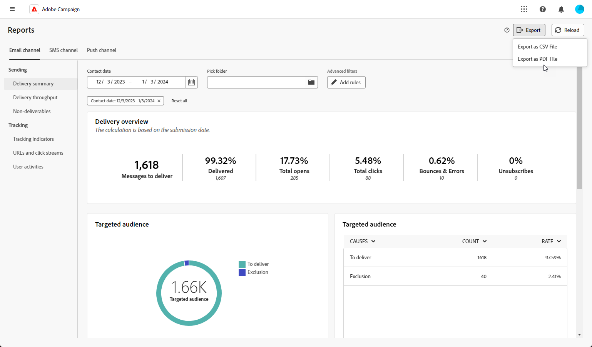

# Exportar seus relatórios {#export-reports}

>[!CONTEXTUALHELP]
>id="acw_reporting_email_exportation"
>title="Exportar seus relatórios"
>abstract="Clique em **Exportar** para exportar essas métricas nos formatos PDF ou CSV, o que permite compartilhá-las ou imprimi-las."

É possível exportar seus relatórios para o formato PDF ou CSV, o que permite compartilhá-los, manipulá-los ou imprimi-los.

1. No seu relatório, clique em **[!UICONTROL Exportar]** e selecione **[!UICONTROL Exportar como arquivo do PDF]** ou **[!UICONTROL Exportar como arquivo CSV]**.

   {zoomable="yes"}

1. Localize a pasta onde deseja salvar o arquivo, renomeie-a, se necessário, e clique em **[!UICONTROL Salvar]**.

Seu relatório agora está disponível para visualização ou compartilhamento em um arquivo PDF ou CSV.