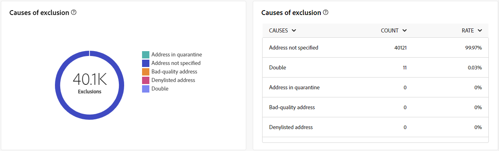

# Relatórios globais para o canal de correspondência direta {#global-report-direct}

Os relatórios globais de correspondência direta fornecem aos usuários uma visão geral abrangente das métricas de tráfego e engajamento no nível do canal.

Navegue até a **[!UICONTROL Relatórios]** no menu **[!UICONTROL Relatórios]** seção. Você pode filtrar seus dados dependendo da data do relatório, pasta ou regras. [Saiba mais](global-reports.md)

## Resumo da entrega {#delivery-summary-direct}

### Visão geral da entrega {#delivery-overview-direct}

>[!CONTEXTUALHELP]
>id="acw_global_reporting_delivery_overview_direct_mail"
>title="Visão geral da entrega"
>abstract="A **Visão geral da entrega** apresenta métricas principais de desempenho (KPIs) com informações detalhadas sobre as interações de visitantes com cada entrega de correspondência direta. As métricas estão descritas abaixo."

A **[!UICONTROL Visão geral da entrega]** apresenta métricas principais de desempenho (KPIs) com informações detalhadas sobre as interações de visitantes com cada entrega de correspondência direta. As métricas estão descritas abaixo.

{zoomable=&quot;yes&quot;}{align="center"}

+++Saiba mais sobre Métricas de visão geral de delivery.

* **[!UICONTROL Mensagens a entregar]**: Número total de mensagens processadas durante a preparação do delivery.

* **[!UICONTROL Entregue]**: Número de mensagens enviadas com êxito em relação ao número total de mensagens enviadas.

* **[!UICONTROL Erros]**: Total de erros acumulados durante o processamento de delivery e retorno automático em relação ao número total de mensagens enviadas.

* **[!UICONTROL Cancelamentos de assinatura]**: Número de recipients que clicaram em unsubscriptions.
+++

### Público-alvo {#delivery-summary-direct-initial-target}

>[!CONTEXTUALHELP]
>id="acw_global_reporting_target_audience_direct_mail_graph"
>title="Público-alvo"
>abstract="Os dados de destinatários e as informações da mensagem são exibidos no gráfico **Público-alvo**, refletindo a análise de preparação da entrega."

>[!CONTEXTUALHELP]
>id="acw_global_reporting_target_audience_direct_mail_table"
>title="Público-alvo"
>abstract="A tabela **Público-alvo** fornece um detalhamento dos destinatários e das mensagens correspondentes, com base nos resultados do processo de preparação da entrega."

A tabela e o gráfico para **[!UICONTROL Público-alvo]** mostre dados relacionados aos seus recipients, com as métricas detalhadas fornecidas abaixo.

{zoomable=&quot;yes&quot;}{align="center"}

+++Saiba mais sobre métricas de Público-alvo direcionado.

* **[!UICONTROL Público-alvo]**: Número total de recipients alvos.

* **[!UICONTROL Mensagem a ser entregue]**: Número total de mensagens a serem entregues após a preparação do delivery.

* **[!UICONTROL Exclusão]**: Número total de endereços ignorados durante a análise ao aplicar as regras: endereço em falta, em quarentena, na inclui na lista de bloqueios, etc.

+++

### Estatísticas de entrega {#delivery-summary-direct-exec-stats}

>[!CONTEXTUALHELP]
>id="acw_global_reporting_delivery_statistics_summary_direct_mail_graph"
>title="Estatísticas de entrega"
>abstract="O gráfico **Estatísticas de entrega** fornece informações sobre a eficácia das entregas de correspondência direta, incluindo entregas bem-sucedidas e erros encontrados."

>[!CONTEXTUALHELP]
>id="acw_global_reporting_delivery_statistics_summary_direct_mail_table"
>title="Estatísticas de entrega"
>abstract="A tabela **Estatísticas de entrega** detalha o sucesso da entrega de correspondência direta e os erros que ocorreram."

A variável **[!UICONTROL Estatísticas de entrega]** O gráfico e a tabela fornecem um detalhamento do sucesso de cada delivery de correspondência direta, com métricas detalhadas descritas abaixo.

+++Saiba mais sobre Estatísticas de entrega.

* **[!UICONTROL Mensagem a ser entregue]**: Número total de mensagens a serem entregues após a preparação do delivery.

* **[!UICONTROL Sucesso]**: Número de mensagens processadas com êxito em relação ao número de mensagens a serem entregues.

* **[!UICONTROL Erros / Rejeições]**: Número total de erros acumulados durante os deliveries e o processamento automático de reassociação em relação ao número de mensagens a serem entregues.

* **[!UICONTROL Novos em quarentena]**: Número total de endereços colocados em quarentena após um delivery com falha (usuário desconhecido, domínio inválido) em relação ao número de mensagens a serem entregues.

+++

### Causas da exclusão {#causes-exclusion}

>[!CONTEXTUALHELP]
>id="acw_global_reporting_exclusions_direct_mail_table"
>title="Exclusões"
>abstract="A tabela **Causas de exclusão** exibe um detalhamento por regra das mensagens que foram rejeitadas durante o processo de preparação da entrega."

>[!CONTEXTUALHELP]
>id="acw_global_reporting_causes_exclusion_direct_mail_graph"
>title="Causas da exclusão"
>abstract="O gráfico **Causas de exclusão** ilustra a distribuição de mensagens rejeitadas durante a preparação para a entrega, categorizada por cada regra."

{zoomable=&quot;yes&quot;}{align="center"}

O gráfico e a tabela de Exclusões ilustram os motivos que impediram os perfis de usuário, excluídos dos perfis direcionados, de receber a mensagem.

+++Saiba mais sobre Causas de métricas de exclusão.

* **[!UICONTROL Endereço em quarentena]**: Tipo de erro gerado quando o endereço é colocado em quarentena.

* **[!UICONTROL Endereço não especificado]**: Tipo de erro gerado ao enviar um delivery para indicar que o endereço não existe.

* **[!UICONTROL Endereço de má qualidade]**: Tipo de erro gerado quando a classificação de qualidade do endereço postal é muito baixa.

* **[!UICONTROL Incluir na lista de bloqueios endereço ➡ alterado]** incluir na lista de bloqueios : Tipo de erro gerado quando o recipient foi atualizado quando o delivery foi executado.

* **[!UICONTROL Duplo]**: Tipo de erro gerado quando o destinatário foi excluído porque seus valores de chaves não eram exclusivos.

* **[!UICONTROL Grupo de controle]**: o endereço do recipient faz parte do grupo de controle.

* **[!UICONTROL Tamanho do público alvo limitado]**: o tamanho máximo de delivery foi atingido para o recipient.

+++
