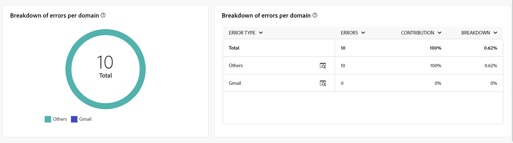

# Relatórios globais para o canal de email {#global-report-direct}

Os Relatórios globais fornecem aos usuários uma visão geral abrangente das métricas de tráfego e engajamento no nível do canal.

Navegue até a **[!UICONTROL Relatórios]** no menu **[!UICONTROL Relatórios]** seção. Você pode filtrar seus dados dependendo da data do relatório, pasta ou regras. [Saiba mais](global-reports.md)

## Resumo da entrega {#delivery-summary-email}

### Visão geral da entrega {#delivery-overview-email}

A variável **[!UICONTROL Visão geral da entrega]** O apresenta as principais métricas de desempenho (KPIs) com informações detalhadas sobre a interação de seus visitantes com cada delivery de email. As métricas estão descritas abaixo.

{align="center"}

+++Saiba mais sobre Métricas de visão geral de delivery.

* **[!UICONTROL Mensagens a entregar]**: Número total de mensagens processadas durante a preparação do delivery.

* **[!UICONTROL Entregue]**: Número de mensagens enviadas com êxito em relação ao número total de mensagens enviadas.

* **[!UICONTROL Total de aberturas]**: número total de recipients alvos que abriram uma mensagem pelo menos uma vez.

* **[!UICONTROL Total de cliques]**: Número total de recipients que clicaram em um delivery pelo menos uma vez.

* **[!UICONTROL Devoluções e erros]**: Total de erros acumulados durante o processamento de delivery e retorno automático em relação ao número total de mensagens enviadas.

* **[!UICONTROL Cancelamentos de assinatura]**: Número de recipients que clicaram em unsubscriptions.
+++

### Público-alvo {#delivery-summary-email-initial-target}

A tabela e o gráfico para **[!UICONTROL Público-alvo]** mostre dados relacionados aos seus recipients, com as métricas detalhadas fornecidas abaixo.

{align="center"}

+++Saiba mais sobre métricas de Público-alvo direcionado.

* **[!UICONTROL Público-alvo]**: Número total de recipients alvos.

* **[!UICONTROL Mensagem a ser entregue]**: Número total de mensagens a serem entregues após a preparação do delivery.

* **[!UICONTROL Exclusão]**: Número total de endereços ignorados durante a análise ao aplicar as regras: endereço em falta, em quarentena, na inclui na lista de bloqueios, etc.

+++

### Estatísticas de entrega {#delivery-summary-email-exec-stats}

A variável **[!UICONTROL Estatísticas de entrega]** A tabela fornece uma análise do sucesso de cada delivery de email, com métricas detalhadas descritas abaixo.

{align="center"}

+++Saiba mais sobre Estatísticas de entrega.

* **[!UICONTROL Mensagem a ser entregue]**: Número total de mensagens a serem entregues após a preparação do delivery.

* **[!UICONTROL Sucesso]**: Número de mensagens processadas com êxito em relação ao número de mensagens a serem entregues.

* **[!UICONTROL Erros / Rejeições]**: Número total de erros acumulados durante os deliveries e o processamento automático de reassociação em relação ao número de mensagens a serem entregues.

* **[!UICONTROL Novos em quarentena]**: Número total de endereços colocados em quarentena após um delivery com falha (usuário desconhecido, domínio inválido) em relação ao número de mensagens a serem entregues.

+++

### Causas de exclusão {#causes-exclusion}

{align="center"}

O gráfico e a tabela de Exclusões ilustram os motivos que impediram os perfis de usuário, excluídos dos perfis direcionados, de receber a mensagem.

Os tipos de erro de email estão listados no [Documentação do Adobe Campaign v8 (console do cliente)](https://experienceleague.adobe.com/docs/campaign/campaign-v8/send/failures/delivery-failures.html#email-error-types){target="_blank"}.

## Taxa de transferência de entrega {#delivery-throughput}

{align="center"}

Este relatório fornece detalhes abrangentes sobre a taxa de transferência do delivery em um período especificado.

## Não entregues {#non-deliverables-email}

### Detalhamento de erros por tipo {#delivery-summary-email-breakdown-per-type}

{align="center"}

A variável **[!UICONTROL Detalhamento de erros por tipo]** A tabela e o gráfico apresentam os dados relacionados a possíveis erros ocorridos em vários domínios, com as métricas específicas fornecidas abaixo.

Os erros exibidos nesse relatório acionam o processo de quarentena. Para obter mais informações sobre gestão de quarentena, consulte [Documentação do Campaign v8 (console do cliente)](https://experienceleague.adobe.com/docs/campaign/campaign-v8/campaigns/send/failures/delivery-failures.html){target="_blank"}.

+++Saiba mais sobre Detalhamento de erros por tipo de métrica.

* **[!UICONTROL Usuário desconhecido]**: Tipo de erro gerado durante o delivery para indicar que o endereço de email é inválido.

* **[!UICONTROL Domínio inválido]**: Tipo de erro gerado ao enviar um delivery para indicar que o domínio do endereço de email está errado ou não existe.

* **[!UICONTROL Caixa de entrada cheia]**: Tipo de erro gerado após cinco tentativas de delivery para indicar que a caixa de entrada dos recipients contém muitas mensagens.

* **[!UICONTROL Conta desabilitada]**: Tipo de erro gerado ao enviar um delivery para indicar que o endereço não existe mais.

* **[!UICONTROL Recusado]**: Tipo de erro gerado quando um endereço é rejeitado pelo IAP (Provedor de Acesso à Internet), por exemplo, ao seguir uma regra de segurança da aplicação (software antispam).

* **[!UICONTROL Inacessível]**: Tipo de erro que ocorre na cadeia de caracteres de distribuição de mensagens: incidente na retransmissão SMTP, domínio temporariamente inacessível, etc

* **[!UICONTROL Não conectado]**: Tipo de erro para indicar que o celular do recipient está desligado ou sem rede no momento do envio.

+++

### Detalhamento de erros por domínio {#delivery-summary-email-breakdown-per-domain}

{align="center"}

A variável **[!UICONTROL Detalhamento de erros por domínio]** A tabela e o gráfico mostram os dados relacionados a possíveis erros em cada domínio. As métricas são comuns com **[!UICONTROL Detalhamento de erros por tipo]** tabela e gráfico detalhados acima.

## Indicadores de rastreamento {#tracking-indicators-email}

### Estatísticas de entrega {#delivery-summary-email-statistics}

A variável **[!UICONTROL Estatísticas de entrega]** As métricas do oferecem indicadores-chave de desempenho (KPIs) que fornecem informações detalhadas sobre os dados associados a cada delivery de email. Mais detalhes sobre essas métricas são fornecidos abaixo.

{align="center"}

+++Saiba mais sobre Estatísticas de entrega.

* **[!UICONTROL Mensagens a entregar]**: Número total de mensagens processadas durante a preparação do delivery.

* **[!UICONTROL Sucesso]**: Número de mensagens processadas com êxito em relação ao número de mensagens a serem entregues.

* **[!UICONTROL Aberturas únicas]**: número total de recipients alvos que abriram uma mensagem pelo menos uma vez.

* **[!UICONTROL Total de aberturas]**: Número de recipients alvos distintos para este domínio que abriram uma mensagem pelo menos uma vez.

* **[!UICONTROL Cliques no link para opção de não participação]**: Número de cliques no link unsubscription.

* **[!UICONTROL Cliques no mirror link]**: Número de cliques no link para a mirror page.

* **[!UICONTROL Estimativa de encaminhamentos]**: Estimativa do número de emails encaminhados pelos recipients alvos.
+++

### Índice de abertura e click-through {#delivery-summary-open-rate}

A variável **[!UICONTROL Índice de abertura e click-through]** A tabela exibe dados relativos aos recipients. As métricas estão detalhadas abaixo.

{align="center"}

+++Saiba mais sobre Métricas de taxa de abertura e de click-through.

* **[!UICONTROL Enviado]**: Número total de mensagens enviadas.

* **[!UICONTROL Reclamações]**: Número e porcentagem de mensagens deste domínio relatadas como indesejáveis pelo recipient.

* **[!UICONTROL Aberturas únicas]**: Número e porcentagem de recipients alvos distintos para este domínio que abriram uma mensagem pelo menos uma vez.

* **[!UICONTROL Cliques únicos]**: Número e porcentagem de recipients alvos distintos que clicaram no mesmo delivery pelo menos uma vez.

* **[!UICONTROL Reatividade bruta]**: Porcentagem do número de recipients que clicaram em um delivery pelo menos uma vez em comparação ao número de recipients que abriram um delivery pelo menos uma vez.
+++

## Fluxos de clique e URLs {#url-email}

### KPIs de fluxos de clique e URLs {#url-email-kpis}

A variável **[!UICONTROL Fluxos de clique e URLs]** O relatório do fornece indicadores principais de desempenho (KPIs) que fornecem insights detalhados sobre os URLs que receberam o maior número de cliques durante um delivery. As métricas estão detalhadas abaixo.

{align="center"}

+++Saiba mais sobre URLs e métricas de fluxos de clique.

* **[!UICONTROL Reatividade]**: Taxa do número de recipients alvos que clicaram em um delivery em relação ao número estimado de recipients alvos que abriram um delivery.

* **[!UICONTROL Cliques únicos]**: Número total de recipients distintos que clicaram em um delivery pelo menos uma vez.

* **[!UICONTROL Total de cliques]**: Número total de cliques nos links nos deliveries.

* **[!UICONTROL Platform average]**: Essa taxa média, exibida em cada taxa (reatividade, cliques distintos e cliques acumulados), é calculada para entregas enviadas nos seis meses anteriores. Somente as entregas com a mesma tipologia e no mesmo canal são consideradas. Provas são excluídas.
+++

### Os 10 links mais visitados {#top10-campaign-report-email}

A variável **[!UICONTROL Os 10 links mais visitados]** o gráfico e a tabela contêm os dados disponíveis para o comportamento do recipient por link. As métricas estão detalhadas abaixo.

{align="center"}

+++Saiba mais sobre as 10 métricas de links mais visitadas.

* **[!UICONTROL Total de cliques]**: Número total de cliques nos links nos deliveries.

* **[!UICONTROL Porcentagem]**: Porcentagem de usuários que interagiram com o delivery.

+++

### Detalhamento dos cliques ao longo do tempo {#campaign-report-email-breakdown-clicks}

A variável **[!UICONTROL Detalhamento dos cliques ao longo do tempo]** o gráfico contém os dados disponíveis para o comportamento do recipient por link.

{align="center"}

## Atividades do usuário {#user-activities-email}

A variável **[!UICONTROL Atividades do usuário]** O relatório mostra o detalhamento de aberturas e cliques no formulário de um gráfico. As métricas para esse relatório são detalhadas abaixo.

{align="center"}

+++Saiba mais sobre métricas de Atividades do usuário.

* **[!UICONTROL Total de cliques]**: Número total de cliques nos links nos deliveries.

* **[!UICONTROL Total de aberturas]**: Número total de recipients alvos distintos para este domínio que abriram uma mensagem pelo menos uma vez.

+++
