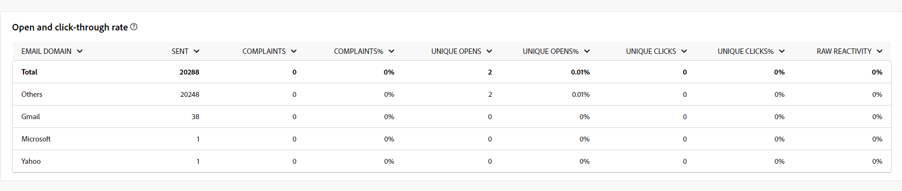

# Relatórios globais para o canal de email {#global-report-direct}

Os relatórios globais fornecem aos usuários uma visão geral abrangente das métricas de tráfego e engajamento no nível do canal.

Navegue até o menu **[!UICONTROL Relatórios]** na seção **[!UICONTROL Relatórios]**. Você pode filtrar seus dados dependendo da data, pasta ou regras do relatório. [Saiba mais](global-reports.md)

## Resumo da entrega {#delivery-summary-email}

### Visão geral da entrega {#delivery-overview-email}

>[!CONTEXTUALHELP]
>id="acw_global_reporting_deliveries_overview_email"
>title="Visão geral da entrega"
>abstract="A **Visão geral da entrega** apresenta os principais indicadores de desempenho (KPIs) que oferecem insights detalhados sobre como seu público-alvo interage com as entregas de email e campanhas enviadas."

A **[!UICONTROL Visão geral da entrega]** apresenta as principais métricas de desempenho (KPIs), oferecendo insights detalhados sobre a interação dos visitantes com cada entrega de email. As métricas estão descritas abaixo.

{zoomable="yes"}{align="center"}

+++Saiba mais sobre Métricas de visão geral de delivery.

* **[!UICONTROL Mensagens a serem entregues]**: número total de mensagens processadas durante a preparação da entrega.

* **[!UICONTROL Entregues]**: número de mensagens enviadas com êxito em relação ao número total de mensagens enviadas.

* **[!UICONTROL Total de aberturas]**: número total de recipients alvos que abriram uma mensagem pelo menos uma vez.

* **[!UICONTROL Total de cliques]**: número total de destinatários que clicaram em um delivery pelo menos uma vez.

* **[!UICONTROL Rejeições e erros]**: total de erros acumulados durante o processamento de entrega e retorno automático em relação ao número total de mensagens enviadas.

* **[!UICONTROL Cancelamentos de assinatura]**: número de destinatários que clicaram em cancelar assinatura.
+++

### Público-alvo {#delivery-summary-email-initial-target}

>[!CONTEXTUALHELP]
>id="acw_global_reporting_target_audience_email"
>title="Estatísticas iniciais do público-alvo"
>abstract="O gráfico e a tabela **Público-alvo** oferecem insights sobre o engajamento do destinatário, ajudando a avaliar a eficácia de suas campanhas e entregas."

A tabela e o gráfico para **[!UICONTROL Público-alvo]** exibem dados relacionados aos seus destinatários, com as métricas detalhadas fornecidas abaixo.

{zoomable="yes"}{align="center"}

+++Saiba mais sobre métricas de Público-alvo direcionado.

* **[!UICONTROL Público-alvo]**: número total de destinatários direcionados.

* **[!UICONTROL Mensagem a ser entregue]**: Número total de mensagens a serem entregues após a preparação da entrega.

* incluir na lista de bloqueios **[!UICONTROL Exclusão]**: número total de endereços ignorados durante a análise ao aplicar regras, como endereço ausente, em quarentena ou em.

+++

### Estatísticas de entrega {#delivery-summary-email-delivery-stats}

>[!CONTEXTUALHELP]
>id="acw_global_reporting_email_delivery_stats"
>title="Estatísticas de entrega"
>abstract="O gráfico e a tabela **Estatísticas de entrega** descrevem as principais métricas, incluindo entregas bem-sucedidas, erros e novas quarentenas, oferecendo uma visão geral concisa sobre o desempenho da entrega."

A tabela **[!UICONTROL Estatísticas de entrega]** fornece um detalhamento do sucesso de cada entrega de email, com as métricas detalhadas descritas abaixo.

{zoomable="yes"}{align="center"}

+++Saiba mais sobre Métricas de estatísticas de delivery.

* **[!UICONTROL Mensagem a ser entregue]**: Número total de mensagens a serem entregues após a preparação da entrega.

* **[!UICONTROL Success]**: Número de mensagens processadas com êxito em relação ao número de mensagens a serem entregues.

* **[!UICONTROL Erros / Devoluções]**: Número total de erros acumulados durante as entregas e o processamento automático de reassociação em relação ao número de mensagens a serem entregues.

* **[!UICONTROL Novas quarentenas]**: Número total de endereços colocados em quarentena após uma entrega com falha (usuário desconhecido, domínio inválido) em relação ao número de mensagens a serem entregues.

+++

### Causas da exclusão {#causes-exclusion}

>[!CONTEXTUALHELP]
>id="acw_global_reporting_exclusion_email"
>title="Causas da exclusão"
>abstract="O gráfico e a tabela **Causas de exclusão** ilustram os motivos específicos das rejeições de mensagem durante a preparação da entrega, oferecendo um detalhamento por regra."

{zoomable="yes"}{align="center"}

O gráfico de exclusões e a tabela ilustram os motivos que impediram os perfis de usuário, excluídos dos perfis direcionados, de receber a mensagem.

Tipos de erro de email listados na [documentação do Adobe Campaign v8 (console do cliente)](https://experienceleague.adobe.com/docs/campaign/campaign-v8/send/failures/delivery-failures.html#email-error-types){target="_blank"}.

## Taxa de transferência de entrega {#delivery-throughput}

>[!CONTEXTUALHELP]
>id="acw_global_reporting_throughput_email"
>title="Taxa de transferência de entrega"
>abstract="A **Taxa de transferência de entrega** fornece insights abrangentes sobre a taxa de transferência da entrega, destacando as taxas de sucesso e erro em um período especificado."

{zoomable="yes"}{align="center"}

O relatório Taxa de transferência de delivery fornece insights detalhados sobre a eficiência do processo de delivery, apresentando uma visão geral detalhada das taxas de sucesso e erro em um período especificado.

+++Saiba mais sobre Métricas de taxa de transferência de entrega.

* **[!UICONTROL Success]**: Número de mensagens processadas com êxito em relação ao número de mensagens a serem entregues.

* **[!UICONTROL Erros]**: Número total de erros acumulados durante as entregas e o processamento automático de reassociação em relação ao número de mensagens a serem entregues.

+++

## Não entregues {#non-deliverables-email}

### Detalhamento de erros por tipo {#delivery-summary-email-breakdown-per-type}

>[!CONTEXTUALHELP]
>id="acw_global_reporting_error_type_email"
>title="Detalhamento de erros por tipo"
>abstract="A tabela e o gráfico **Detalhamento de erros por tipo** fornece informações sobre vários tipos de erro encontrados durante o processo, incluindo erros de usuário desconhecido, caixa de entrada cheia, domínio inválido e outros."

{zoomable="yes"}{align="center"}

A tabela e o gráfico **[!UICONTROL Detalhamento de erros por tipo]** apresentam os dados relacionados a possíveis erros ocorridos em vários domínios, com as métricas específicas fornecidas a seguir.

Os erros exibidos nesse relatório acionam o processo de quarentena. Para obter mais informações sobre o gerenciamento de quarentena, consulte a [documentação do Campaign v8 (console do cliente)](https://experienceleague.adobe.com/docs/campaign/campaign-v8/campaigns/send/failures/delivery-failures.html){target="_blank"}.

+++Saiba mais sobre o Detalhamento de erros por tipo de métrica.

* **[!UICONTROL Usuário desconhecido]**: Tipo de erro gerado durante a entrega para indicar que o endereço de email é inválido.

* **[!UICONTROL Domínio inválido]**: Tipo de erro gerado ao enviar uma entrega para indicar que o domínio do endereço de email está errado ou não existe.

* **[!UICONTROL Caixa de correio cheia]**: Tipo de erro gerado após cinco tentativas de entrega para indicar que a caixa de entrada dos destinatários contém muitas mensagens.

* **[!UICONTROL Conta desabilitada]**: Tipo de erro gerado ao enviar uma entrega para indicar que o endereço não existe mais.

* **[!UICONTROL Recusado]**: Tipo de erro gerado quando um endereço é rejeitado pelo Provedor de Acesso à Internet, por exemplo, ao seguir uma regra de segurança da aplicação (software antispam).

* **[!UICONTROL Inacessível]**: Tipo de erro que ocorre na cadeia de caracteres de distribuição de mensagens, como um incidente na retransmissão SMTP ou domínio temporariamente inacessível.

* **[!UICONTROL Não conectado]**: Tipo de erro para indicar que o celular do recipient está desligado ou sem rede no momento do envio.

+++

### Detalhamento de erros por domínio {#delivery-summary-email-breakdown-per-domain}

>[!CONTEXTUALHELP]
>id="acw_global_reporting_error_domain_email"
>title="Detalhamento de erros por domínio"
>abstract="A tabela e o gráfico **Detalhamento de erros por domínio** apresentam os dados correspondentes a cada tipo de erro encontrado, categorizados por domínios específicos."

{zoomable="yes"}{align="center"}

A tabela e o gráfico **[!UICONTROL Breakdown of errors per domain]** mostram os dados relacionados a possíveis erros em cada domínio. As métricas são comuns com a tabela e o gráfico **[!UICONTROL Breakdown of errors per type]** detalhados acima.

## Indicadores de rastreamento {#tracking-indicators-email}

### Estatísticas de entrega {#delivery-summary-email-statistics}

>[!CONTEXTUALHELP]
>id="acw_global_delivery_statistics_summary_email"
>title="Estatísticas de entrega"
>abstract="Os principais indicadores de desempenho (KPIs) das **Estatísticas de entrega** fornecem uma visão geral abrangente do desempenho de suas entregas e campanhas, oferecendo insights sobre entregas bem-sucedidas, erros encontrados e engajamento do usuário."

As métricas **[!UICONTROL Estatísticas de entrega]** oferecem KPIs (indicadores-chave de desempenho), fornecendo informações detalhadas sobre os dados associados a cada entrega de email. Mais detalhes sobre essas métricas são fornecidos abaixo.

{zoomable="yes"}{align="center"}

+++Saiba mais sobre Métricas de estatísticas de delivery.

* **[!UICONTROL Mensagens a serem entregues]**: número total de mensagens processadas durante a preparação da entrega.

* **[!UICONTROL Success]**: Número de mensagens processadas com êxito em relação ao número de mensagens a serem entregues.

* **[!UICONTROL Aberturas exclusivas]**: número total de destinatários direcionados que abriram uma mensagem pelo menos uma vez.

* **[!UICONTROL Total de Aberturas]**: Número de destinatários direcionados distintos para este domínio que abriram uma mensagem pelo menos uma vez.

* **[!UICONTROL Cliques no link para opção de não participação]**: Número de cliques no link para cancelamento de inscrição.

* **[!UICONTROL Clicks on the mirror link]**: Número de cliques no link para a mirror page.

* **[!UICONTROL Estimativa de encaminhamentos]**: Estimativa do número de emails encaminhados pelos destinatários direcionados.
+++

### Índice de abertura e click-through {#delivery-summary-open-rate}

>[!CONTEXTUALHELP]
>id="acw_global_reporting_open_clickthrough_email"
>title="Índice de abertura e click-through"
>abstract="A tabela **Índices de abertura e click-through** revela o engajamento do destinatário com a entrega, apresentando dados sobre índices de abertura e click-through para uma visão geral rápida e informativa."

A tabela **[!UICONTROL Taxa de abertura e de click-through]** exibe os dados relativos aos seus destinatários. As métricas estão detalhadas abaixo.

{zoomable="yes"}{align="center"}

+++Saiba mais sobre métricas de taxa de abertura e click-through.

* **[!UICONTROL Enviado]**: Número total de mensagens enviadas.

* **[!UICONTROL Reclamações]**: número e porcentagem de mensagens deste domínio relatadas como indesejáveis pelo destinatário.

* **[!UICONTROL Aberturas Exclusivas]**: Número e porcentagem de destinatários direcionados distintos para este domínio que abriram uma mensagem pelo menos uma vez.

* **[!UICONTROL Cliques únicos]**: número e porcentagem de recipients alvos distintos que clicaram no mesmo delivery pelo menos uma vez.

* **[!UICONTROL Reatividade bruta]**: porcentagem do número de recipients que clicaram em uma entrega pelo menos uma vez em comparação ao número de recipients que abriram uma entrega pelo menos uma vez.
+++

## Fluxos de clique e URLs {#url-email}

### KPIs de fluxos de clique e URLs {#url-email-kpis}

>[!CONTEXTUALHELP]
>id="acw_global_reporting_urls_clickstreams_email"
>title="Fluxos de clique e URLs"
>abstract="O relatório **Fluxos de clique e URLs** utiliza indicadores principais de desempenho (KPIs) essenciais para fornecer insights detalhados sobre os URLs mais clicados durante uma entrega."

O relatório **[!UICONTROL URLs and click streams]** fornece KPIs (indicadores-chave de desempenho), oferecendo insights detalhados sobre as URLs que receberam o maior número de cliques durante uma entrega. As métricas estão detalhadas abaixo.

{zoomable="yes"}{align="center"}

+++Saiba mais sobre URLs e métricas de fluxos de clique.

* **[!UICONTROL Reatividade]**: taxa do número de recipients alvos que clicaram em uma entrega em relação ao número estimado de recipients alvos que abriram uma entrega.

* **[!UICONTROL Cliques únicos]**: número total de recipients distintos que clicaram em um delivery pelo menos uma vez.

* **[!UICONTROL Total de Cliques]**: número total de cliques nos links nas entregas.

* **[!UICONTROL Média da plataforma]**: essa taxa média, exibida em cada taxa (reatividade, cliques distintos e cliques cumulativos), é calculada para entregas enviadas nos seis meses anteriores. Somente as entregas com a mesma tipologia e no mesmo canal são consideradas. Provas são excluídas.
+++

### Os 10 links mais visitados {#top10-global-report-email}

>[!CONTEXTUALHELP]
>id="acw_global_reporting_top10_email"
>title="Os 10 links mais visitados"
>abstract="O gráfico e a tabela **Os 10 links mais visitados** apresentam dados abrangentes sobre a interação do destinatário com cada link."

O gráfico e a tabela **[!UICONTROL Os 10 links mais visitados]** contêm os dados disponíveis para o comportamento do recipient por link. As métricas estão detalhadas abaixo.

{zoomable="yes"}{align="center"}

+++Saiba mais sobre as 10 métricas de links mais visitadas.

* **[!UICONTROL Total de Cliques]**: número total de cliques nos links nas entregas.

* **[!UICONTROL Porcentagem]**: porcentagem de usuários que interagiram com a entrega.

+++

### Detalhamento dos cliques ao longo do tempo {#global-report-email-breakdown-clicks}

>[!CONTEXTUALHELP]
>id="acw_global_reporting_urls_click_breakdown_email"
>title="Detalhamento dos cliques ao longo do tempo"
>abstract="O gráfico **Detalhamento dos cliques ao longo do tempo** oferece uma visão abrangente de como os destinatários se envolvem com links durante o período designado."

O gráfico **[!UICONTROL Breakdown of clicks over time]** contém os dados disponíveis para o comportamento do recipient por link.

{zoomable="yes"}{align="center"}

## Atividades do usuário {#user-activities-email}

>[!CONTEXTUALHELP]
>id="acw_global_reporting_user_activities_email"
>title="Atividades do usuário"
>abstract="A representação gráfica das **Atividades do usuário** oferece um detalhamento das interações do destinatário, retratando aberturas e cliques por meio de um gráfico informativo."

O relatório **[!UICONTROL Atividades do usuário]** mostra o detalhamento de aberturas e cliques no formato de um gráfico. As métricas para esse relatório são detalhadas abaixo.

{zoomable="yes"}{align="center"}

+++Saiba mais sobre as métricas de Atividades do usuário.

* **[!UICONTROL Total de Cliques]**: número total de cliques nos links nas entregas.

* **[!UICONTROL Total de Aberturas]**: Número total de destinatários direcionados distintos para este domínio que abriram uma mensagem pelo menos uma vez.

+++