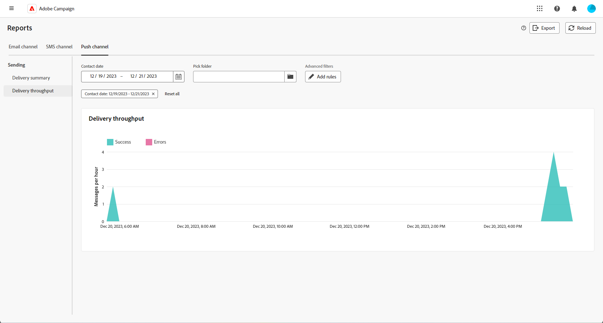

# Relatórios globais para o canal de push {#campaign-reports-push}

Os Relatórios globais fornecem aos usuários uma visão geral abrangente das métricas de tráfego e engajamento no nível do canal.

Navegue até a **[!UICONTROL Relatórios]** no menu **[!UICONTROL Relatórios]** seção. Você pode filtrar seus dados dependendo da data do relatório, pasta ou regras. [Saiba mais](global-reports.md)

## Resumo da entrega {#delivery-summary-push}

### Visão geral da entrega {#delivery-overview-push}

>[!CONTEXTUALHELP]
>id="acw_push_global_report_overview"
>title="Visão geral da entrega por push"
>abstract="O Push **visão geral do delivery** Os KPIs fornecem um exame completo dos deliveries por push, fornecendo insights detalhados e dados específicos. Ele fornece detalhes abrangentes sobre o desempenho, a eficácia e os resultados dos deliveries."

A variável **[!UICONTROL Visão geral da entrega]** O relatório do fornece indicadores principais de desempenho (KPIs) que fornecem informações detalhadas sobre como seus visitantes se envolvem com cada delivery de notificação por push. As métricas estão detalhadas abaixo.

+++Saiba mais sobre Métricas de visão geral de delivery.

* **[!UICONTROL Mensagens a entregar]**: Número total de mensagens processadas durante a preparação do delivery.

* **[!UICONTROL Entregue]**: Número de mensagens enviadas com êxito em relação ao número total de mensagens enviadas.

* **[!UICONTROL Total de cliques]**: Número total de recipients distintos que clicaram em um delivery pelo menos uma vez.

* **[!UICONTROL Erros]**: Total de erros acumulados durante o processamento de delivery e retorno automático em relação ao número total de mensagens enviadas.

+++

### Público-alvo {#delivery-summary-push-initial-target}

>[!CONTEXTUALHELP]
>id="acw_global_reporting_push_targeted_audience"
>title="População direcionada por push"
>abstract="A variável **População direcionada** o gráfico e a tabela exibem dados relacionados ao público-alvo de mensagens de push, apresentando informações sobre mensagens a serem entregues e exclusões."

A variável **[!UICONTROL Público-alvo]** A tabela e o gráfico apresentam dados relacionados aos recipients para cada delivery de notificação por push enviado. As métricas estão detalhadas abaixo.

+++Saiba mais sobre métricas de Público-alvo direcionado.

* **[!UICONTROL Público-alvo]**: Número total de recipients alvos.

* **[!UICONTROL Mensagem a ser entregue]**: Número total de mensagens a serem entregues após a preparação do delivery.

* **[!UICONTROL Exclusão]**: Número total de endereços ignorados durante a análise ao aplicar as regras: endereço em falta, em quarentena, na inclui na lista de bloqueios, etc.

+++

### Estatísticas de entrega {#delivery-summary-push-exec-stats}

>[!CONTEXTUALHELP]
>id="acw_global_reporting_push_delivery_stats"
>title="Estatísticas de entrega por push"
>abstract="A variável **Estatísticas gerais** O relatório de fornece informações sobre notificações por push enviadas, incluindo taxas de sucesso, erros e quarentenas."

A variável **[!UICONTROL Estatísticas de entrega]** A tabela detalha o sucesso de cada delivery de notificação por push. As métricas estão detalhadas abaixo.

+++Saiba mais sobre Estatísticas de entrega.

* **[!UICONTROL Total de mensagens]**: Número total de mensagens a serem entregues após a preparação do delivery.

* **[!UICONTROL Sucesso]**: Número de mensagens processadas com êxito em relação ao número de mensagens a serem entregues.

* **[!UICONTROL Erros / Rejeições]**: Número total de erros acumulados durante os deliveries e o processamento automático de reassociação em relação ao número de mensagens a serem entregues.

* **[!UICONTROL Novos em quarentena]**: Número total de endereços colocados em quarentena após um delivery com falha (registro inválido, rejeição de mensagem, erro de carga, por exemplo). em relação ao número de mensagens a serem entregues.

  Os tipos de erro de notificações por push estão listados na variável [Documentação do Adobe Campaign v8 (console do cliente)](https://experienceleague.adobe.com/docs/campaign/campaign-v8/send/failures/delivery-failures.html#push-error-types){target="_blank"}.

+++

### Causas de exclusão {#causes-exclusion}

>[!CONTEXTUALHELP]
>id="acw_global_reporting_push_exclusion"
>title="Causas de exclusão por push"
>abstract="A variável **Causas de exclusão** O gráfico e a tabela ilustram os diversos motivos que impediram os perfis de usuário de receber as notificações por push."

A variável **[!UICONTROL Causas de exclusão]** o gráfico e a tabela exibem os motivos que impediram os perfis de usuário, que foram excluídos dos perfis direcionados, de receber a mensagem.

Os tipos de erro de notificações por push estão listados na variável [Documentação do Adobe Campaign v8 (console do cliente)](https://experienceleague.adobe.com/docs/campaign/campaign-v8/send/failures/delivery-failures.html#push-error-types){target="_blank"}.

## Taxa de transferência de entrega {#delivery-throughput-sms}

>[!CONTEXTUALHELP]
>id="acw_global_reporting_throughput_push"
>title="Relatório de taxa de transferência de entrega"
>abstract="A variável **Taxa de transferência de entrega** O relatório do apresenta informações detalhadas sobre a taxa de transferência de delivery de notificação por push de toda a plataforma em um período especificado."

A variável **[!UICONTROL Taxa de transferência de entrega]** O relatório do oferece insights abrangentes sobre a eficácia do sistema de delivery de notificações por push, oferecendo um resumo detalhado das taxas de sucesso e erro por um período especificado.

