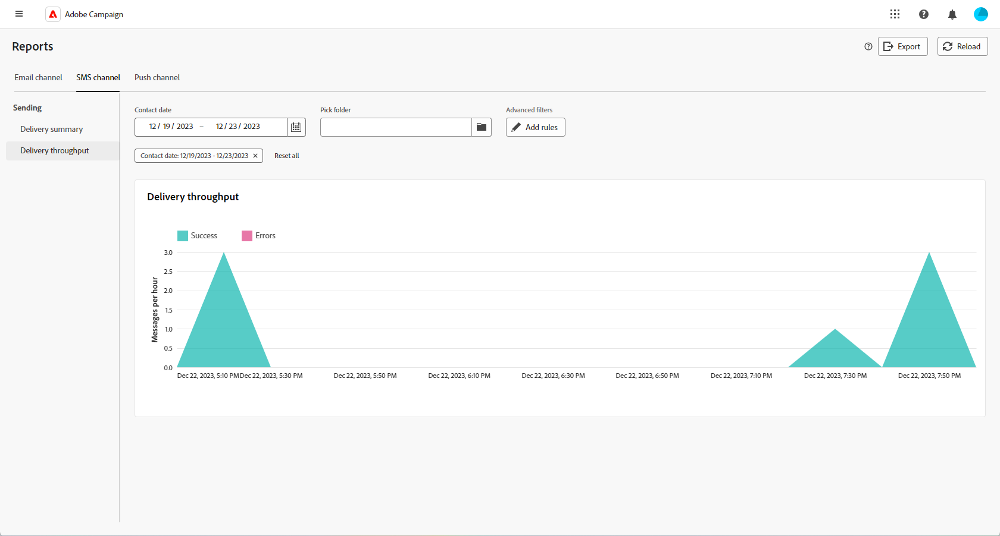

# Relatórios globais para o canal SMS {#campaign-reports-sms}

Os relatórios globais fornecem aos usuários uma visão geral abrangente das métricas de tráfego e engajamento no nível do canal.

Navegue até o menu **[!UICONTROL Relatórios]** na seção **[!UICONTROL Relatórios]**. Você pode filtrar seus dados dependendo da data, pasta ou regras do relatório. [Saiba mais](global-reports.md)

## Resumo da entrega {#delivery-summary-sms}

### Visão geral da entrega {#delivery-overview-sms}

>[!CONTEXTUALHELP]
>id="acw_sms_global_report_overview"
>title="Visão geral da entrega de SMS"
>abstract="Os KPIs da **Visão geral da entrega de SMS** oferecem um resumo abrangente da entrega de SMS, com insights detalhados e dados específicos. Esses KPIs fornecem informações abrangentes sobre o desempenho, a eficácia e os resultados da entrega."

O relatório **[!UICONTROL Visão geral da entrega]** oferece KPIs (indicadores-chave de desempenho) abrangentes, que fornecem insights detalhados sobre os padrões de interação de seus visitantes com cada entrega de SMS. As métricas a seguir são descritas abaixo.

{zoomable="yes"}

+++Saiba mais sobre Métricas de visão geral de delivery.

* **[!UICONTROL Mensagens a serem entregues]**: número total de mensagens processadas durante a preparação da entrega.

* **[!UICONTROL Entregues]**: porcentagem de mensagens enviadas com êxito em relação ao número total de mensagens enviadas.

* **[!UICONTROL Taxa de click-through]**: porcentagem de recipients distintos que clicaram em uma entrega pelo menos uma vez.

* **[!UICONTROL Erros]**: porcentagem de erros acumulados durante o processamento de entrega e retorno automático em relação ao número total de mensagens enviadas.

+++

### Público-alvo {#delivery-summary-sms-initial-target}

>[!CONTEXTUALHELP]
>id="acw_global_reporting_sms_targeted_audience"
>title="População direcionada por SMS"
>abstract="O gráfico e a tabela **População direcionada** apresentam dados relacionados ao público-alvo de SMS, incluindo informações sobre mensagens a serem entregues e exclusões."

A tabela e o gráfico **[!UICONTROL Público-alvo]** apresentam dados relacionados aos seus destinatários para cada entrega de SMS enviada. As métricas estão detalhadas abaixo.

{zoomable="yes"}

+++Saiba mais sobre métricas de Público-alvo direcionado.

* **[!UICONTROL Público-alvo]**: número total de destinatários direcionados.

* **[!UICONTROL Mensagem a ser entregue]**: Número total de mensagens a serem entregues após a preparação da entrega.

* incluir na lista de bloqueios **[!UICONTROL Exclusão]**: número total de endereços ignorados durante a análise ao aplicar regras, como endereço ausente, em quarentena ou em um arquivo de pesquisa.

+++

### Estatísticas de entrega {#delivery-summary-sms-exec-stats}

>[!CONTEXTUALHELP]
>id="acw_global_reporting_sms_delivery_stats"
>title="Estatísticas da entrega de SMS"
>abstract="O relatório **Estatísticas de entrega** fornece insights abrangentes sobre o SMS enviado, oferecendo um detalhamento de várias métricas, como taxas de sucesso, ocorrências de erros e o público-alvo colocado em quarentena. Essa apresentação detalhada permite uma análise completa do desempenho geral e dos resultados do processo de entrega de SMS."

A tabela **[!UICONTROL Estatísticas de entrega]** detalha o sucesso de cada entrega de SMS. As métricas estão detalhadas abaixo.

{zoomable="yes"}

+++Saiba mais sobre Métricas de estatísticas de delivery.

* **[!UICONTROL Total de mensagens]**: número total de mensagens a serem entregues após a preparação da entrega.

* **[!UICONTROL Success]**: Número de mensagens processadas com êxito em relação ao número de mensagens a serem entregues.

* **[!UICONTROL Errors / Bounces]**: Número total de erros acumulados durante os deliveries e o processamento automático de reassociação, em relação ao número de mensagens a serem entregues.

* **[!UICONTROL Novas quarentenas]**: Número total de endereços colocados em quarentena após uma entrega com falha (por exemplo, usuário desconhecido, domínio inválido), em relação ao número de mensagens a serem entregues.

  Os tipos de erro de SMS estão listados na [documentação do Adobe Campaign v8 (console do cliente)](https://experienceleague.adobe.com/docs/campaign/campaign-v8/send/failures/delivery-failures.html?lang=pt-BR#sms-quarantines){target="_blank"}.

+++

### Causas da exclusão {#causes-exclusion}

>[!CONTEXTUALHELP]
>id="acw_global_reporting_sms_exclusions"
>title="Causas de exclusão de SMS"
>abstract="O gráfico e a tabela **Causas de exclusão** ilustram os diversos motivos que impediram os perfis de usuário de receber as mensagens SMS."

O gráfico e a tabela **[!UICONTROL Causas da exclusão]** exibem os motivos que impediram os perfis de usuário, que foram excluídos dos perfis direcionados, de receber seus deliveries de SMS.

Os tipos de erro estão listados na [documentação do Adobe Campaign v8 (console do cliente)](https://experienceleague.adobe.com/docs/campaign/campaign-v8/send/failures/delivery-failures.html?lang=pt-BR#email-error-types){target="_blank"}.

{zoomable="yes"}

## Taxa de transferência de entrega {#delivery-throughput-sms}

>[!CONTEXTUALHELP]
>id="acw_global_reporting_throughput_sms"
>title="Taxa de transferência de entrega de SMS"
>abstract="O relatório **Taxa de transferência de entrega** fornece insights abrangentes sobre a eficiência do sistema de entrega de mensagens SMS, com uma visão geral detalhada das taxas de sucesso e erros em um período especificado."

{zoomable="yes"}

O relatório **[!UICONTROL Taxa de Transferência de Entrega]** oferece insights abrangentes sobre a eficácia do sistema de entrega de mensagens SMS, oferecendo um resumo detalhado das taxas de sucesso e erro em um período especificado.