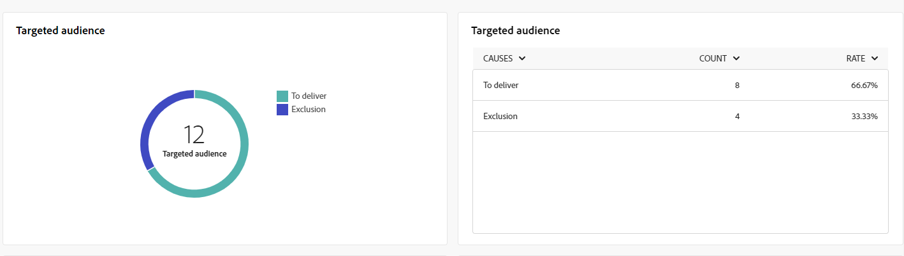

# Relatórios globais para o canal SMS {#campaign-reports-sms}

Os relatórios globais fornecem aos usuários uma visão geral abrangente das métricas de tráfego e engajamento no nível do canal.

Navegue até a **[!UICONTROL Relatórios]** no menu **[!UICONTROL Relatórios]** seção. Você pode filtrar seus dados dependendo da data do relatório, pasta ou regras. [Saiba mais](global-reports.md)

## Resumo da entrega {#delivery-summary-sms}

### Visão geral da entrega {#delivery-overview-sms}

>[!CONTEXTUALHELP]
>id="acw_sms_global_report_overview"
>title="Visão geral da entrega de SMS"
>abstract="A variável **Visão geral da entrega de SMS** Os KPIs fornecem um resumo completo do delivery de SMS, oferecendo insights detalhados e dados específicos. Ele fornece informações abrangentes sobre o desempenho, a eficácia e os resultados do seu delivery."

A variável **[!UICONTROL Visão geral da entrega]** O relatório do oferece indicadores principais de desempenho (KPIs) abrangentes que fornecem insights detalhados sobre os padrões de interação de seus visitantes com cada delivery de SMS. As métricas a seguir são descritas abaixo.

+++Saiba mais sobre Métricas de visão geral de delivery.

* **[!UICONTROL Mensagens a entregar]**: Número total de mensagens processadas durante a preparação do delivery.

* **[!UICONTROL Entregue]**: Porcentagem de mensagens enviadas com êxito em relação ao número total de mensagens enviadas.

* **[!UICONTROL Taxa de cliques]**: Porcentagem de recipients distintos que clicaram em um delivery pelo menos uma vez.

* **[!UICONTROL Erros]**: Porcentagem de erros acumulados durante o processamento de delivery e retorno automático em relação ao número total de mensagens enviadas.

+++

### Público-alvo {#delivery-summary-sms-initial-target}

>[!CONTEXTUALHELP]
>id="acw_global_reporting_sms_targeted_audience"
>title="População direcionada por SMS"
>abstract="O gráfico e a tabela para a variável **População direcionada** apresente dados relacionados ao seu público de SMS, incluindo informações sobre mensagens a serem entregues e exclusões."

A variável **[!UICONTROL Público-alvo]** A tabela e o gráfico apresentam dados relacionados aos seus recipients para cada delivery de SMS enviado. As métricas estão detalhadas abaixo.

+++Saiba mais sobre métricas de Público-alvo direcionado.

* **[!UICONTROL Público-alvo]**: Número total de recipients alvos.

* **[!UICONTROL Mensagem a ser entregue]**: Número total de mensagens a serem entregues após a preparação do delivery.

* **[!UICONTROL Exclusão]**: Número total de endereços ignorados durante a análise ao aplicar as regras: endereço em falta, em quarentena, na inclui na lista de bloqueios, etc.

+++

### Estatísticas de entrega {#delivery-summary-sms-exec-stats}

>[!CONTEXTUALHELP]
>id="acw_global_reporting_sms_delivery_stats"
>title="Estatísticas de entrega de SMS"
>abstract="A variável **Estatísticas de entrega** O relatório do fornece insights abrangentes sobre o SMS enviado, oferecendo um detalhamento de várias métricas, como taxas de sucesso, ocorrências de erros e público-alvo colocado em quarentena. Essa apresentação detalhada permite um exame completo do desempenho geral e dos resultados do processo de delivery de SMS."

A variável **[!UICONTROL Estatísticas de entrega]** A tabela detalha o sucesso de cada delivery de SMS. As métricas estão detalhadas abaixo.

+++Saiba mais sobre Estatísticas de entrega.

* **[!UICONTROL Total de mensagens]**: Número total de mensagens a serem entregues após a preparação do delivery.

* **[!UICONTROL Sucesso]**: Número de mensagens processadas com êxito em relação ao número de mensagens a serem entregues.

* **[!UICONTROL Erros / Rejeições]**: Número total de erros acumulados durante os deliveries e o processamento automático de reassociação em relação ao número de mensagens a serem entregues.

* **[!UICONTROL Novos em quarentena]**: Número total de endereços colocados em quarentena após um delivery com falha (usuário desconhecido, domínio inválido) em relação ao número de mensagens a serem entregues.

  Os tipos de erro de SMS estão listados no [Documentação do Adobe Campaign v8 (console do cliente)](https://experienceleague.adobe.com/docs/campaign/campaign-v8/send/failures/delivery-failures.html#sms-quarantines){target="_blank"}.

+++

### Causas de exclusão {#causes-exclusion}

>[!CONTEXTUALHELP]
>id="acw_global_reporting_sms_exclusions"
>title="Causas de exclusão por SMS"
>abstract="A variável **Causas de exclusão** O gráfico e a tabela ilustram os diversos motivos que impediram os perfis de usuário de receber as mensagens SMS."

A variável **[!UICONTROL Causas de exclusão]** O gráfico e a tabela exibem os motivos que impediram os perfis de usuário, que foram excluídos dos perfis direcionados, de receber seus deliveries de SMS.

Os tipos de erro estão listados no [Documentação do Adobe Campaign v8 (console do cliente)](https://experienceleague.adobe.com/docs/campaign/campaign-v8/send/failures/delivery-failures.html#email-error-types){target="_blank"}.

## Taxa de transferência de entrega {#delivery-throughput-sms}

>[!CONTEXTUALHELP]
>id="acw_global_reporting_throughput_sms"
>title="Taxa de transferência de entrega de SMS"
>abstract="A variável **Taxa de transferência de entrega** O relatório do fornece insights abrangentes sobre a eficiência do sistema de entrega de mensagens SMS, apresentando uma visão geral detalhada das taxas de sucesso e erro em um período especificado."

A variável **[!UICONTROL Taxa de transferência de entrega]** O relatório do oferece insights abrangentes sobre a eficácia do sistema de delivery de mensagens SMS, oferecendo um resumo detalhado das taxas de sucesso e erro por um período especificado.
