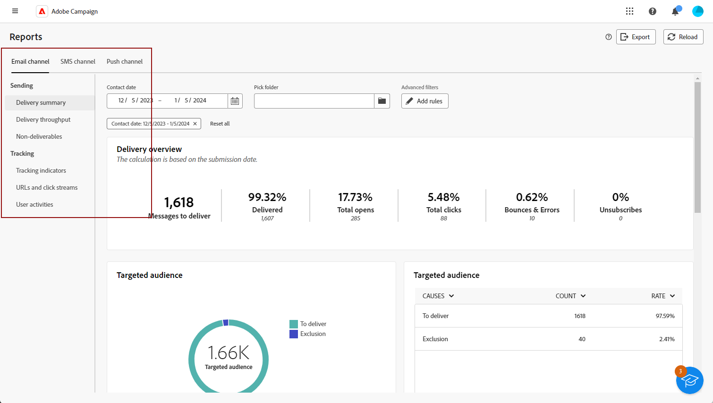

# Introdução a relatórios globais {#global-report-gs}

>[!CONTEXTUALHELP]
>id="acw_campaign_reporting_global_report"
>title="Relatório global"
>abstract="Os relatórios globais oferecem uma maneira avançada e eficiente de analisar o desempenho da sua campanha. Esses relatórios fornecem uma visualização consolidada do tráfego principal e das métricas de engajamento de cada canal da sua campanha."

Os **relatórios globais** funcionam como uma ferramenta eficiente, oferecendo um resumo geral consolidado das métricas de tráfego e engajamento para cada canal na instância do seu Campaign. Esses relatórios consistem em vários dispositivos, cada um oferecendo uma perspectiva distinta sobre sua campanha ou desempenho de entrega.

Os indicadores principais de desempenho (KPIs) são atualizados a cada hora, garantindo insights atualizados. Por padrão, os dados são filtrados para cobrir os últimos 30 dias, oferecendo uma perspectiva atual e relevante sobre as campanhas e o desempenho dos deliveries.

A lista completa de relatórios e métricas associadas para cada canal está disponível nas seguintes páginas:

* [Enviar relatórios globais por email](global-report-email.md)
* [Relatórios globais de SMS](global-report-sms.md)
* [Enviar relatórios globais](global-report-push.md)
* [Relatórios globais de correspondência direta](global-report-direct.md)

## Gerencie seu painel de relatório {#manage-reports}

Para acessar e gerenciar os relatórios globais, siga estas etapas:

1. Navegue até o menu **[!UICONTROL Relatórios]** na seção **[!UICONTROL Relatórios]**.

1. No menu esquerdo, selecione um relatório da lista e navegue pela guia para exibir dados de cada canal.

   {zoomable="yes"}

1. No painel, escolha um **Início** e **[!UICONTROL Término]** para direcionar dados específicos.

   {zoomable="yes"}

1. No campo **[!UICONTROL Separar pasta]**, selecione se deseja direcionar entregas ou campanhas de uma pasta específica.

   {zoomable="yes"}

1. Clique em **[!UICONTROL Adicionar regras]** para começar a criar consultas para filtrar melhor os dados de relatórios. [Saiba como usar o modelador de consultas](../query/query-modeler-overview.md)

1. Nas **[!UICONTROL URLs e fluxos de cliques]**, você também pode escolher os **[!UICONTROL Links Mais Visitados]** ou o **[!UICONTROL Período]**.

   As opções **[!UICONTROL Exibir por]** permitem filtrar por URLs, Rótulos ou Categorias.
