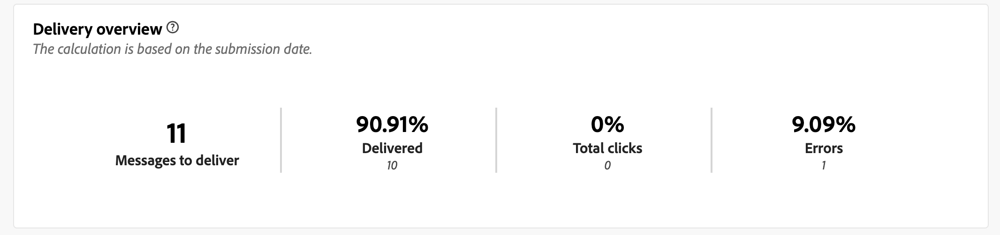

# Relatório de entrega por push {#push-report}

>[!CONTEXTUALHELP]
>id="acw_push_report_overview"
>title="Resumo do relatório de push"
>abstract="A variável **Visão geral da entrega por push** O oferece uma visão geral abrangente da entrega por push, fornecendo insights abrangentes e dados específicos. Ele fornece informações abrangentes sobre o desempenho, a eficácia e os resultados do seu delivery."

>[!CONTEXTUALHELP]
>id="acw_delivery_reporting_sending_push"
>title="Envio de relatório"
>abstract="he **Enviando** A guia no relatório fornece insights detalhados sobre as interações dos visitantes com os deliveries e quaisquer erros em potencial que possam ter encontrado."

A variável **Relatório de entrega por push** O fornece uma visão geral completa do canal de push, oferecendo insights abrangentes e dados específicos. Ele oferece informações abrangentes sobre o desempenho, a eficácia e os resultados de cada delivery.

## Resumo por push {#push-summary}

* **[!UICONTROL Visão geral da entrega]** O fornece indicadores principais de desempenho (KPIs) que fornecem informações detalhadas sobre como seus visitantes se envolvem com suas mensagens de push.

  

  +++Saiba mais sobre métricas de relatório de delivery por push.

   * **[!UICONTROL Total enviado]**: Número total de mensagens processadas durante a preparação do delivery.

   * **[!UICONTROL Entregue]**: Número de mensagens enviadas com êxito em relação ao número total de mensagens enviadas.

   * **[!UICONTROL Cliques]**: número total de recipients que interagiram com a mensagem de push.

   * **[!UICONTROL Erros]**: Número total de erros que ocorreram durante um delivery impedindo que ele fosse enviado a perfis.

+++

* **População direcionada** gráfico e tabela exibem dados relativos ao seu público-alvo:

  

  +++Saiba mais sobre métricas de relatório de delivery por push.

   * **[!UICONTROL Para entregar]**: Número total de mensagens processadas durante a preparação do delivery.

   * **[!UICONTROL Exclusões]**: Número de perfis que foram excluídos da análise.

+++

* **Estatísticas gerais** apresenta dados para as notificações por push enviadas, incluindo:

  

  +++Saiba mais sobre métricas de relatório de delivery por push.

   * **[!UICONTROL Success]**: Número de mensagens processadas com êxito.

   * **[!UICONTROL Erros]**: número total de erros que ocorreram durante o delivery, impedindo que as mensagens sejam enviadas para determinados perfis.

   * **[!UICONTROL Nova quarentena]**: Número de perfis que foram excluídos e adicionados à quarentena.

+++

* **[!UICONTROL Exclusões]** o gráfico e a tabela exibem os vários motivos que impediram os perfis de usuário, que foram excluídos dos perfis direcionados, de receber a mensagem.

  

## Taxa de transferência de delivery {#delivery-throughput}

>[!CONTEXTUALHELP]
>id="acw_delivery_reporting_throughput_push"
>title="Relatório de taxa de transferência de entrega"
>abstract="O relatório Delivery throughput apresenta informações detalhadas sobre a taxa de transferência de delivery da plataforma inteira em um período especificado."

Este relatório apresenta informações detalhadas sobre a taxa de transferência de delivery de toda a plataforma em um período especificado. A métrica primária usada para medir a velocidade de entrega de mensagens é o número de mensagens enviadas por hora.

