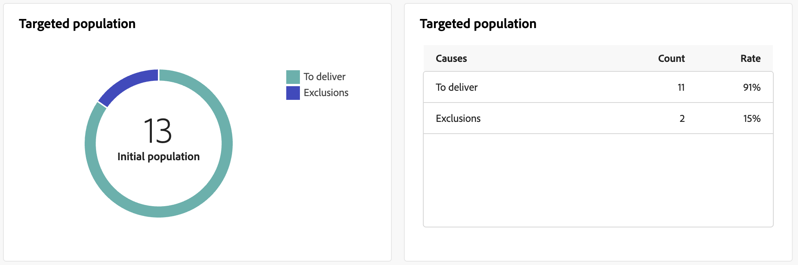

# Relatórios de entrega por push {#push-report}

>[!CONTEXTUALHELP]
>id="acw_delivery_reporting_sending_push"
>title="Envio de relatórios"
>abstract="A guia **Envio** no relatório fornece insights aprofundados sobre as interações dos visitantes com as suas entregas e os possíveis erros que possam ter encontrado."

O **Relatório de entrega por push** fornece uma visão geral completa do canal por push, oferecendo insights abrangentes e dados específicos. Ele fornece informações abrangentes sobre o desempenho, a eficácia e os resultados de cada delivery.

## Resumo por push {#push-summary}

### Visão geral da entrega {#push-delivery-overview}

>[!CONTEXTUALHELP]
>id="acw_push_report_overview"
>title="Visão geral da entrega por push"
>abstract="A **Visão geral da entrega por push** oferece uma visão geral abrangente da sua entrega por push, fornecendo insights extensos e dados específicos. Ela fornece informações abrangentes sobre o desempenho, a eficácia e os resultados da sua entrega."

O relatório **[!UICONTROL Visão geral da entrega]** fornece KPIs (indicadores-chave de desempenho) que fornecem informações detalhadas sobre como seus visitantes se envolvem com suas mensagens de push.

{zoomable="yes"}

+++Saiba mais sobre Métricas de relatório de push delivery.

* **[!UICONTROL Total enviado]**: número total de mensagens processadas durante a preparação da entrega.
* **[!UICONTROL Entregues]**: número de mensagens enviadas com êxito em relação ao número total de mensagens enviadas.
* **[!UICONTROL Cliques]**: número total de destinatários que interagiram com a mensagem de push.
* **[!UICONTROL Erros]**: Número total de erros ocorridos durante uma entrega, impedindo que ela seja enviada aos perfis.

+++

### População direcionada {#push-delivery-targeted-population}

>[!CONTEXTUALHELP]
>id="acw_delivery_reporting_push_targeted_population"
>title="População direcionada por push"
>abstract="O gráfico e tabela **População direcionada** exibem os dados relativos ao público-alvo de mensagens por push: mensagens a serem entregues e exclusões."

O gráfico e a tabela **População direcionada** exibem dados relativos ao seu público-alvo: mensagens a serem entregues e exclusões. As métricas estão detalhadas abaixo.

{zoomable="yes"}

+++Saiba mais sobre Métricas de relatório de push delivery.

* **[!UICONTROL Para entregar]**: número total de mensagens processadas durante a preparação da entrega.
* **[!UICONTROL Exclusões]**: número de perfis excluídos da análise.

+++

### Estatísticas gerais {#push-delivery-overall}

>[!CONTEXTUALHELP]
>id="acw_delivery_reporting_push_overall_stats"
>title="Estatísticas gerais de push"
>abstract="O relatório **Estatísticas gerais** apresenta dados das notificações enviadas por push: sucesso, erros e quarentenas."

O relatório **Estatísticas gerais** apresenta dados para as notificações por push enviadas: êxito, erros e quarentenas. As métricas estão detalhadas abaixo.

{zoomable="yes"}

+++Saiba mais sobre Métricas de relatório de push delivery.

* **[!UICONTROL Êxito]**: número de mensagens processadas com êxito.
* **[!UICONTROL Erros]**: Número total de erros que ocorreram durante a entrega, impedindo que as mensagens sejam enviadas para determinados perfis.
* **[!UICONTROL Nova quarentena]**: número de perfis que foram excluídos e adicionados à quarentena.

+++

### Exclusões {#push-delivery-exclusions}

>[!CONTEXTUALHELP]
>id="acw_delivery_reporting_push_exclusions"
>title="Exclusões de push"
>abstract="O gráfico e a tabela **Exclusões** exibem os vários motivos que impediram os perfis de usuário, excluídos dos perfis direcionados, de receber a mensagem."

O gráfico e a tabela **[!UICONTROL Exclusões]** exibem os vários motivos que impediram os perfis de usuário, que foram excluídos dos perfis direcionados, de receber a mensagem. As regras de exclusão são detalhadas na [documentação do Campaign v8 (console)](https://experienceleague.adobe.com/docs/campaign/campaign-v8/send/failures/delivery-failures.html?lang=pt-BR#push-error-types){_blank}.

{zoomable="yes"}

## Taxa de transferência de entrega {#delivery-throughput}

>[!CONTEXTUALHELP]
>id="acw_delivery_reporting_throughput_push"
>title="Relatório de taxa de transferência de entrega"
>abstract="O relatório de taxa de transferência de entrega apresenta informações detalhadas sobre a taxa de transferência de entrega de toda a plataforma em um período especificado."

O relatório **Taxa de transferência de entrega** apresenta informações detalhadas sobre a taxa de transferência de entrega de toda a plataforma em um período especificado. A principal métrica usada para medir a velocidade de entrega de mensagens é o número de mensagens enviadas por hora.

{zoomable="yes"}