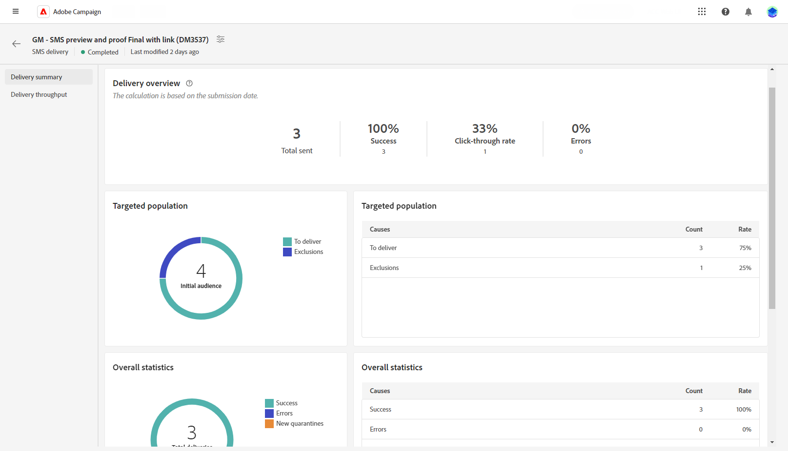

# Relatório de entrega de SMS {#report}

>[!CONTEXTUALHELP]
>id="acw_sms_report_overview"
>title="Resumo do relatório de SMS"
>abstract="Conheça as métricas de relatório para a entrega de SMS."

## Resumo da entrega {#delivery-summary}

* **[!UICONTROL Visão geral da entrega]** O fornece indicadores principais de desempenho (KPIs) que fornecem informações detalhadas sobre como os visitantes se envolvem com suas mensagens SMS. Esses KPIs incluem:

   * **[!UICONTROL Total enviado]**: Número total de mensagens processadas durante a análise de delivery.

   * **[!UICONTROL Sucesso]**: Número de mensagens enviadas com êxito em relação ao número total de mensagens enviadas.

   * **[!UICONTROL Taxa de cliques]**: Porcentagem de usuários que interagiram com links incluídos no delivery do SMS.

   * **[!UICONTROL Erros]**: Número total de erros que ocorreram durante um delivery impedindo que ele fosse enviado a perfis.

* **População direcionada** gráfico e tabela exibem dados relativos ao seu público-alvo:

   * **[!UICONTROL Para entregar]**: Número total de mensagens processadas durante a análise de delivery.

   * **[!UICONTROL Exclusões]**: Número de perfis que foram excluídos da análise.

* **Estatísticas gerais** apresenta dados para as mensagens SMS enviadas, incluindo:

   * **[!UICONTROL Success]**: Número de mensagens processadas com êxito.

   * **[!UICONTROL Erros]**: número total de erros que ocorreram durante o delivery, impedindo que as mensagens sejam enviadas para determinados perfis.

   * **[!UICONTROL Nova quarentena]**: Número de perfis que foram excluídos e adicionados à quarentena.

* **[!UICONTROL Exclusões]** o gráfico e a tabela exibem os vários motivos que impediram os perfis de usuário, que foram excluídos dos perfis direcionados, de receber a mensagem.
