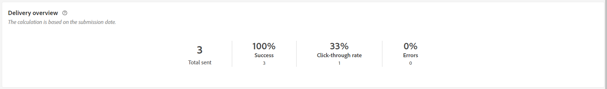

# Relatórios de entrega por SMS {#sms-report}

>[!CONTEXTUALHELP]
>id="acw_delivery_reporting_sending_sms"
>title="Envio de relatórios"
>abstract="A guia **Envio** no relatório fornece insights aprofundados sobre as interações dos visitantes com as suas entregas e os possíveis erros que possam ter encontrado."

A **Visão geral da entrega de SMS** oferece uma visão geral abrangente da sua entrega de SMS, fornecendo insights extensos e dados específicos. Ela fornece informações abrangentes sobre o desempenho, a eficácia e os resultados da sua entrega.

## Resumo da entrega {#delivery-summary}

>[!CONTEXTUALHELP]
>id="acw_sms_report_overview"
>title="Visão geral da entrega de SMS"
>abstract="A **Visão geral da entrega de SMS** oferece uma visão geral abrangente da sua entrega de SMS, fornecendo insights extensos e dados específicos. Ela fornece informações abrangentes sobre o desempenho, a eficácia e os resultados da sua entrega."

### Visão geral da entrega {#sms-delivery-overview}

A variável **[!UICONTROL Visão geral da entrega]** O relatório do fornece indicadores principais de desempenho (KPIs) que fornecem informações detalhadas sobre taxas de sucesso e erro e como seus visitantes se envolvem com mensagens SMS.

+++Saiba mais sobre métricas de relatório de delivery de SMS.

* **[!UICONTROL Total enviado]**: porcentagem e número total de mensagens processadas durante a preparação do delivery.

* **[!UICONTROL Sucesso]**: Porcentagem e número de mensagens enviadas com êxito em relação ao número total de mensagens enviadas.

* **[!UICONTROL Taxa de cliques]**: porcentagem e número de usuários que interagiram com os links incluídos no delivery do SMS.

* **[!UICONTROL Erros]**: Porcentagem e número total de erros que ocorreram durante um delivery, impedindo que ele fosse enviado a perfis.

+++

### População direcionada {#sms-delivery-targeted-population}

>[!CONTEXTUALHELP]
>id="acw_delivery_reporting_sms_targeted_population"
>title="População direcionada por SMS"
>abstract="O gráfico e a tabela **População direcionada** exibem dados relativos ao público-alvo de SMS: mensagens a serem entregues e exclusões."

A variável **População direcionada** gráfico e tabela exibem dados relativos ao seu público-alvo. As métricas estão detalhadas abaixo.

+++Saiba mais sobre métricas de relatório de delivery de SMS.

* **[!UICONTROL Para entregar]**: Número total e taxa percentual de mensagens processadas durante a preparação do delivery.

* **[!UICONTROL Exclusões]**: número e taxa de porcentagem de perfis que foram excluídos da análise.
+++

### Estatísticas gerais {#sms-delivery-overall}

>[!CONTEXTUALHELP]
>id="acw_delivery_reporting_sms_overall_stats"
>title="Estatísticas gerais de SMS"
>abstract="O relatório **Estatísticas gerais** apresenta dados dos SMS enviados: sucesso, erros e quarentenas."

A variável **Estatísticas gerais** O relatório apresenta dados para as mensagens SMS enviadas. As métricas estão detalhadas abaixo.

+++Saiba mais sobre métricas de relatório de delivery de SMS.

* **[!UICONTROL Sucesso]**: Número e taxa percentual de mensagens processadas com êxito.

* **[!UICONTROL Erros]**: número total e taxa percentual de erros que ocorreram durante o delivery, impedindo que as mensagens sejam enviadas para determinados perfis.

* **[!UICONTROL Nova quarentena]**: número e taxa percentual de perfis que foram excluídos e adicionados à quarentena.
+++

### Exclusões {#sms-delivery-exclusions}

>[!CONTEXTUALHELP]
>id="acw_delivery_reporting_sms_exclusions"
>title="Exclusões de SMS"
>abstract="O gráfico e a tabela **Exclusões** exibem os vários motivos que impediram os perfis de usuário, excluídos dos perfis direcionados, de receber a mensagem."

A variável **[!UICONTROL Exclusões]** o gráfico e a tabela exibem os motivos que impediram os perfis de usuário, que foram excluídos dos perfis direcionados, de receber a mensagem. As regras de exclusão são detalhadas na seção [Documentação do Campaign v8 (console)](https://experienceleague.adobe.com/docs/campaign/campaign-v8/send/failures/delivery-failures.html#sms-quarantines){_blank}.

## Taxa de transferência de entrega {#delivery-throughput}

>[!CONTEXTUALHELP]
>id="acw_delivery_reporting_throughput_sms"
>title="Taxa de transferência de entrega de SMS"
>abstract="O relatório **Taxa de transferência de entrega** apresenta informações detalhadas sobre a taxa de transferência da entrega em um período especificado.  A principal métrica usada para medir a velocidade de entrega de mensagens é o número de mensagens enviadas por hora."

Este relatório apresenta informações detalhadas sobre a taxa de transferência do delivery em um período especificado. A principal métrica usada para medir a velocidade de entrega de mensagens é o número de mensagens enviadas por hora.

