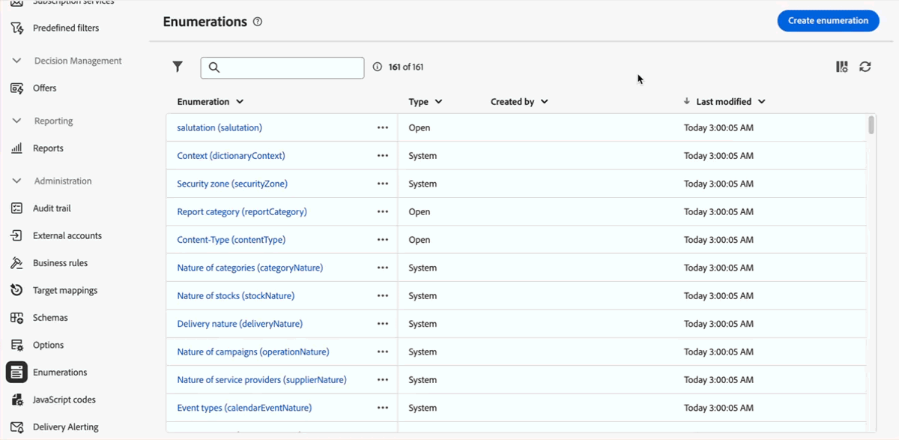

# Notas de versão de 2025 {#2025-release}

Esta página lista todas as alterações e melhorias disponíveis com as **versões de 2025**. As notas de versão mais recentes estão disponíveis [nesta página](release-notes.md).

## Versão de setembro de 2025 {#25-9-release}

_23 de setembro de 2025_

Os seguintes recursos estão disponíveis a partir da versão de setembro.

<table>
<thead>
<tr>
<th><strong>Canal personalizado para entregas de API</strong> </th>
</tr>
</thead>
<tbody>
<tr>
<td>

Agora é possível orquestrar e executar entregas com base em canais de API personalizados diretamente da interface do Adobe Campaign Web. Essas entregas podem ser autônomas ou fazer parte de um fluxo de trabalho. A configuração do canal de API personalizado é realizada no console.

Para obter mais informações, consulte a <a href="../call-center/gs-custom-channel.md">documentação detalhada</a>.

</td>
</tr>
</tbody>
</table>

<table>
<thead>
<tr>
<th><strong>Criação de conta externa</strong> </th>
</tr>
</thead>
<tbody>
<tr>
<td>

Como administrador do Campaign, agora você pode configurar novas conexões com sistemas externos à partir da interface do Campaign Web. Você também pode exibir, atualizar e gerenciar contas externas existentes.

Para obter mais informações, consulte a <a href="../administration/create-external-account.md">documentação detalhada</a>.

</td>
</tr>
</tbody>
</table>

<table>
<thead>
<tr>
<th><strong>Bloqueio de conteúdo de email</strong> </th>
</tr>
</thead>
<tbody>
<tr>
<td>

O Campaign agora permite bloquear conteúdo em modelos de email ao bloquear todo o modelo ou estruturas e componentes específicos. Isso permite evitar edições ou exclusões não intencionais, dando a você maior controle sobre a personalização do modelo e melhorando a eficiência e a confiabilidade de suas campanhas de email.

Para obter mais informações, consulte a <a href="../content/content-locking.md">documentação detalhada</a>.

</td>
</tr>
</tbody>
</table>

<!--table>
<thead>
<tr>
<th><strong>Integration with Adobe GenStudio</strong> </th>  LA? sort? Juliette
</tr>
</thead>
<tbody>
<tr>
<td>

To enhance marketing efficiency and to maintain brand consistency, you can now seamlessly integrate GenStudio for Performance Marketing experiences with Campaign. This enables you to leverage GenStudio's AI-power content creation alongside Campaign's advanced orchestration capabilities.

For more information, refer to the detailed documentation.

</td>
</tr>
</tbody>
</table-->

<!--table>
<thead>
<tr>
<th><strong>Dark mode support in the Email designer</strong> </th> -> pas sept, modifier composant... -> Juliette
</tr>
</thead>
<tbody>
<tr>
<td>

The Email Designer now offers the ability to switch to dark mode view, where you can additionally define specific custom settings. Note that the final rendering depends on the recipient's email client, and not all email clients support dark mode.

For more information, refer to the detailed documentation.

</td>
</tr>
</tbody>
</table-->

<!--table>>
<thead>
<tr>
<th><strong>Multilingual capabilities for transactional messaging and push notifications (LA)</strong> </th> 
</tr>
</thead>
<tbody>
<tr>
<td>

You can now send multiple transactional messages and push notifications in different languages in Adobe Campaign Web User Interface. The Multilingual delivery feature allows you to choose the default language of your delivery as well as the different languages in which the delivery can be sent. You can also preview these deliveries in the languages you have chosen.

Note: this capability is only available for a set of organizations (Limited Availability), and will be rolled out globally in a future release.

For more information, refer to the detailed documentation.

</td>
</tr>
</tbody>
</table-->

<!--table>
<thead>
<tr>
<th><strong>Profile enrichment in Transactional Messages (LA)</strong> </th> 
</tr>
</thead>
<tbody>
<tr>
<td>

This capability allows you to personalize transactional messages (Email, SMS, Push) by linking Adobe Campaign database fields to the message content. You can select target mappings, enrichment columns, and a reconciliation key to ensure accurate, real-time personalization while maintaining performance thresholds.

Note: this capability is only available for a set of organizations (Limited Availability), and will be rolled out globally in a future release.

For more information, refer to the detailed documentation.

</td>
</tr>
</tbody>
</table-->

<!--table>
<thead>
<tr>
<th><strong>Dynamic reporting for transactional messaging (LA)</strong> </th> 
</tr>
</thead>
<tbody>
<tr>
<td>

Note: this capability is only available for a set of organizations (Limited Availability), and will be rolled out globally in a future release.

For more information, refer to the detailed documentation.

</td>
</tr>
</tbody>
</table-->

### Aprimoramentos {#25-9-improvements}

* Um conjunto de novos operadores foi adicionado ao configurar uma condição por meio do recurso de conteúdo condicional do designer de email.
* A dimensão de filtros agora está disponível na atividade de fluxo de trabalho **Criar público-alvo**. Para exibi-lo ou alterá-lo, clique no ícone ao lado da dimensão de direcionamento. [Saiba mais](../workflows/activities/build-audience.md#build-audience-configuration).
<!--

NEO-84915 Stop button for deliveries???? ->>> met pas, juste bouton ajouté dans webUI meme comportement que console. bleu, marche, marche pas.
NEO-90345 WebUI - Extended operators for dynamic content ->>>> deja mis
NEO-88858 WebUI - Send proof from execution recurring delivery -> bug
NEO-89777 Content locking on create email template -> juliette
NEO-90365 Multi-lingual – Identify fields editable from variants???? -> fix pour SMS
query activity -> query ds workflow fitleting dimentsion 

-->

## Versão de agosto de 2025 {#25-8-release}

Esta versão traz uma série de correções de erros, incluindo:

* O processo de duplicação de perfil foi aprimorado para corresponder ao comportamento do console do cliente, garantindo uma experiência consistente em ambas as interfaces. Isso corrige um problema que podia impedir a criação de perfis duplicados.

* A opção **[!UICONTROL CCO do email]**, na tela de configuração de entrega, agora funciona com Momentum (MTA aprimorado). Anteriormente, essa função só estava disponível no console do cliente.

## Versão de julho de 2025 {#25-7-release}

### Novos recursos {#25-7-features}

Os seguintes recursos estão disponíveis a partir da versão de julho.

<!--table>
<thead>
<tr>
<th><strong>Multilingual email and SMS</strong> </th>
</tr>
</thead>
<tbody>
<tr>
<td>

You can now send multiple email and SMS deliveries in different languages in Adobe Campaign Web UI. The multilingual delivery feature allows you to choose the default language of your delivery as well as the different languages in which the delivery can be sent. You can also preview these deliveries in the languages you have chosen.

For Multilingual email, your server must be upgraded to 8.8.1 minimum. Refer to the Client Console <a href="https://experienceleague.adobe.com/docs/campaign/campaign-v8/releases/release-notes.html" target="_blank">release notes</a>.

For more information, refer to the <a href="../email/edit-content.md#multilingual-delivery">detailed documentation</a>.

</td>
</tr>
</tbody>
</table-->

<!--table>
<thead>
<tr>
<th><strong>Custom channel for API deliveries</strong> </th>
</tr>
</thead>
<tbody>
<tr>
<td>

You can now, directly from Adobe Campaign Web UI, orchestrate and execute deliveries based on custom API channels. These deliveries can be standalone or part of a workflow. The configuration of the custom API channel is performed in the console.

For more information, refer to the detailed documentation.

</td>
</tr>
</tbody>
</table-->

<table>
<thead>
<tr>
<th><strong>Compatibilidade com CSS personalizado no designer de email</strong> </th>
</tr>
</thead>
<tbody>
<tr>
<td>

Ao criar emails, agora é possível adicionar o seu próprio CSS personalizado diretamente no designer de email. Esse recurso permite aplicar estilos avançados e específicos para obter mais flexibilidade e controle sobre a aparência do conteúdo.

Para obter mais informações, consulte a <a href="../email/custom-css.md">documentação detalhada</a>.

</td>
</tr>
</tbody>
</table>

<table>
<thead>
<tr>
<th><strong>Marcas</strong> </th>
</tr>
</thead>
<tbody>
<tr>
<td>

Agora, você pode criar e personalizar as suas próprias marcas para definir claramente a sua identidade visual e verbal nas comunicações. Com a pontuação de alinhamento à marca, você pode receber feedback em tempo real sobre a conformidade do seu conteúdo em relação ao tom, ao estilo e às diretrizes da sua marca, o que ajuda a manter o alinhamento à marca em todas as mensagens enviadas.

Para obter mais informações, consulte a <a href="../content/brands.md">documentação detalhada</a>.

</td>
</tr>
</tbody>
</table>

<table>
<thead>
<tr>
<th><strong>Alerta de entrega</strong> </th>
</tr>
</thead>
<tbody>
<tr>
<td>

O recurso Alerta de entrega é um sistema de gerenciamento de alertas que permite que um grupo de usuários receba automaticamente notificações sobre a execução de suas entregas.

Para obter mais informações, consulte a <a href="../msg/delivery-alerting.md">documentação detalhada</a>.

</td>
</tr>
</tbody>
</table>

<!--table>
<thead>
<tr>
<th><strong>Landing pages improvements</strong> </th>
</tr>
</thead>
<tbody>
<tr>
<td>

The following improvements to landing pages are now available:

<ul>
    <li>You can now reference a default subscription/unsubscription landing page when configuring a service. When designing an email, if you define a link to that landing page, users submitting the landing page form are automatically subscribed to or unsubscribed from this service. <a href="../audience/manage-services.md#create-service">Read more</a></li>
    <li>A new option in the landing page configuration allows anonymous visitors to access the landing page. If you unselect this option, only identified users can access and submit the form. <a href="../landing-pages/create-lp.md#create-landing-page">Read more</a></li>
    <li>A new option in the landing page configuration allows to store additional internal data when the landing page is being submitted. <a href="../landing-pages/create-lp.md#create-landing-page">Read more</a></li>
    <li>A new option enables to use a landing page for several services, making it dynamic. When adding a link to an email, if you select a dynamic landing page, you can select any service. If you select a landing page that has a specific service associated, this service will be automatically used (you cannot select another one). <a href="../landing-pages/create-lp.md#define-actions-on-form-submission">Read more</a></li>
    <li>Conditional content is now supported in landing pages. <a href="../landing-pages/lp-content.md">Read more</a></li>
    <li>You can link a landing page to a service, and send a confirmation message when users validate it. <a href="../landing-pages/lp-content.md#lp-message">Read more</a></li>
    <li>You can add captcha to protect your landing page from spam and abuse caused by bots. This is non-intrusive for your customers since it does not require any interaction from them and is based on interactions with your site. <a href="../landing-pages/create-lp.md#captcha">Read more</a></li>
</ul>
</td>
</tr>
</tbody>
</table-->

<table>
<thead>
<tr>
<th><strong>Geração de relatórios dinâmica</strong> </th>
</tr>
</thead>
<tbody>
<tr>
<td>

Agora é possível acessar o recurso Relatórios dinâmicos, que permite gerar relatórios totalmente personalizáveis e em tempo real para medir o impacto das suas atividades de marketing. Eles adicionam acesso aos dados do perfil, permitindo análises demográficas por dimensões do perfil, como gênero, cidade e idade, além de dados funcionais de campanhas de email, como aberturas e cliques. Os relatórios dinâmicos também estão disponíveis para entregas de email e mensagens transacionais multilíngues.

Este recurso só está disponível sob demanda. Para obter acesso, entre em contato com o(a) representante da Adobe. O seu servidor precisa ser atualizado para a versão 8.8.1, no mínimo. Consulte as <a href="https://experienceleague.adobe.com/docs/campaign/campaign-v8/releases/release-notes.html?lang=pt-BR" target="_blank">notas de versão</a> do Console do cliente.

Para obter mais informações, consulte a <a href="../reporting/dynamic-reporting/get-started-reporting.md">documentação detalhada</a>.

</td>
</tr>
</tbody>
</table>

<table>
<thead>
<tr>
<th><strong>Identidade visual centralizada</strong> </th>
</tr>
</thead>
<tbody>
<tr>
<td>

Agora, os seus administradores técnicos podem definir uma ou várias marcas para centralizar os parâmetros que afetam a identidade de uma marca. Isso inclui o logotipo da marca, o domínio do URL de acesso da página de destino ou as configurações de rastreamento de mensagens. Você pode criar essas marcas e vinculá-las a mensagens ou páginas de destino. Essa configuração é gerenciada nos modelos. As opções de identidade visual estão disponíveis para todos os canais, incluindo SMS e correspondência direta.

Este recurso está disponível somente sob demanda para novas implementações. Para obter acesso, entre em contato com o(a) representante da Adobe. O seu servidor precisa ser atualizado para a versão 8.8.1, no mínimo. Consulte as <a href="https://experienceleague.adobe.com/docs/campaign/campaign-v8/releases/release-notes.html?lang=pt-BR" target="_blank">notas de versão</a> do Console do cliente.

Para obter mais informações, consulte a <a href="../administration/branding/branding-gs.md">documentação detalhada</a>.

</td>
</tr>
</tbody>
</table>

Além dos recursos listados acima, esta versão também vem com um conjunto de funcionalidades disponíveis no Console do cliente:

* [Novo conector de envio de SMS](https://experienceleague.adobe.com/docs/campaign/campaign-v8/send/sms/sms.html?lang=pt-BR) (ambientes FDA)
* [APIs REST](https://experienceleague.adobe.com/docs/campaign/campaign-v8/developer/apis/get-started-apis.html?lang=pt-BR) (sob demanda, ambientes FDA)

Consulte as [notas de versão](https://experienceleague.adobe.com/docs/campaign/campaign-v8/releases/release-notes.html?lang=pt-BR){target="_blank"} do Console do cliente.

<!--

### Features previously in Limited Availability {#25-7-limited} 

>[!AVAILABILITY]
>
>To benefit from these updates, your server must be upgrated to 8.8.1 mininum. Refer to the Client Console [release notes](https://experienceleague.adobe.com/docs/campaign/campaign-v8/releases/release-notes.html){target="_blank"}.

Previously released in Limited Availability, the following capabilities are now available to all environments (General Availability):

* **Multilingual delivery creation** - You can now send multiple email deliveries in different languages in Adobe Campaign Web User Interface. The Multilingual delivery feature allows you to choose the default language of your delivery as well as the different languages in which the delivery can be sent. You can also preview these deliveries in the languages you have chosen. [Read more](../email/edit-content.md#multilingual-delivery).

* **Visual fragments** - You can now create, use and archive content fragments. Visual fragments are pre-defined visual blocks that you can reuse across multiple email deliveries, or in content templates. [Learn more](https://experienceleague.adobe.com/docs/campaign-web/v8/content/manage-reusable-content/fragments/fragments.html){target="_blank"}

* **Delivery alerting** - The Delivery alerting feature is an alert management system that enables a group of users to automatically receive notifications containing information on the execution of their deliveries. [Read more](../msg/delivery-alerting.md)

* **Landing pages improvements** - The following improvements to landing pages are now available:

    * You can now reference a default subscription/unsubscription landing page when configuring a service. When designing an email, if you define a link to that landing page, users submitting the landing page form are automatically subscribed to or unsubscribed from this service. [Read more](../audience/manage-services.md#create-service)
    * A new option in the landing page configuration allows anonymous visitors to access the landing page. If you unselect this option, only identified users can access and submit the form. [Read more](../landing-pages/create-lp.md#create-landing-page)
    * A new option in the landing page configuration allows to store additional internal data when the landing page is being submitted. [Read more](../landing-pages/create-lp.md#create-landing-page)
    * A new option enables to use a landing page for several services, making it dynamic. When adding a link to an email, if you select a dynamic landing page, you can select any service. If you select a landing page that has a specific service associated, this service will be automatically used (you cannot select another one). [Read more](../landing-pages/create-lp.md#define-actions-on-form-submission)
    * Conditional content is now supported in landing pages. [Read more](../landing-pages/lp-content.md)
    * You can link a landing page to a service, and send a confirmation message when users validate it. [Learn more](../landing-pages/lp-content.md#lp-message)
    * You can add captcha to protect your landing page from spam and abuse caused by bots. This is non-intrusive for your customers since it does not require any interaction from them and is based on interactions with your site. [Learn more](../landing-pages/create-lp.md#captcha)

Previously released in Limited Availability, the following capabilities are now available **on demand**:

* **Dynamic Reporting** - You can now access Dynamic Reporting which provides fully customizable and real-time reports to measure the impact of your marketing activities. It adds access to profile data, enabling demographic analysis by profile dimensions such as gender, city and age in addition to functional email campaign data like opens and clicks. Dynamic reporting is also available for multilingual email deliveries and transactional messages. [Read more](../reporting/dynamic-reporting/get-started-reporting.md)

* **Centralized Branding** -  Your technical administrators can now define one or several brands to centralize the parameters that affect a brand's identity. This includes the brand logo, the domain of the landing pages' access URL, or message tracking settings. You can create these brands and link them to messages or landing pages. This configuration is managed in templates. Branding options are available for all channels, including SMS and Direct mail. [Read more](../administration/branding/branding-gs.md){target="_blank"}

    >[!NOTE]
    >
    >This feature is only available for new implementations.

In addition to the features listed above, this release also comes with a set of functionalities available in the Client Console:

* [New SMS sending connector](https://experienceleague.adobe.com/docs/campaign/campaign-v8/send/sms/sms.html) (FDA environments)
* [Rest APIs](https://experienceleague.adobe.com/docs/campaign/campaign-v8/developer/apis/get-started-apis.html) (on demand, FDA environments)

Refer to the Client Console [release notes](https://experienceleague.adobe.com/docs/campaign/campaign-v8/releases/release-notes.html){target="_blank"}.

-->

### Aprimoramentos {#25-7-improvements}

* Agora é possível calcular o público-alvo diretamente em cada condição e grupo no construtor de regras. Clique no número resultante para visualizar a lista detalhada de registros. [Saiba mais](../query/build-query.md#validate-query)

* Agora é possível editar ou excluir um filtro predefinido diretamente do construtor de regras. [Saiba mais](../get-started/predefined-filters.md#manage-predefined-filter)

* Ao configurar uma entrega de SMS, a seção **SMS** agora concede acesso aos **Parâmetros de SMPP opcionais (TLV)**. Esse parâmetro é igual ao do console do cliente. [Saiba mais](../advanced-settings/delivery-settings.md#sms-tab)

* Agora é possível habilitar notificações em segundo plano no iOS usando a nova opção **Conteúdo disponível**, encontrada na seção **Configurações avançadas** da tela de edição de conteúdo do iOS. Isso adiciona o sinalizador `content-available:1` no conteúdo `aps`. Saiba mais [nesta página](../push/content-push.md). Confira também [esta página](../push/rich-push-ios.md)

* As seguintes melhorias agora estão disponíveis na página de destino:

   * Agora você pode fazer referência a uma página de destino de assinatura/cancelamento de assinatura padrão ao configurar um serviço. Ao criar um email, se você definir um link para essa página de destino, os usuários que enviarem o formulário da página de destino automaticamente assinarão ou cancelarão a assinatura desse serviço. [Leia mais](../audience/manage-services.md#create-service)
   * Uma nova opção na configuração da página de destino permite que visitantes anônimos acessem-na. Se você desmarcar esta opção, apenas usuários identificados poderão acessar e enviar o formulário. [Leia mais](../landing-pages/create-lp.md#create-landing-page)
   * Uma nova opção na configuração da página de destino permite armazenar dados internos adicionais quando a página de destino está sendo enviada. [Leia mais](../landing-pages/create-lp.md#create-landing-page)
   * Uma nova opção permite utilizar uma página de destino para diversos serviços, tornando-a dinâmica. Ao adicionar um link a um email, se você selecionar uma página de destino dinâmica, poderá selecionar qualquer serviço. Se você selecionar uma página de destino que tenha um serviço específico associado, esse serviço será utilizado automaticamente (não será possível selecionar outro). [Leia mais](../landing-pages/create-lp.md#define-actions-on-form-submission)
   * O conteúdo condicional agora é compatível com páginas de destino. [Leia mais](../landing-pages/lp-content.md)
   * É possível vincular uma página de destino a um serviço e enviar uma mensagem de confirmação quando os usuários a validarem. [Saiba mais](../landing-pages/lp-content.md#lp-message)
   * É possível adicionar captcha para proteger a página de destino contra spam e abusos de bots. Esse mecanismo não é intrusivo para os clientes, pois não requer nenhuma interação deles e se baseia em interações com seu site. [Saiba mais](../landing-pages/create-lp.md#captcha)

## Versão de junho de 2025 {#25-6-release}

### Aprimoramentos {#25-6-improvements}

* O relatório Resumo da entrega agora está disponível para os canais Central de atendimento e Personalizado. [Saiba mais](../reporting/direct-mail.md)

* Ao configurar uma entrega de SMS, agora você tem acesso aos parâmetros de SMS específicos. Esses são os mesmos parâmetros disponíveis no Console do cliente. [Saiba mais](../advanced-settings/delivery-settings.md#sms-tab)

* Suas pastas favoritas agora aparecem na parte superior do painel esquerdo da página Explorer, o que as torna mais fáceis de acessar. [Saiba mais](../get-started/work-with-folders.md#favorite-folders)

* O Construtor de regras agora permite arrastar e soltar, possibilitando reorganizar os componentes da consulta de maneira mais eficiente. [Saiba mais](../query/build-query.md#drag-and-drop)

* A &quot;condição humana&quot; no Construtor de regras foi aprimorada. Esta é a versão escrita e em linguagem simples das regras, exibida na parte inferior da tela:

   * Os atributos agora são realçados e o esquema associado é exibido.
   * É possível clicar nesses elementos para exibir informações mais detalhadas.
   * Agora é possível copiar a condição humana usando o botão correspondente.

* O acesso às pastas “Fluxos de trabalho técnicos” e “Objetos criados automaticamente” agora é restrito para impedir a visualização. [Saiba mais](../get-started/work-with-folders.md#about-folders)

## Versão de maio de 2025 {#25-5-release}

Os seguintes recursos estão disponíveis para todos os usuários a partir da versão de maio.

<table>
<thead>
<tr>
<th><strong>Pontuação de alinhamento da marca (beta)</strong> </th>
</tr>
</thead>
<tbody>
<tr>
<td>

O recurso de pontuação de alinhamento da marca fornece um feedback claro diretamente no designer de email, ajudando a ver se o conteúdo está alinhado ao tom, estilo e diretrizes da sua marca. Esse recurso está disponível na versão beta.

Para obter mais informações, consulte a <a href="../content/brands-score.md">documentação detalhada</a>.

</td>
</tr>
</tbody>
</table>

<table>
<thead>
<tr>
<th><strong>Canal personalizado para entregas externas</strong> </th>
</tr>
</thead>
<tbody>
<tr>
<td>

Agora é possível, diretamente da interface da web do Adobe Campaign, orquestrar e executar entregas com base em canais externos personalizados. Essas entregas podem ser autônomas ou fazer parte de um fluxo de trabalho. A criação do canal externo personalizado integrado a terceiros é realizada no console.

Observação: os relatórios não estão disponíveis na interface da web para o canal personalizado. É necessário navegar até o Console do cliente para acessar os relatórios.

Para obter mais informações, consulte a <a href="../call-center/gs-custom-channel.md">documentação detalhada</a>.

</td>
</tr>
</tbody>
</table>

### Aprimoramentos {#25-5-improvements}

A tela de criação de regras de tipologia foi atualizada para facilitar a seleção do tipo de regra.

## Versão de abril de 2025 {#25-4-release}

**Data de lançamento**: 29 de abril de 2025

### Novos recursos {#25-4-features}

Os seguintes recursos estão disponíveis para todos os usuários a partir da versão de abril.

<table>
<thead>
<tr>
<th><strong>Canal da central de atendimento</strong> </th>
</tr>
</thead>
<tbody>
<tr>
<td>

O canal da central de atendimento já está disponível na interface do usuário da web do Campaign. Este canal se refere a um método de comunicação usado para gerenciar e rastrear comunicações ou interações realizadas por meio de uma central de atendimento, normalmente, chamadas telefônicas feitas por agentes para clientes ou clientes potenciais.

Observação: os relatórios não estão disponíveis na interface da web para o canal da central de atendimento. É necessário navegar até o Console do cliente para acessar os relatórios.

Para obter mais informações, consulte a <a href="../call-center/gs-call-center.md">documentação detalhada</a>.

</td>
</tr>
</tbody>
</table>

<table>
<thead>
<tr>
<th><strong>Novo construtor de regras</strong> </th>
</tr>
</thead>
<tbody>
<tr>
<td>

Um novo construtor de regras agora está disponível para ajudar você a definir condições complexas em uma interface aprimorada. Você pode alternar do construtor de regras antigo para o novo, conforme necessário.

Para obter mais informações, consulte a <a href="../query/query-modeler-overview.md">documentação detalhada</a>.

</td>
</tr>
</tbody>
</table>

<table>
<thead>
<tr>
<th><strong>Criação de conta externa</strong> </th>
</tr>
</thead>
<tbody>
<tr>
<td>

Como administrador do Campaign, agora você pode configurar novas conexões com sistemas externos por meio da interface do Campaign Web.
Você também pode exibir, atualizar e gerenciar contas externas existentes.

Para obter mais informações, consulte a <a href="../administration/external-account.md">documentação detalhada</a>.

</td>
</tr>
</tbody>
</table>

### Aprimoramentos {#25-4-improvements}

**Melhorias gerais na interface**

* A descrição do Campo, as opções “Adicionar aos favoritos” e “Distribuição de valores” para atributos de esquema agora estão mais visíveis na interface. Para obter mais informações, consulte a [documentação detalhada](../get-started/attributes.md).
* Na interface, a data e a hora agora são exibidas de acordo com o idioma principal definido nas preferências da Experience League. Esta melhoria está disponível apenas para alguns idiomas. Para ver a lista completa dos idiomas compatíveis, consulte a [documentação detalhada](https://experienceleague.adobe.com/pt-br/docs/core-services/interface/features/browser-language){target=_blank}.

<!--
ko * Built-in options are now only visible in the list of options if the **Show advanced options** toggle is activated.
ko * The typology rules creation screen has been updated to facilitate the selection of the type of rule.
-->

**Editor de email**: para aprimorar a acessibilidade na interface do Campaign Web, dois novos campos agora estão disponíveis no Designer de email: eles correspondem ao elemento `title` e ao atributo lang no elemento `html` do seu conteúdo de email. É possível definir essas configurações além do campo Pré-cabeçalho, na seção Corpo do email. Para obter mais informações, consulte a [documentação detalhada](../email/metadata.md).

<!--
**Workflow**: You can now select an existing Javascript code in workflow properties or in a Javascript activity.    
-->

**Esquemas**

* Agora é possível editar o esquema temporário de uma lista na interface do Campaign Web. Para obter mais informações, consulte a [documentação detalhada](../audience/manage-audience.md).
* Agora você pode visualizar os campos personalizados de um esquema em uma tela de amostra. Para obter mais informações, consulte a [documentação detalhada](../administration/custom-fields.md#add).
* Agora é possível mover campos personalizados na lista usando a função arrastar e soltar. Para obter mais informações, consulte a [documentação detalhada](../administration/custom-fields.md#add).

### Novos recursos em Disponibilidade limitada {#25-4-features-la}

>[!AVAILABILITY]
>
>Os seguintes recursos estão em Disponibilidade limitada (LA). Eles são restritos a clientes que migram **do Adobe Campaign Standard para o Adobe Campaign v8** e não podem ser implantados em nenhum outro ambiente. Eles exigem uma atualização do servidor do Campaign para a v8.7.4.
>
>Consulte as seguintes páginas de documentação: [Transição do Campaign Standard para o Campaign v8](../rn/acs-migration.md) e [Recursos para usuários do Campaign Standard](https://experienceleague.adobe.com/docs/experience-cloud/campaign/campaign-standard-migration-home.html?lang=pt-BR).

* **Criação de entrega multilíngue**: agora você pode enviar várias entregas de email em diferentes idiomas na Interface do Adobe Campaign Web. O recurso de entrega multilíngue permite escolher o idioma padrão da entrega, bem como os diferentes idiomas nos quais a entrega pode ser enviada. Você também pode visualizar essas entregas nos idiomas escolhidos. Para obter mais informações, consulte a [documentação detalhada](../email/edit-content.md).

* **Relatórios dinâmicos para multilíngue**: os relatórios dinâmicos agora estão disponíveis para entregas de email multilíngues. Para obter mais informações, consulte a [documentação detalhada](../reporting/global-reports.md).

* **Suporte à API REST de SMS (Disponibilidade limitada)**: a API REST de Mensagens transacionais agora está disponível para o canal de SMS. Quando email e mobilePhone estão presentes no conteúdo, você pode usar o campo “wishedChannel” para especificar o canal. Se não for fornecido, o email será usado por padrão, a menos que wishedChannel solicite explicitamente SMS. Para obter mais informações, consulte a [documentação detalhada](https://experienceleague.adobe.com/docs/campaign/campaign-v8/developer/apis/get-started-apis.html?lang=pt-BR){target=_blank}.

## Versão de fevereiro de 2025 {#25-2-release}

**Data de lançamento**: 18 de fevereiro de 2025

Os seguintes recursos e melhorias estão disponíveis a partir da versão de fevereiro.

### Recursos {#25-2-features}

<table>
<thead>
<tr>
<th><strong>Criar regras de negócios (regras de tipologia)</strong> </th>
</tr>
</thead>
<tbody>
<tr>
<td>

Agora é possível criar tipologias e regras de tipologia na interface do Adobe Campaign Web. Elas permitem controlar, filtrar e priorizar o envio de entregas. Tipologias são usadas para validar que as entregas sempre contenham componentes obrigatórios (como um link de cancelamento de assinatura ou uma linha de assunto) ou regras de filtragem para excluir grupos do seu público-alvo (como pessoas que cancelaram a assinatura, concorrentes ou clientes sem fidelização).

Para obter mais informações, consulte a <a href="../administration/typologies.md">documentação detalhada</a>.

</td>
</tr>
</tbody>
</table>

<table>
<thead>
<tr>
<th><strong>Direcionar mapeamentos</strong> </th>
</tr>
</thead>
<tbody>
<tr>
<td>

Agora é possível criar target mappings na interface do Campaign Web. Os target mappings definem como diferentes canais de entrega (email, SMS, notificações por push) se vinculam aos campos de dados de um esquema. O target mapping permite definir o público-alvo: perfis, beneficiários de contrato, operadores, assinantes, clientes potenciais etc.

Para obter mais informações, consulte a <a href="../administration/target-mappings.md">documentação detalhada</a>.

</td>
</tr>
</tbody>
</table>

<table>
<thead>
<tr>
<th><strong>Detalhes do esquema</strong> </th>
</tr>
</thead>
<tbody>
<tr>
<td>

Agora é possível acessar os detalhes de um esquema selecionando seu nome na lista. A edição de campos personalizados agora pode ser acessada pelo botão <b>Editar campos personalizados</b>, disponível nos detalhes do esquema.

Para obter mais informações, consulte a <a href="../administration/schemas.md">documentação detalhada</a>.

</td>
</tr>
</tbody>
</table>

## Versão de janeiro de 2025 {#25-1-release}

**Data de lançamento**: 5 de fevereiro de 2025

Os seguintes recursos e melhorias estão disponíveis a partir da versão de janeiro.

### Recursos {#25-1-features}

<table>
<thead>
<tr>
<th><strong>Criar e usar fragmentos visuais</strong> </th>
</tr>
</thead>
<tbody>
<tr>
<td>

Fragmentos visuais são blocos visuais predefinidos que podem ser reutilizados em várias entregas de email ou em modelos de conteúdo. Esse recurso agora está disponível para todos os clientes que estão na build 8.6.4 do servidor e posteriores.

Para obter mais informações, consulte a <a href="../content/use-visual-fragments.md">documentação detalhada</a>.

</td>
</tr>
</tbody>
</table>

<table>
<thead>
<tr>
<th><strong>Usar um sistema de terceiros para entregas</strong> </th>
</tr>
</thead>
<tbody>
<tr>
<td>

Agora, é possível definir entregas externas e modelos de entrega externa na interface do Campaign Web. Nesse modo, as mensagens são compiladas em um arquivo de saída que pode ser compartilhado com o provedor externo. Por padrão, o modo de entrega externa é usado no canal de correspondência direta.

Para obter mais informações, consulte a <a href="../msg/send-external-deliveries.md">documentação detalhada</a>.

</td>
</tr>
</tbody>
</table>

<table>
<thead>
<tr>
<th><strong>Gerenciar enumerações</strong> </th>
</tr>
</thead>
<tbody>
<tr>
<td>

Agora é possível criar enumerações diretamente por meio da interface do Adobe Campaign Web. Uma enumeração é uma lista de valores sugeridos pelo sistema para preencher campos. Enumerações permitem padronizar os valores desses campos, ajudam na entrada de dados ou podem ser usadas em consultas.

Para obter mais informações, consulte a <a href="../administration/enumerations.md">documentação detalhada</a>.

</td>
</tr>
</tbody>
</table>

<table>
<thead>
<tr>
<th><strong>Criar opções personalizadas</strong> </th>
</tr>
</thead>
<tbody>
<tr>
<td>

Agora é possível acessar as opções técnicas na interface do Adobe Campaign Web e criar suas próprias opções personalizadas para atender às suas necessidades. Isso é particularmente útil ao trabalhar com atividades de fluxo de trabalho de código JavaScript para armazenar dados intermediários.

Para obter mais informações, consulte a <a href="../administration/options.md">documentação detalhada</a>.

</td>
</tr>
</tbody>
</table>

<table>
<thead>
<tr>
<th><strong>Definir e chamar códigos JavaScript</strong> </th>
</tr>
</thead>
<tbody>
<tr>
<td>

Agora é possível criar códigos JavaScript na interface do Adobe Campaign Web. Isso permite criar funções reutilizáveis que podem ser usadas em fluxos de trabalho, de modo semelhante a uma biblioteca.

Para obter mais informações, consulte a <a href="../administration/javascript-codes.md">documentação detalhada</a>.

</td>
</tr>
</tbody>
</table>

<table>
<thead>
<tr>
<th><strong>Geração de páginas de destino com o Assistente de IA</strong> </th>
</tr>
</thead>
<tbody>
<tr>
<td>

O Assistente de IA agora está disponível para entregas de página de destino, permitindo gerar texto, imagens ou layouts de página completos.

Para obter mais informações sobre o Assistente de IA, consulte a <a href="../content/generative-full-content.md">documentação detalhada</a>.

</td>
</tr>
</tbody>
</table>

### Aprimoramentos {#25-1-improvements}

* Personalize a exibição de campos personalizados na interface:

   * Agora é possível selecionar campos personalizados adicionais para exibição na interface
   * Agora é possível definir regras para exibir campos personalizados do tipo link, como restringir valores de lista com base na entrada de outro campo
   * Agora é possível organizar os campos na interface com mais flexibilidade: os campos podem se estender por uma única coluna ou ser agrupados em subseções para melhorar a organização
   * Agora você pode definir campos específicos como somente leitura

* Filtros Recentes e Favoritos: para reutilizar rapidamente atributos usados com frequência, agora é possível adicioná-los aos favoritos. Isso garante que eles estejam prontamente acessíveis para tarefas futuras. Além dos favoritos, é possível também visualizar e usar os atributos selecionados mais recentemente.

* Contas externas: o novo tipo **[!UICONTROL Roteamento]** está disponível para seleção ao criar uma nova conta externa. Ele permite configurar uma conta externa específica para usar nas entregas externas. [Saiba mais](../administration/external-account.md#routing)
