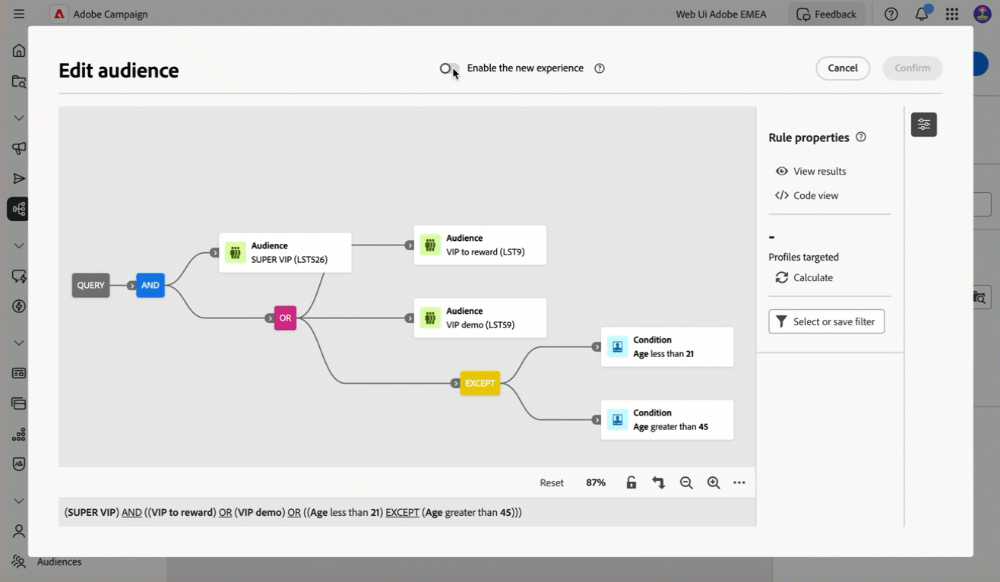

# Notas de versão {#latest-release}

>[!CONTEXTUALHELP]
>id="acw_homepage_learning_card2"
>title="Notas de versão"
>abstract="As versões da interface do usuário do Adobe Campaign Web operam em um modelo de entrega contínua que permite uma abordagem à implantação de recursos mais dimensionável e em fases. Devido a isso, as notas de versão do Campaign são atualizadas várias vezes por mês, com os recursos, melhorias e correções mais recentes. Recomendamos que você as verifique regularmente."

As versões da interface do usuário do Adobe Campaign Web operam em um modelo de entrega contínua que permite uma abordagem à implantação de recursos mais dimensionável e em fases. Devido a isso, essas notas de versão são atualizadas várias vezes por mês. Verifique-as regularmente.

As alterações e melhorias disponíveis em versões anteriores estão listadas nas versões de [2024](release-notes-24.md) e [2025](release-notes-25.md).

## Atualizações de maio de 2025 {#25-5-release}

<table>
<thead>
<tr>
<th><strong>Pontuação de alinhamento da marca (beta)</strong> </th>
</tr>
</thead>
<tbody>
<tr>
<td>

O recurso de pontuação de alinhamento da marca fornece um feedback claro diretamente no designer de email, ajudando a ver se o conteúdo está alinhado ao tom, estilo e diretrizes da sua marca. Esse recurso está disponível na versão beta.

Para obter mais informações, consulte a <a href="../content/brands-score.md">documentação detalhada</a>.

</td>
</tr>
</tbody>
</table>

## Versão de abril de 2025 {#25-4-release}

**Data de lançamento**: 29 de abril de 2025

### Novos recursos {#25-4-features}

Os seguintes recursos estão disponíveis para todos os usuários a partir da versão de abril.

<table>
<thead>
<tr>
<th><strong>Canal da central de atendimento</strong> </th>
</tr>
</thead>
<tbody>
<tr>
<td>

O canal da central de atendimento já está disponível na interface do usuário da web do Campaign. Este canal se refere a um método de comunicação usado para gerenciar e rastrear comunicações ou interações realizadas por meio de uma central de atendimento, normalmente, chamadas telefônicas feitas por agentes para clientes ou clientes potenciais.

Para obter mais informações, consulte a <a href="../call-center/gs-call-center.md">documentação detalhada</a>.

</td>
</tr>
</tbody>
</table>

<table>
<thead>
<tr>
<th><strong>Novo construtor de regras</strong> </th>
</tr>
</thead>
<tbody>
<tr>
<td>

Um novo construtor de regras agora está disponível para ajudar você a definir condições complexas em uma interface aprimorada. Você pode alternar do construtor de regras antigo para o novo, conforme necessário.

Para obter mais informações, consulte a <a href="../query/query-modeler-overview.md">documentação detalhada</a>.

</td>
</tr>
</tbody>
</table>

<table>
<thead>
<tr>
<th><strong>Criação de conta externa</strong> </th>
</tr>
</thead>
<tbody>
<tr>
<td>

Como administrador do Campaign, agora você pode configurar novas conexões com sistemas externos por meio da interface do Campaign Web.
Você também pode exibir, atualizar e gerenciar contas externas existentes.

Para obter mais informações, consulte a <a href="../administration/external-account.md">documentação detalhada</a>.

</td>
</tr>
</tbody>
</table>

### Melhorias {#25-4-improvements}

**Melhorias gerais na interface**

* A descrição do Campo, as opções “Adicionar aos favoritos” e “Distribuição de valores” para atributos de esquema agora estão mais visíveis na interface. Para obter mais informações, consulte a [documentação detalhada](../get-started/attributes.md).
* Na interface, a data e a hora agora são exibidas de acordo com o idioma principal definido nas preferências da Experience League. Esta melhoria está disponível apenas para alguns idiomas. Para ver a lista completa dos idiomas compatíveis, consulte a [documentação detalhada](https://experienceleague.adobe.com/pt-br/docs/core-services/interface/features/browser-language){target=_blank}.

<!--
ko * Built-in options are now only visible in the list of options if the **Show advanced options** toggle is activated.
ko * The typology rules creation screen has been updated to facilitate the selection of the type of rule.
-->

**Editor de email**: para aprimorar a acessibilidade na interface do Campaign Web, dois novos campos agora estão disponíveis no Designer de email: eles correspondem ao elemento `title` e ao atributo lang no elemento `html` do seu conteúdo de email. É possível definir essas configurações além do campo Pré-cabeçalho, na seção Corpo do email. Para obter mais informações, consulte a [documentação detalhada](../email/metadata.md).

<!--
**Workflow**: You can now select an existing Javascript code in workflow properties or in a Javascript activity.    
-->

**Esquemas**

* Agora é possível editar o esquema temporário de uma lista na interface do Campaign Web. Para obter mais informações, consulte a [documentação detalhada](../audience/manage-audience.md).
* Agora você pode visualizar os campos personalizados de um esquema em uma tela de amostra. Para obter mais informações, consulte a [documentação detalhada](../administration/custom-fields.md#add).
* Agora é possível mover campos personalizados na lista usando a função arrastar e soltar. Para obter mais informações, consulte a [documentação detalhada](../administration/custom-fields.md#add).

### Novos recursos em Disponibilidade limitada {#25-4-features-la}

>[!AVAILABILITY]
>
>Os seguintes recursos estão em Disponibilidade limitada (LA). Eles são restritos a clientes que migram **do Adobe Campaign Standard para o Adobe Campaign v8** e não podem ser implantados em nenhum outro ambiente. Eles exigem uma atualização do servidor do Campaign para a v8.7.4.
>
>Consulte as seguintes páginas de documentação: [Transição do Campaign Standard para o Campaign v8](../rn/acs-migration.md) e [Recursos para usuários do Campaign Standard](https://experienceleague.adobe.com/pt-br/docs/experience-cloud/campaign/campaign-standard-migration-home).

* **Criação de entrega multilíngue**: agora você pode enviar várias entregas de email em diferentes idiomas na Interface do Adobe Campaign Web. O recurso de entrega multilíngue permite escolher o idioma padrão da entrega, bem como os diferentes idiomas nos quais a entrega pode ser enviada. Você também pode visualizar essas entregas nos idiomas escolhidos. Para obter mais informações, consulte a [documentação detalhada](../email/edit-content.md).

* **Relatórios dinâmicos para multilíngue**: os relatórios dinâmicos agora estão disponíveis para entregas de email multilíngues. Para obter mais informações, consulte a [documentação detalhada](../reporting/global-reports.md).

* **Suporte à API REST de SMS (Disponibilidade limitada)**: a API REST de Mensagens transacionais agora está disponível para o canal de SMS. Quando email e mobilePhone estão presentes no conteúdo, você pode usar o campo “wishedChannel” para especificar o canal. Se não for fornecido, o email será usado por padrão, a menos que wishedChannel solicite explicitamente SMS. Para obter mais informações, consulte a [documentação detalhada](https://experienceleague.adobe.com/pt-br/docs/experience-cloud/campaign/apis/managing-transactional-messages){target=_blank}.

