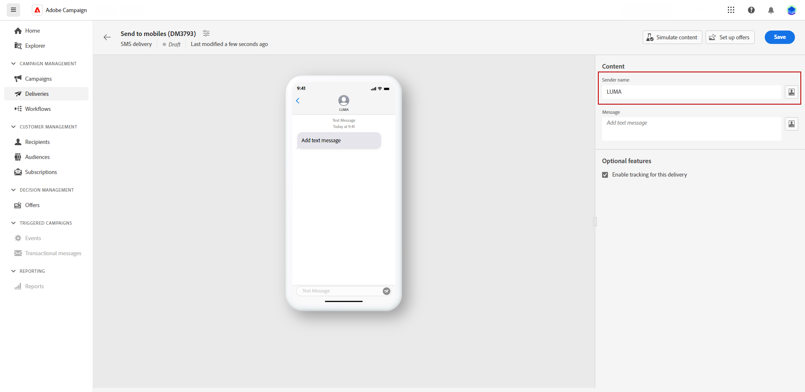

# Criar uma entrega de SMS {#design-sms}

>[!CONTEXTUALHELP]
>id="acw_deliveries_sms_content"
>title="Conteúdo de SMS"
>abstract="Crie o conteúdo das entregas de SMS e personalize-o com campos de personalização, fragmentos de expressão e conteúdo dinâmico. Para começar a redigir a mensagem, clique em **Editar conteúdo**."

>[!CONTEXTUALHELP]
>id="acw_deliveries_sms_msg"
>title="Conteúdo da mensagem de SMS"
>abstract="Defina o conteúdo do seu SMS. Para redigir a mensagem, clique no campo **Mensagem** e insira o conteúdo da mensagem. Use o Editor de expressão para adicionar dados personalizados e conteúdo dinâmico. Você também pode personalizar o nome do remetente. Por padrão, o rastreamento é habilitado para todas as entregas de SMS para que você possa medir quando os destinatários clicam em links."

Para projetar o conteúdo de um delivery de SMS, siga estas etapas:

1. Na página da entrega, clique no botão **[!UICONTROL Editar conteúdo]** para criar o conteúdo de SMS.

1. Na página **[!UICONTROL Editar conteúdo]**, personalize o nome do remetente acessando o **[!UICONTROL campo Remetente]** e inserindo o nome preferencial.

   Além disso, clique em **[!UICONTROL Abrir caixa de diálogo de personalização]** para incluir campos de personalização, fragmentos de expressão e conteúdo dinâmico na mensagem.

   {zoomable="yes"}

1. Digite sua mensagem de texto no campo **[!UICONTROL Mensagem]** ou clique na opção **[!UICONTROL Abrir caixa de diálogo de personalização]** para definir o conteúdo e adicionar conteúdo dinâmico. [Saiba mais](../personalization/gs-personalization.md)

   {zoomable="yes"}

1. Por padrão, o rastreamento está habilitado para entregas. Desabilite esta opção na **[!UICONTROL seção de recursos opcionais]**, se necessário.

1. Clique em **[!UICONTROL Configurações]** para acessar as opções avançadas relacionadas ao seu modelo de entrega. [Saiba mais](../advanced-settings/delivery-settings.md)

1. Acesse o menu **[!UICONTROL Simular conteúdo]** para visualizar seu conteúdo personalizado. [Saiba mais](send-sms.md#preview-sms)

1. Clique em **[!UICONTROL Salvar]** e verifique sua mensagem na visualização.

Revise e envie sua mensagem SMS para o público-alvo.