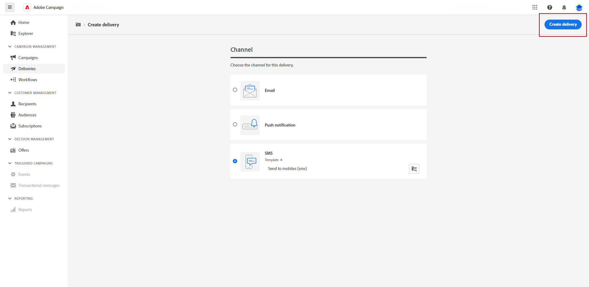

# Criar uma entrega de SMS {#create-sms}

>[!CONTEXTUALHELP]
>id="acw_deliveries_sms_properties"
>title="Propriedades de entrega de SMS"
>abstract="As propriedades abrangem os parâmetros de entrega comuns que ajudam a nomear e classificar sua entrega. Se a entrega for baseada em um schema estendido, campos de opções personalizadas específicos estarão disponíveis."

>[!CONTEXTUALHELP]
>id="acw_deliveries_sms_audience"
>title="Defina o público-alvo do SMS"
>abstract="Selecione o melhor público-alvo para a sua mensagem de SMS."

>[!CONTEXTUALHELP]
>id="acw_deliveries_sms_template_selection"
>title="Seleção de modelo de SMS"
>abstract="Selecione um modelo predefinido para iniciar a entrega de SMS."

Você pode criar um delivery de SMS independente ou criar um SMS no contexto de um workflow da campanha. As etapas abaixo detalham o procedimento para um delivery de SMS independente (único). Se estiver trabalhando no contexto de um workflow de campanha, as etapas de criação serão detalhadas em [nesta seção](../workflows/activities/channels.md#create-a-delivery-in-a-campaign-workflow).

Para criar um novo delivery de SMS independente, siga estas etapas:

1. Navegue até o **[!UICONTROL Entregas]** no painel à esquerda e clique no botão  **[!UICONTROL Criar entrega]** botão.

1. Na seção **[!UICONTROL Canal]**, escolha o canal de SMS e selecione um template. [Saiba mais sobre templates](../msg/delivery-template.md)

1. Clique no botão **[!UICONTROL Criar entrega]** para confirmar.

   

1. Insira um **[!UICONTROL Rótulo]** para a entrega e acesse o menu suspenso **[!UICONTROL Opções adicionais]**.

   +++Defina as seguintes configurações com base nos seus requisitos.
   * **[!UICONTROL Nome interno]**: atribua um identificador exclusivo à entrega.
   * **[!UICONTROL Pasta]**: armazene a entrega em uma pasta específica.
   * **[!UICONTROL Código de entrega]**: organize suas entregas usando sua própria convenção de nomeação.
   * **[!UICONTROL Descrição]**: forneça uma descrição da entrega.
   * **[!UICONTROL Natureza]**: especifique a natureza do email para fins de classificação.
+++

1. Clique no botão **[!UICONTROL Selecionar público-alvo]** para direcionar um público já existente ou criar o seu próprio. [Saiba mais](../audience/about-audiences.md).

   

1. Ative a opção **[!UICONTROL Habilitar grupo de controle]** e defina um grupo de controle para medir o impacto da entrega, permitindo comparar o comportamento da população que recebeu a mensagem com o comportamento dos contatos que não receberam. [Saiba mais](../audience/control-group.md)

1. Clique em **[!UICONTROL Editar conteúdo]** para começar a criar o conteúdo da mensagem SMS. [Saiba mais](content-sms.md)

   

   Nessa tela, também é possível [simular seu conteúdo](../preview-test/preview-test.md) e [configurar ofertas](../content/offers.md).

1. Para programar sua entrega para uma data e hora específicas, ative a opção **[!UICONTROL Habilitar agendamento]**. Depois de iniciar a entrega, a mensagem será enviada automaticamente na data e hora exatas definidas para o destinatário. Saiba mais sobre a programação de delivery em [nesta seção](../msg/gs-messages.md#gs-schedule).

1. Clique em **[!UICONTROL Definir configurações de entrega]** para acessar opções avançadas relacionadas ao seu template do delivery. [Saiba mais](../advanced-settings/delivery-settings.md)

   
