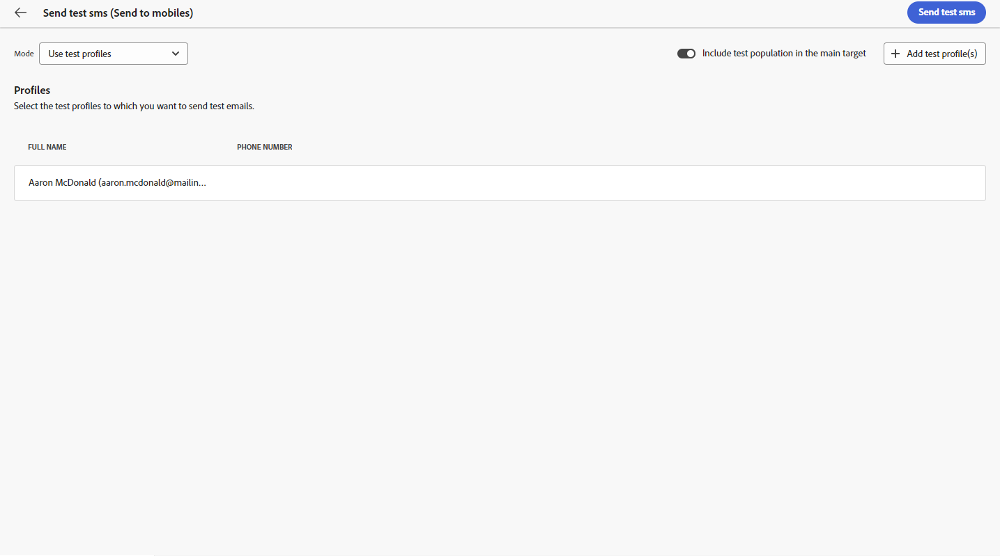

# Visualizar e enviar uma entrega de SMS {#send-sms-delivery}

>[!CONTEXTUALHELP]
>id="acw_deliveries_metrics_newquarantines"
>title="Nova métrica de quarentenas"
>abstract="Número total de endereços colocados em quarentena após falha em uma entrega (usuário desconhecido, domínio inválido) em relação ao número de mensagens a serem entregues."

## Pré-visualizar seu delivery de SMS{#preview-sms}

Depois de definir o conteúdo da mensagem, você pode utilizar perfis de teste para pré-visualizá-la e testá-la. Se você incluiu conteúdo personalizado, poderá examinar como esse conteúdo é exibido na mensagem usando os dados do perfil de teste. Isso permite garantir que a mensagem apareça conforme esperado e que qualquer informação personalizada seja apresentada corretamente.

As principais etapas para visualizar seu delivery de SMS são as seguintes. Mais detalhes sobre como visualizar deliveries estão disponíveis em [nesta seção](../preview-test/preview-content.md).

1. Na página de conteúdo do delivery, use **[!UICONTROL Simular conteúdo]** para visualizar seu conteúdo personalizado.

   

1. Clique em **[!UICONTROL Adicionar perfil(s) de teste]** para selecionar um ou vários perfis de teste ou perfis.

   <!--
    Once your test profiles are selected, click **[!UICONTROL Select]**.
    
    -->

1. No painel direito, você encontrará uma pré-visualização do delivery de SMS, em que os elementos personalizados são substituídos dinamicamente pelos dados do perfil selecionado.

   

Agora é possível revisar e enviar uma mensagem de SMS para o público-alvo.

## Testar sua entrega de SMS {#test-sms}

Com **Adobe Campaign** Além disso, você pode testar uma mensagem antes de enviá-la para o público principal, o que é uma etapa essencial na validação da campanha de email e na identificação de possíveis problemas.

O envio de SMS de teste é uma etapa importante para garantir a qualidade e a eficácia do delivery. Os recipients de teste podem revisar vários elementos, como links, links para opção de não participação e imagens, bem como identificar erros na renderização, conteúdo, configurações de personalização e configuração de SMS. Esse processo ajuda a avaliar e otimizar completamente o SMS antes de alcançar seu público principal.

 Saiba como enviar SMS de teste no [nesta seção](../preview-test/test-deliveries.md).

## Enviar a entrega de SMS {#send-sms}

1. Após personalizar o conteúdo de SMS, clique em **[!UICONTROL Revisar e enviar]** do seu **[!UICONTROL Entrega]** página.

   

1. Clique em **[!UICONTROL Preparar]** acompanhamento dos progressos e das estatísticas fornecidos.

   Se ocorrer algum erro, consulte o menu Logs para obter informações detalhadas sobre a falha.

1. Envie as mensagens clicando em **[!UICONTROL Enviar]** para continuar com o processo final de envio.

   

   Se o delivery de SMS tiver sido agendado, clique no link **[!UICONTROL Enviar conforme agendado]** botão. Saiba mais sobre a programação de delivery em [nesta seção](../msg/gs-messages.md#schedule-the-delivery-sending).

1. Confirme a ação de envio clicando no ícone **[!UICONTROL Enviar]** botão.

Depois que o delivery for enviado, você poderá rastrear os KPIs (indicadores principais de desempenho) na página do delivery e os dados na **[!UICONTROL Logs]** menu.

Agora você pode começar a medir o impacto de sua mensagem com relatórios integrados. [Saiba mais](../reporting/sms-report.md)

