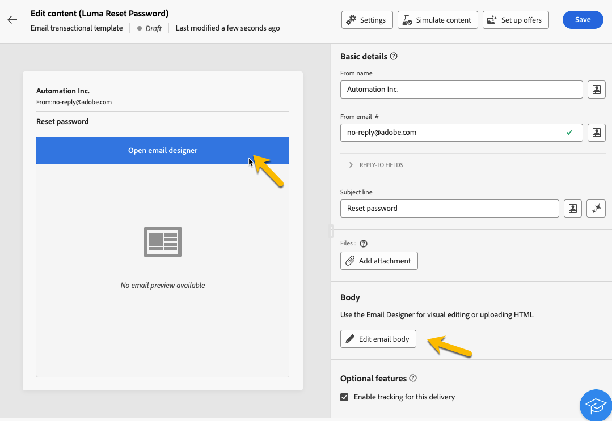
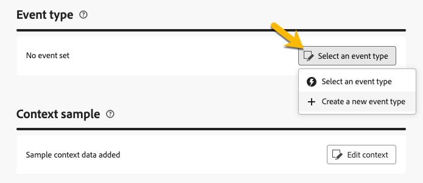

# Criar mensagens transacionais

Em mensagens transacionais, um evento aciona o envio de uma mensagem personalizada.
Para habilitar isso, você precisa criar um template de mensagem para cada tipo de evento. Esses templates contêm todas as informações necessárias para personalizar a mensagem transacional.

## Criar um modelo de mensagem transacional {#transactional-template}

Na interface do usuário da Web do Campaign, a primeira etapa na configuração de mensagens transacionais é a criação do template ou a criação direta da mensagem. Isso difere com [a configuração de mensagens transacionais no console do cliente](https://experienceleague.adobe.com/en/docs/campaign/campaign-v8/send/real-time/transactional).

Um template de mensagem transacional pode ser usado para pré-visualizar o conteúdo de delivery recebido pelo perfil antes que ele atinja o público final. Por exemplo, um administrador pode definir e configurar os templates, deixando-os prontos para uso pelos usuários de marketing.

Para criar um template de mensagem transacional, siga as etapas abaixo:

* Na seção **[!UICONTROL Mensagens acionadas]**, vá para **[!UICONTROL Mensagens transacionais]**. Na guia **[!UICONTROL Modelos]**, você pode ver todos os modelos de entrega para mensagens transacionais. Clique no botão **[!UICONTROL Criar modelo de mensagem transacional]** para começar a criação do modelo.

  {zoomable="yes"}

* Na nova página exibida, escolha o canal do modelo. Para o nosso exemplo, selecionamos o canal **[!UICONTROL Email]**. Você também pode trabalhar em outro modelo de mensagem e selecioná-lo na lista de modelos.

  {zoomable="yes"}

  Clique novamente no botão **[!UICONTROL Criar mensagem transacional]** para validar a criação do modelo no canal selecionado.

* Agora você tem acesso à configuração do seu template de mensagens transacionais.

  {zoomable="yes"}

### Propriedades de mensagem transacional {#transactional-properties}

>[!CONTEXTUALHELP]
>id="acw_transacmessages_properties"
>title="Propriedades de mensagens transacionais"
>abstract="Preencha este formulário para configurar as propriedades de mensagens transacionais"

>[!CONTEXTUALHELP]
>id="acw_transacmessages_email_properties"
>title="Propriedades de email de mensagens transacionais"
>abstract="Preencha este formulário para configurar as propriedades de email de mensagens transacionais"

>[!CONTEXTUALHELP]
>id="acw_transacmessages_sms_properties"
>title="Propriedades de SMS de mensagens transacionais"
>abstract="Preencha este formulário para configurar as propriedades de SMS de mensagens transacionais"

>[!CONTEXTUALHELP]
>id="acw_transacmessages_push_properties"
>title="Propriedades de push de mensagens transacionais"
>abstract="Preencha este formulário para configurar as propriedades de push de mensagens transacionais"

A seção **[!UICONTROL Propriedades]** de uma mensagem transacional ajudará você a configurar:

* O **[!UICONTROL Rótulo]** é o nome que é exibido na lista de mensagens transacionais. Deixar claro para pesquisa e uso futuro.
* O **[!UICONTROL Nome interno]** é um nome exclusivo que diferencia sua mensagem das outras mensagens criadas.
* A **[!UICONTROL Pasta]** é onde o modelo de mensagem transacional é criado.
* A **[!UICONTROL Pasta de execução]** é o local onde a mensagem é armazenada após a execução.
* O **[!UICONTROL Código de entrega]**: um código que ajuda a reconhecer a mensagem para relatórios, se necessário.
* A **[!UICONTROL Descrição]**
* A **[!UICONTROL Natureza]** é a natureza da sua entrega, conforme listado na enumeração *deliveryNature*. [Saiba mais sobre enumerações](https://experienceleague.adobe.com/en/docs/campaign/campaign-v8/config/configuration/ui-settings#enumerations)

{zoomable="yes"}

### Aplicativo móvel {#mobile-app}

>[!CONTEXTUALHELP]
>id="acw_transacmessages_mobileapp"
>title="Aplicativo móvel para mensagens transacionais"
>abstract="Nesta seção, você pode selecionar o aplicativo para o qual deseja enviar sua mensagem."

Nesta seção, você pode selecionar o aplicativo para o qual deseja enviar sua mensagem.

Ao clicar no ícone de pesquisa, você acessa o aplicativo móvel listado na instância do Adobe Campaign.

{zoomable="yes"}

### Amostra de contexto {#context-sample}

>[!CONTEXTUALHELP]
>id="acw_transacmessages_context"
>title="Contexto de mensagens transacionais"
>abstract="A amostra de contexto permite criar um evento de teste para visualizar a mensagem transacional recebida com a personalização do perfil."

>[!CONTEXTUALHELP]
>id="acw_transacmessages_addcontext"
>title="Contexto de mensagens transacionais"
>abstract="A amostra de contexto permite criar um evento de teste para visualizar a mensagem transacional recebida com a personalização do perfil. "

A amostra de contexto permite criar um evento de teste para visualizar a mensagem transacional recebida com a personalização do perfil.

Esta etapa é opcional. Você pode usar o template sem a amostra de contexto, mas a desvantagem é que não é possível visualizar o conteúdo personalizado.

Em nosso exemplo de configuração de senha, o evento enviará o nome, sobrenome e um link personalizado do usuário para redefinir sua senha. O contexto pode ser configurado conforme mostrado abaixo.

O conteúdo do contexto depende da personalização necessária.

{zoomable="yes"}

### Conteúdo de modelo de mensagem transacional {#transactional-content}

>[!CONTEXTUALHELP]
>id="acw_transacmessages_content"
>title="Conteúdo de mensagens transacionais"
>abstract="Saiba como criar conteúdo de mensagens transacionais"

>[!CONTEXTUALHELP]
>id="acw_transacmessages_personalization"
>title="Personalização de mensagens transacionais"
>abstract="Saiba como personalizar o conteúdo de mensagens transacionais"

>[!CONTEXTUALHELP]
>id="acw_personalization_editor_event_context"
>title="Contexto do evento"
>abstract="Esse menu fornece variáveis do evento de acionador que você pode aproveitar para personalizar o conteúdo da mensagem transacional."

Trabalhar no conteúdo de uma mensagem transacional é como criar conteúdo de um delivery. Clique em **[!UICONTROL Abrir designer de email]** ou **[!UICONTROL Editar corpo de email]** e selecione um conteúdo de modelo ou importe seu código de HTML.

{zoomable="yes"}

Para adicionar a personalização ao conteúdo, clique na seção à qual deseja adicioná-la e escolha o ícone **[!UICONTROL Adicionar Personalization]**.

{zoomable="yes"}

Você terá acesso à janela **[!UICONTROL Editar personalização]**.
Para adicionar as variáveis do evento de acionador, clique no ícone **[!UICONTROL Contexto do evento]**. Você pode navegar pelo contexto definido para o modelo ([saiba mais sobre o contexto](#context-sample)) e clicar no botão **[!UICONTROL +]** para inserir a variável necessária.

Você pode ver na imagem abaixo como adicionar a personalização do nome.

{zoomable="yes"}

No nosso exemplo, adicionamos o nome, depois o sobrenome e personalizamos o link do botão **[!UICONTROL Redefinir sua senha]**.

{zoomable="yes"}

### Pré-visualizar seu modelo

Nesse estágio da criação do template, talvez você queira pré-visualizar o conteúdo do template e verificar a personalização.

Para fazer isso, preencha a [amostra de contexto](#context-sample) e clique no botão **[!UICONTROL Simular conteúdo]**.

{zoomable="yes"}

## Criar uma mensagem transacional {#transactional-message}

Você pode criar uma mensagem transacional diretamente ou usando um template de mensagem transacional. [Saiba como criar um modelo de mensagem transacional](#transactional-template).

Para criar uma mensagem transacional, siga as etapas abaixo:

* Na seção **[!UICONTROL Mensagens acionadas]**, vá para **[!UICONTROL Mensagens transacionais]**. Na guia **[!UICONTROL Procurar]**, você pode ver todas as mensagens transacionais criadas. Clique no botão **[!UICONTROL Criar mensagem transacional]** para iniciar a criação da mensagem.

  {zoomable="yes"}

* Na nova página exibida, escolha o canal da mensagem e escolha o modelo com o qual deseja trabalhar. No nosso exemplo, escolhemos [o modelo que criamos aqui](#transactional-template).

  {zoomable="yes"}

  Clique novamente no botão **[!UICONTROL Criar mensagem transacional]** para validar a criação da mensagem no canal selecionado.

* Agora você tem acesso à configuração da mensagem transacional. Sua mensagem herda a configuração do modelo. Essa página é quase idêntica à página de configuração do template de mensagem transacional, exceto por incluir também a configuração do tipo de evento.

  {zoomable="yes"}

  Preencha a configuração da sua mensagem como para um template:
   * [As propriedades da mensagem transacional](#transactional-properties)
   * [A amostra de contexto](#context-sample)
   * [O conteúdo da mensagem](#transactional-content)
e [configure o tipo de evento](#event-type) conforme detalhado abaixo.

* Após [validar sua mensagem transacional](validate-transactional.md), clique no botão **[!UICONTROL Revisar e publicar]** para criar e publicar sua mensagem.
Os acionadores agora podem enviar por push a sua mensagem transacional.

### Sobre o tipo de evento {#event-type}

>[!CONTEXTUALHELP]
>id="acw_transacmessages_event"
>title="Evento de mensagens transacionais"
>abstract="A configuração do tipo de evento vincula a mensagem ao evento acionador."

A configuração do tipo de evento vincula a mensagem ao evento acionador.

Na interface do usuário da Web do Campaign, você pode selecionar um tipo de evento já criado ou criar diretamente seu tipo de evento nesta página de configuração.

{zoomable="yes"}

>[!CAUTION]
>
>Se você selecionar um tipo de evento que esteja sendo usado no momento por outra mensagem transacional, ela acionará as duas mensagens. Para práticas recomendadas, **recomendamos vincular UM tipo de evento a apenas UMA mensagem transacional.**

## Adicionar ofertas às suas mensagens transacionais {#transactional-offers}

Você tem a opção de incluir ofertas em suas mensagens transacionais, permitindo apresentar propostas relevantes aos usuários finais, mesmo quando a mensagem é acionada por evento.

Esse recurso é acessível durante a fase de edição de conteúdo da mensagem transacional. Basta clicar no botão **[!UICONTROL Configurar ofertas]** para configurá-lo.

O processo de configuração é idêntico à configuração de ofertas para deliveries padrão. [Saiba como adicionar ofertas à sua mensagem](../msg/offers.md).

{zoomable="yes"}
