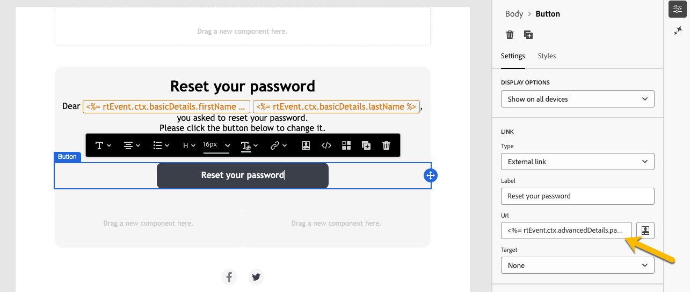

# Criar mensagens transacionais

Em mensagens transacionais, um evento aciona o envio de uma mensagem personalizada. Para ativar isso, crie um template de mensagem para cada tipo de evento. Esses templates contêm todas as informações necessárias para personalizar a mensagem transacional.

## Criar um modelo de mensagem transacional {#transactional-template}

Na interface do usuário da Web do Campaign, a primeira etapa na configuração de mensagens transacionais é a criação do template ou a criação direta da mensagem. Isso é diferente da [configuração de mensagens transacionais no console do cliente](https://experienceleague.adobe.com/pt-br/docs/campaign/campaign-v8/send/real-time/transactional).

Um template de mensagem transacional pode ser usado para pré-visualizar o conteúdo de delivery recebido pelo perfil antes que ele atinja o público final. Por exemplo, um administrador pode definir e configurar os templates, deixando-os prontos para uso pelos usuários de marketing.

Para criar um template de mensagem transacional, siga as etapas abaixo:

* Na seção **[!UICONTROL Mensagens acionadas]**, vá para **[!UICONTROL Mensagens transacionais]**. Na guia **[!UICONTROL Modelos]**, você pode ver todos os modelos de entrega para mensagens transacionais. Clique no botão **[!UICONTROL Criar modelo de mensagem transacional]** para começar a criação do modelo.

  {zoomable="yes"}

* Na nova página exibida, escolha o canal do modelo. Para este exemplo, selecione o canal **[!UICONTROL Email]**. Você também pode trabalhar em outro modelo de mensagem e selecioná-lo na lista de modelos.

  {zoomable="yes"}

  Clique novamente no botão **[!UICONTROL Criar mensagem transacional]** para validar a criação do modelo no canal selecionado.

* Acesse a configuração do seu template de mensagem transacional.

  {zoomable="yes"}

### Propriedades de mensagem transacional {#transactional-properties}

>[!CONTEXTUALHELP]
>id="acw_transacmessages_properties"
>title="Propriedades de mensagens transacionais"
>abstract="Preencha este formulário para configurar as propriedades de mensagens transacionais."

>[!CONTEXTUALHELP]
>id="acw_transacmessages_email_properties"
>title="Propriedades de email de mensagens transacionais"
>abstract="Preencha este formulário para configurar as propriedades de email de mensagens transacionais."

>[!CONTEXTUALHELP]
>id="acw_transacmessages_sms_properties"
>title="Propriedades de SMS de mensagens transacionais"
>abstract="Preencha este formulário para configurar as propriedades de SMS de mensagens transacionais."

>[!CONTEXTUALHELP]
>id="acw_transacmessages_push_properties"
>title="Propriedades de push de mensagens transacionais"
>abstract="Preencha este formulário para configurar as propriedades de push das mensagens transacionais."

A seção **[!UICONTROL Propriedades]** de uma mensagem transacional ajuda a configurar:

* O **[!UICONTROL Rótulo]**, que é o nome exibido na lista de mensagens transacionais. Deixar claro para pesquisa e uso futuro.
* O **[!UICONTROL Nome interno]**, que é um nome exclusivo que diferencia sua mensagem de outras mensagens criadas.
* A **[!UICONTROL Pasta]**, onde o modelo de mensagem transacional é criado.
* A **[!UICONTROL Pasta de execução]**, onde a mensagem é armazenada após a execução.
* O **[!UICONTROL Código de entrega]**, que é um código que ajuda a reconhecer a mensagem para relatórios, se necessário.
* A **[!UICONTROL Descrição]**.
* A **[!UICONTROL Nature]**, que é a natureza da entrega, conforme listada na enumeração *deliveryNature*. [Saiba mais sobre enumerações](https://experienceleague.adobe.com/pt-br/docs/campaign/campaign-v8/config/configuration/ui-settings#enumerations).

{zoomable="yes"}

### Aplicativo móvel {#mobile-app}

>[!CONTEXTUALHELP]
>id="acw_transacmessages_mobileapp"
>title="Aplicativo móvel para mensagens transacionais"
>abstract="Nesta seção, você pode selecionar o aplicativo para o qual deseja enviar sua mensagem."

Nesta seção, selecione o aplicativo para o qual deseja enviar a mensagem.

Ao clicar no ícone de pesquisa, acesse a lista de aplicativos móveis na instância do Adobe Campaign.

{zoomable="yes"}

### Amostra de contexto {#context-sample}

>[!CONTEXTUALHELP]
>id="acw_transacmessages_context"
>title="Contexto de mensagens transacionais"
>abstract="A amostra de contexto permite criar um evento de teste para visualizar a mensagem transacional recebida com a personalização do perfil."

>[!CONTEXTUALHELP]
>id="acw_transacmessages_addcontext"
>title="Contexto de mensagens transacionais"
>abstract="A amostra de contexto permite criar um evento de teste para visualizar a mensagem transacional recebida com a personalização do perfil."

A amostra de contexto permite criar um evento de teste para visualizar a mensagem transacional recebida com a personalização do perfil.

Esta etapa é opcional. Você pode usar o template sem a amostra de contexto, mas a desvantagem é que não é possível visualizar o conteúdo personalizado.

No exemplo de configuração de senha, o evento envia o nome, sobrenome e um link personalizado do usuário para redefinir sua senha. O contexto pode ser configurado conforme mostrado abaixo.

O conteúdo do contexto depende da personalização necessária.

{zoomable="yes"}

### Conteúdo de modelo de mensagem transacional {#transactional-content}

>[!CONTEXTUALHELP]
>id="acw_transacmessages_content"
>title="Conteúdo de mensagens transacionais"
>abstract="Saiba como criar o conteúdo de mensagens transacionais."

>[!CONTEXTUALHELP]
>id="acw_transacmessages_personalization"
>title="Personalização de mensagens transacionais"
>abstract="Saiba como personalizar o conteúdo de mensagens transacionais."

>[!CONTEXTUALHELP]
>id="acw_personalization_editor_event_context"
>title="Contexto do evento"
>abstract="Esse menu fornece variáveis do evento acionador que você pode aproveitar para personalizar o conteúdo da mensagem transacional."

Trabalhar no conteúdo de uma mensagem transacional é semelhante à criação de conteúdo de um delivery. Clique em **[!UICONTROL Abrir designer de email]** ou **[!UICONTROL Editar corpo de email]** e selecione um conteúdo de modelo ou importe seu código HTML.

{zoomable="yes"}

Para adicionar personalização ao conteúdo, clique na seção onde deseja adicioná-lo e escolha o ícone **[!UICONTROL Adicionar Personalization]**.

{zoomable="yes"}

Acesse a janela **[!UICONTROL Editar personalização]**. Para adicionar variáveis do evento de acionador, clique no ícone **[!UICONTROL Contexto do evento]**. Navegue pelo contexto definido para o modelo ([saiba mais sobre o contexto](#context-sample)) e clique no botão **[!UICONTROL +]** para inserir a variável necessária.

A imagem abaixo mostra como adicionar personalização para o nome.

{zoomable="yes"}

Neste exemplo, adicione o nome, sobrenome e personalize o link do botão **[!UICONTROL Redefinir sua senha]**.

{zoomable="yes"}

### Pré-visualizar seu modelo

Nesta fase de criação do template, visualize o conteúdo do template e verifique a personalização.

Para fazer isso, preencha a [amostra de contexto](#context-sample) e clique no botão **[!UICONTROL Simular conteúdo]**.

{zoomable="yes"}

## Criar uma mensagem transacional {#transactional-message}

Você pode criar uma mensagem transacional diretamente ou usando um template de mensagem transacional. [Saiba como criar um modelo de mensagem transacional](#transactional-template).

Para criar uma mensagem transacional, siga as etapas abaixo:

* Na seção **[!UICONTROL Mensagens acionadas]**, vá para **[!UICONTROL Mensagens transacionais]**. Na guia **[!UICONTROL Procurar]**, você pode ver todas as mensagens transacionais criadas. Clique no botão **[!UICONTROL Criar mensagem transacional]** para iniciar a criação da mensagem.

  {zoomable="yes"}

* Na nova página exibida, escolha o canal da mensagem e selecione o modelo com o qual deseja trabalhar. Neste exemplo, escolha [o modelo criado anteriormente](#transactional-template).

  {zoomable="yes"}

  Clique novamente no botão **[!UICONTROL Criar mensagem transacional]** para validar a criação da mensagem no canal selecionado.

* Acesse a configuração da sua mensagem transacional. Sua mensagem herda a configuração do modelo. Essa página é quase idêntica à página de configuração do template de mensagem transacional, exceto por incluir também a configuração do tipo de evento.

  {zoomable="yes"}

  Preencha a configuração da sua mensagem como para um template:
   * [Propriedades de mensagem transacional](#transactional-properties)
   * [Amostra de contexto](#context-sample)
   * [Conteúdo da mensagem](#transactional-content)
e [configure o tipo de evento](#event-type) conforme detalhado abaixo.

* Após [validar sua mensagem transacional](validate-transactional.md), clique no botão **[!UICONTROL Revisar e publicar]** para criar e publicar sua mensagem. Os acionadores agora podem enviar por push a sua mensagem transacional.

### Sobre o tipo de evento {#event-type}

>[!CONTEXTUALHELP]
>id="acw_transacmessages_event"
>title="Evento de mensagens transacionais"
>abstract="A configuração do tipo de evento vincula a mensagem ao evento do acionador."

A configuração do tipo de evento vincula a mensagem ao evento do acionador.

Na interface do usuário da Web do Campaign, selecione um tipo de evento já criado ou crie seu tipo de evento diretamente nesta página de configuração.

{zoomable="yes"}

>[!CAUTION]
>
>Se você selecionar um tipo de evento que esteja sendo usado no momento por outra mensagem transacional, ela acionará ambas as mensagens. Para práticas recomendadas, **vincule UM tipo de evento a apenas UMA mensagem transacional.**

## Adicionar ofertas às suas mensagens transacionais {#transactional-offers}

Você pode incluir ofertas em suas mensagens transacionais, permitindo que você apresente propostas relevantes aos usuários finais, mesmo quando a mensagem for acionada por evento.

Esse recurso é acessível durante a fase de edição de conteúdo da mensagem transacional. Clique no botão **[!UICONTROL Configurar ofertas]** para configurá-lo.

O processo de configuração é idêntico à configuração de ofertas para deliveries padrão. [Saiba como adicionar ofertas à sua mensagem](../msg/offers.md).

{zoomable="yes"}