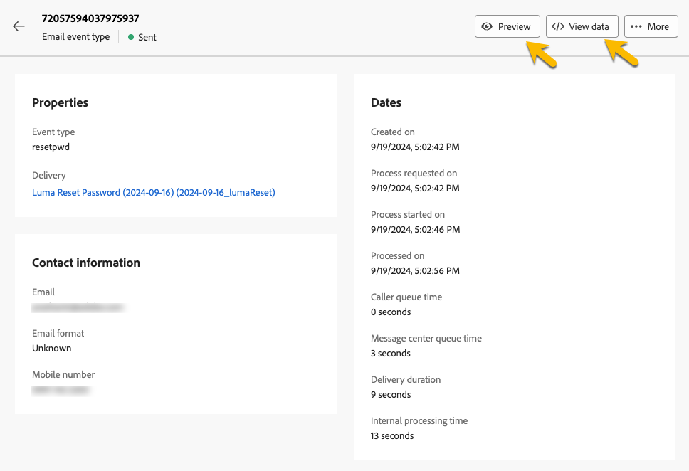

# Monitorar mensagens transacionais

Depois de publicar e enviar a mensagem transacional, você pode acessar os relatórios e logs relacionados a ela.

## Logs de mensagem transacional {#transactional-logs}

Depois que a mensagem for publicada, revise sua execução clicando no botão **[!UICONTROL Logs]**.

{zoomable="yes"}

Isso fornece acesso a logs detalhados sobre a publicação da mensagem na guia **[!UICONTROL logs]**.

{zoomable="yes"}

Além disso, exiba a lista de **[!UICONTROL Provas]** enviadas junto com seus logs na guia correspondente.

## Histórico de mensagens transacionais {#transactional-history}

Na seção **[!UICONTROL Mensagens acionadas]**, exiba detalhes sobre todas as mensagens transacionais executadas. Para acessar, navegue até **[!UICONTROL Mensagens transacionais]**. Na guia **[!UICONTROL Histórico]**, consulte a lista de mensagens transacionais executadas, juntamente com seus status e informações adicionais.

{zoomable="yes"}

Pesquise a mensagem e clique nela para exibir os detalhes.

{zoomable="yes"}

## Histórico de eventos {#event-history}

>[!CONTEXTUALHELP]
>id="acw_transacmessages_eventhistory"
>title="Histórico de eventos de mensagens transacionais"
>abstract="Você pode exibir os eventos que acionam a mensagem transacional."

>[!CONTEXTUALHELP]
>id="acw_transacmessages_eventhistory_preview"
>title="Visualização do histórico de eventos de mensagens transacionais"
>abstract="Você pode exibir os eventos que acionam a mensagem transacional."

Você pode exibir os eventos que acionam a mensagem transacional. Para acessá-las, vá para a seção **[!UICONTROL Histórico de eventos]**.

Os eventos são exibidos com o nome do tipo de evento.

{zoomable="yes"}

Clique na ID do **[!UICONTROL Evento]** para obter mais detalhes, incluindo:

* As informações de contato
* Informações sobre as datas do processo

Visualize a mensagem enviada usando o botão **[!UICONTROL Visualizar]** e os dados recebidos que acionaram a mensagem usando o botão **[!UICONTROL Exibir dados]**.

{zoomable="yes"}

O botão **[!UICONTROL Mais]** permite excluir o histórico de eventos.