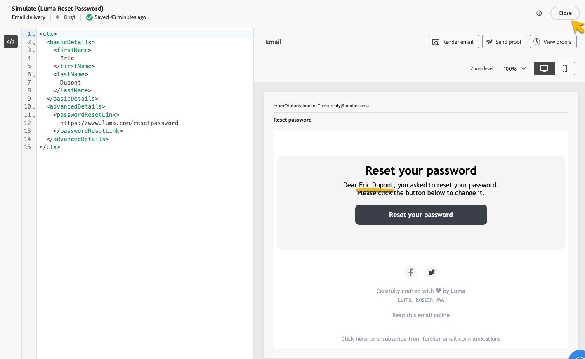

# Validar mensagens transacionais

Durante ou depois de criar a mensagem transacional, talvez você queira validar o conteúdo usando uma amostra de dados.

## Simular conteúdo {#simulate-content}

Siga estas etapas para simular o conteúdo da mensagem:

* Verifique se o caminho de personalização no conteúdo da mensagem corresponde à sua amostra de contexto. No exemplo abaixo, para exibir o nome do perfil de teste, usamos o caminho *rtEvent.ctx.basicDetails.firstName*

  Você pode alterar o conteúdo da mensagem ou da amostra de contexto para alinhá-los.

  {zoomable="yes"}

* Clique no botão **[!UICONTROL Simular conteúdo]** para visualizar sua mensagem transacional com os dados inseridos na amostra de contexto.

  {zoomable="yes"}

  Após verificar seu conteúdo, clique no botão **[!UICONTROL Fechar]**.

* Não se esqueça de clicar no botão **[!UICONTROL Republicar]** se você tiver feito alterações no conteúdo.

## Enviar prova

Se quiser testar e experimentar a mensagem transacional como ela seria entregue pelo canal escolhido (como email, SMS ou notificação por push), você pode usar o recurso de prova.

Na [janela de conteúdo da simulação](#simulate-content), clique no botão **[!UICONTROL Enviar prova]**.

{zoomable="yes"}

Na nova janela exibida, digite o endereço de email (ou número de telefone, dependendo do canal) onde deseja receber a prova. Depois de inserir o endereço desejado, clique nos botões **[!UICONTROL Enviar prova]** e **[!UICONTROL Confirmar]**. Essa ação permite enviar uma amostra da mensagem transacional, garantindo que todas as personalizações, o conteúdo dinâmico e a formatação sejam exibidos corretamente para os usuários finais.

{zoomable="yes"}

Essa é uma etapa essencial para identificar possíveis problemas antes de publicar sua mensagem transacional.
