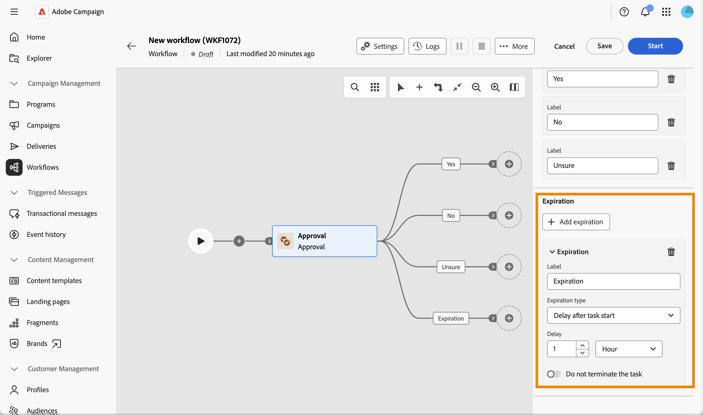

# Aprovação {#approval}

>[!CONTEXTUALHELP]
>id="acw_orchestration_approval"
>title="Atividade de aprovação"
>abstract="A atividade **Approval** requer a participação de um operador. Atribua a tarefa a um grupo ou operador individual, personalize o título da notificação e a mensagem e defina as respostas possíveis como ramificações de saída."

A atividade de fluxo de trabalho **Aprovação** permite atribuir uma tarefa a um grupo ou a um operador individual, personalizar o título e a mensagem do email de notificação e definir as respostas possíveis (por exemplo, Sim/Não) como ramificações de saída.

Use esta atividade sempre que uma etapa do fluxo de trabalho exigir uma decisão humana antes de continuar, por exemplo, para obter aprovação em um orçamento, um público-alvo ou conteúdo, antes que o fluxo de trabalho continue.

## Como funciona o processo de aprovação {#process}

Ela requer a participação de pelo menos um operador. Essa atividade não bloqueia o fluxo de trabalho: outras tarefas podem ser executadas enquanto o fluxo de trabalho aguarda uma resposta.

Enquanto aguarda uma resposta, a atividade é mostrada como pendente na tela. O destinatário responde usando o link incluído na mensagem de notificação.

Este é o processo da tarefa de aprovação:

1. Crie um fluxo de trabalho e configure uma atividade **Approval**.
1. Inicie o fluxo de trabalho. Quando atinge a atividade **Aprovação**, uma tarefa é criada para o destinatário.
1. O destinatário recebe a mensagem de notificação, clica no link e seleciona uma resposta.
1. Depois que o destinatário responder, o fluxo de trabalho continuará pela transição correspondente à resposta.

Para configurar essa atividade, siga estas etapas:

1. Atribuir a tarefa, [leia mais](#assignment)
1. Definir a mensagem de notificação, [leia mais](#message)
1. Defina as respostas possíveis, [leia mais](#answers)
1. Opcionalmente, defina uma expiração, [leia mais](#expiration)

## Atribuir a tarefa {#assignment}

Atribuir a tarefa a um grupo ou operador é obrigatório: um aviso é exibido até que você o faça.

{zoomable="yes"}

Siga estas etapas:

1. No campo **[!UICONTROL Tipo de atribuição]**, escolha se a tarefa é atribuída a um **[!UICONTROL Grupo]** (padrão) ou a um **[!UICONTROL Operador]**.

1. Em seguida, selecione o **[!UICONTROL Grupo]** (de operadores) ou um **[!UICONTROL Operador]** (operador único).

1. Habilite **[!UICONTROL Aprovação múltipla]** se quiser que cada destinatário responda antes que o fluxo de trabalho continue. Essa opção está disponível independentemente do tipo de atribuição. Quando desativado, o fluxo de trabalho continua assim que qualquer destinatário responde e essa resposta é a única levada em conta.

1. Clique em **[!UICONTROL Parâmetros avançados]** para selecionar o modelo de entrega usado para a notificação. Por padrão, um template incorporado é usado, mas é possível selecionar qualquer outro template do delivery.

   {zoomable="yes"}

## Definir a mensagem de notificação {#message}

Agora você pode definir a mensagem de notificação enviada ao destinatário.

{zoomable="yes"}

Siga estas etapas:

1. Defina o **[!UICONTROL Título]** da notificação enviada ao destinatário.

1. Defina a **[!UICONTROL Mensagem]** da notificação enviada ao destinatário.

Ambos os campos oferecem suporte à personalização: clique no ícone de personalização para inserir variáveis de evento, como o **[!UICONTROL Operador que respondeu]** e a **[!UICONTROL Resposta]**, que você pode reutilizar em outro lugar do seu fluxo de trabalho.

{zoomable="yes"}

## Definir as respostas possíveis {#answers}

A atividade vem com duas respostas padrão, **[!UICONTROL Sim]** e **[!UICONTROL Não]**. Cada resposta corresponde a uma transição de saída na tela.

{zoomable="yes"}

Clique em **[!UICONTROL Adicionar resposta]** para definir opções adicionais.

Quando o destinatário responde, o fluxo de trabalho continua pela transição correspondente à escolha.

## Definir uma expiração {#expiration}

Por fim, é possível definir uma expiração para a tarefa de aprovação. Como uma resposta, uma expiração aciona sua própria transição de saída se o destinatário não tiver respondido até o prazo.

{zoomable="yes"}

1. Clique em **[!UICONTROL Adicionar expiração]**.

1. Defina um **[!UICONTROL Rótulo]** para a transição de saída correspondente.

1. No menu suspenso **[!UICONTROL Tipo de expiração]**, escolha uma das seguintes opções:

   * **[!UICONTROL Atraso após o início da tarefa]**: defina um atraso para aguardar após o início da tarefa de aprovação.
   * **[!UICONTROL Atraso após uma data]**: defina um atraso para aguardar após uma data específica.
   * **[!UICONTROL Atraso antes de uma data]**: defina um atraso a ser aguardado antes de uma data específica.
   * **[!UICONTROL Expiração calculada pelo script]**: use um script para calcular a expiração.

1. Habilite **[!UICONTROL Não encerrar a tarefa]** se desejar que a transição de expiração seja ativada sem finalizar a tarefa de aprovação, de modo que o destinatário ainda possa responder depois.

É possível definir várias expirações para a mesma tarefa de aprovação.

Em seguida, você pode iniciar o workflow. Depois que o destinatário responder, o fluxo de trabalho continuará pela transição correspondente à resposta. [Leia mais](#process)

## Tópicos relacionados {#related}

* [Sobre atividades de fluxo de trabalho](about-activities.md)
* [Configurar e gerenciar o processo de aprovação](../../campaigns/campaign-approvals.md)
