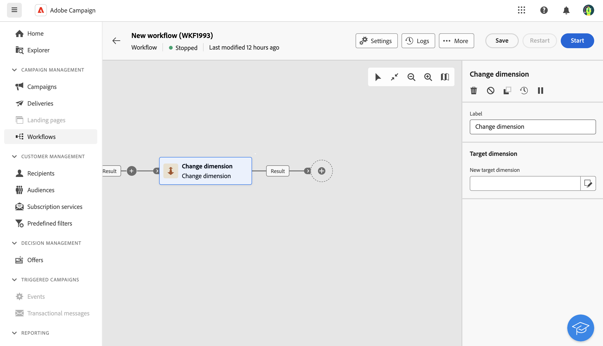

# Mudar dimensão {#change-dimension}

>[!CONTEXTUALHELP]
>id="acw_orchestration_dimension_complement"
>title="Gerar um complemento"
>abstract="Você pode gerar uma transição de saída adicional com a população restante, que foi excluída como uma duplicata. Para fazer isso, ative a opção **Gerar complemento**"

>[!CONTEXTUALHELP]
>id="acw_orchestration_change_dimension"
>title="Alterar atividade da dimensão"
>abstract="Essa atividade permite alterar o targeting dimension à medida que você constrói um público-alvo. Ele desloca o eixo dependendo do template de dados e da dimensão de entrada. Por exemplo, você pode alternar da dimensão &quot;contratos&quot; para a dimensão &quot;clientes&quot;."

A variável **Alterar dimensão** a atividade é um **Direcionamento** atividade. Essa atividade permite alterar o targeting dimension à medida que você constrói seu fluxo de trabalho.
Essa atividade altera o eixo dependendo do template de dados e da dimensão de entrada.

Por exemplo, você pode alternar o targeting dimension de um workflow de &quot;Recipients&quot; para &quot;Aplicativo de assinantes&quot; para enviar notificações por push aos recipients direcionados.

## Configurar a atividade Change dimension {#configure}

Siga estas etapas para configurar o **Alterar dimensão** atividade:

1. Adicionar um **Alterar dimensão** atividade ao seu fluxo de trabalho.

   

1. Defina o **Nova dimensão de destino**. Durante a alteração de dimensão, todos os registros são mantidos. Outras opções ainda não estão disponíveis.

1. Execute o workflow para visualizar o resultado. Compare os dados nas tabelas antes e depois da atividade de alteração de dimensão e compare a estrutura das tabelas do workflow.

## Exemplo {#example}

Neste exemplo, queremos enviar um delivery de SMS para todos os perfis que fizeram uma compra. Para fazer isso, primeiro usamos um **[!UICONTROL Criar público-alvo]** atividade vinculada a uma dimensão de direcionamento &quot;Compra&quot; personalizada para direcionar todas as compras que ocorreram.

Em seguida, usamos um **[!UICONTROL Alterar dimensão]** atividade para alternar a targeting dimension do workflow para &quot;Recipients&quot;. Isso nos permite direcionar os recipients que correspondem ao query.

