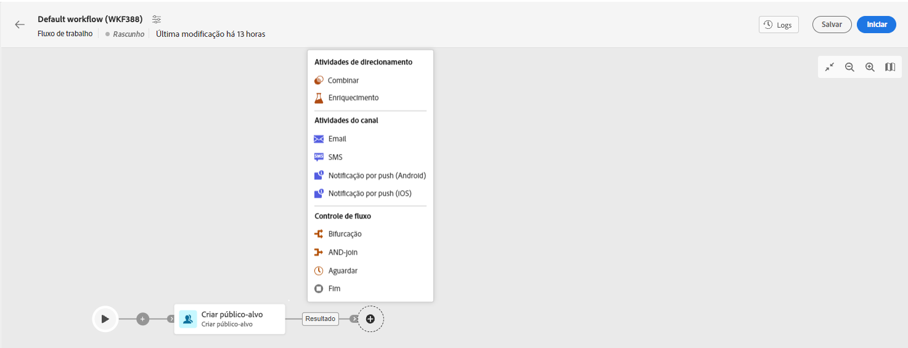

# Atividades de email, SMS, Push, Correspondência direta {#channel}

O Adobe Campaign Web permite automatizar e executar campanhas de marketing em canais de email, SMS, correspondência direta e push. Você pode combinar atividades do canal na tela do fluxo de trabalho para criar fluxos de trabalho entre canais que podem iniciar ações com base no comportamento e nos dados do cliente.

Por exemplo, você pode criar uma campanha de email de boas-vindas que inclui uma série de mensagens em diferentes canais, como email, SMS, push e correspondência direta. Também é possível enviar um email de acompanhamento depois que alguém concluir uma compra ou enviar uma mensagem de aniversário personalizada para um cliente por SMS.

Usando atividades do canal, você pode criar campanhas abrangentes e personalizadas que envolvem clientes em vários pontos de contato e impulsionam conversões.

>[!NOTE]
>
>Também é possível criar um delivery de uma só vez, fora do contexto de um fluxo de trabalho da campanha. Saiba mais nestas seções:
>* [Criar entrega de email independente](../../email/create-email.md)
>* [Criar entrega de SMS independente](../../sms/create-sms.md)
>* [Criar entrega por push autônoma](../../push/create-push.md)
>* [Criar entrega autônoma de correspondência direta](../../direct-mail/create-direct-mail.md)

## Pré-requisitos {#channel-activity-prereq}

Comece a criar seu workflow com as atividades relevantes:

* Antes de inserir uma atividade de canal, é necessário definir o público-alvo. O público-alvo é o principal alvo do delivery: os perfis que recebem as mensagens. Ao enviar mensagens no contexto de um workflow de campanha, o público-alvo da mensagem não é definido na atividade de canal, mas em uma atividade dedicada, como:

   * Uma atividade **Build audience**. [Saiba mais](build-audience.md).

     

   * Uma atividade **Load file** seguida de uma atividade **Reconciliation**. [Saiba mais](load-file.md).

     

* Para enviar uma entrega recorrente, inicie o fluxo de trabalho com uma atividade **Scheduler**. Você também pode usar uma atividade **Scheduler** para entregas únicas e únicas para definir a data de contato para essa entrega. Essa data de contato também pode ser definida nas configurações de delivery. Consulte [esta seção](scheduler.md).

## Configurar a atividade Canal {#create-a-delivery-in-a-workflow}

>[!CONTEXTUALHELP]
>id="acw_orchestration_email"
>title="Atividade Email"
>abstract="A atividade Email facilita o envio de emails dentro do fluxo de trabalho, permitindo mensagens recorrentes e únicas. Ela serve para automatizar o processo de envio de emails para um público-alvo calculado dentro do mesmo fluxo de trabalho. Você pode combinar atividades do canal na tela do fluxo de trabalho para criar fluxos de trabalho entre canais que podem iniciar ações com base no comportamento e nos dados do cliente."

>[!CONTEXTUALHELP]
>id="acw_orchestration_sms"
>title="Atividade de SMS"
>abstract="A atividade SMS facilita o envio de mensagens SMS no fluxo de trabalho, permitindo mensagens únicas e recorrentes. Ela serve para automatizar o processo de envio de SMS para um público-alvo calculado dentro do mesmo fluxo de trabalho. Você pode combinar atividades do canal na tela do fluxo de trabalho para criar fluxos de trabalho entre canais que podem iniciar ações com base no comportamento e nos dados do cliente."

>[!CONTEXTUALHELP]
>id="acw_orchestration_push_ios"
>title="Atividade push para iOS"
>abstract="A atividade Push para iOS simplifica o processo de envio de notificações por push para iOS como parte do fluxo de trabalho. Ela permite a entrega de mensagens únicas e recorrentes, automatizando o envio de notificações por push para iOS para um público-alvo predefinido no mesmo fluxo de trabalho. Você pode combinar atividades do canal na tela do fluxo de trabalho para criar fluxos de trabalho entre canais que podem iniciar ações com base no comportamento e nos dados do cliente."

>[!CONTEXTUALHELP]
>id="acw_orchestration_push_android"
>title="Atividade push para Android"
>abstract="A atividade Push para Android simplifica o processo de envio de notificações por push para Android como parte do fluxo de trabalho. Ela permite a entrega de mensagens únicas e recorrentes, automatizando o envio de notificações por push para Android para um público-alvo predefinido no mesmo fluxo de trabalho. Você pode combinar atividades do canal na tela do fluxo de trabalho para criar fluxos de trabalho entre canais que podem iniciar ações com base no comportamento e nos dados do cliente."

>[!CONTEXTUALHELP]
>id="acw_orchestration_directmail"
>title="Atividade Correspondência direta"
>abstract="A atividade Correspondência direta facilita o envio de correspondência direta no seu fluxo de trabalho, permitindo mensagens individuais e recorrentes. Ela serve para automatizar o processo de geração do arquivo de extração exigido pelos provedores de correspondência direta. Você pode combinar atividades do canal na tela do fluxo de trabalho para criar fluxos de trabalho entre canais que podem iniciar ações com base no comportamento e nos dados do cliente."

Para configurar um delivery no contexto de um workflow, siga as etapas abaixo:

1. Adicione uma atividade de canal: **[!UICONTROL Email]**, **[!UICONTROL SMS]**, **[!UICONTROL Notificação por push (Android)]**, **[!UICONTROL Notificação por push (iOS)]** ou **[!UICONTROL Correspondência direta]**.

1. Selecione o **Tipo de entrega**: única ou recorrente.

   * Uma **Entrega única** é uma entrega única, enviada apenas uma vez, por exemplo, um email Black Friday.
   * Uma **entrega recorrente** é enviada várias vezes com base em sua frequência de execução definida em uma [atividade do agendador](scheduler.md). Cada vez que o fluxo de trabalho é executado, o público-alvo é recalculado e o delivery é enviado ao público-alvo atualizado, com o conteúdo atualizado. Pode ser um informativo semanal ou um email de aniversário recorrente, por exemplo.

1. Selecione um **Modelo** da entrega. Os modelos são configurações de entrega pré-definidas, específicas para um canal. Um modelo integrado está disponível para cada canal e é preenchido previamente por padrão. [Saiba mais](../../msg/delivery-template.md)

   

   Você pode selecionar o modelo no painel esquerdo da configuração de atividade do canal. Se o público-alvo selecionado anteriormente não for compatível com o canal, não será possível selecionar um modelo. Para resolver isso, atualize a atividade **Criar público-alvo** para selecionar um público-alvo com o target mapping correto. Saiba mais sobre target mappings em [esta seção](../../audience/targeting-dimensions.md)

1. Clique em **Criar entrega**. Você pode então definir as configurações de mensagem e o conteúdo da mesma maneira que cria um delivery independente. Também é possível testar e simular o conteúdo. [Saiba mais](../../msg/gs-messages.md)

1. Volte para o fluxo de trabalho. Para continuar o fluxo de trabalho, alterne a opção **Generate an outbound transition** para adicionar uma transição após a atividade do canal.

1. Clique em **Iniciar** para iniciar o fluxo de trabalho.

   Por padrão, iniciar um fluxo de trabalho aciona a etapa de preparação da mensagem, sem enviar imediatamente a mensagem.

1. Abra a atividade do canal para confirmar o envio com o botão **Revisar e enviar**.

1. No painel de entrega, clique em **Enviar**.

## Exemplos {#cross-channel-workflow-sample}

Este é um exemplo de fluxo de trabalho entre canais com uma segmentação e duas entregas. O fluxo de trabalho tem como público-alvo todos os clientes que vivem em Paris e que estão interessados em máquinas de café. Entre essa população, um email é enviado aos clientes regulares e um SMS é enviado aos clientes VIP.

<!--
description, which use case you can perform (common other activities that you can link before of after the activity)

how to add and configure the activity

example of a configured activity within a workflow
The Email delivery activity allows you to configure the sending an email in a workflow. 

-->

Você também pode criar um fluxo de trabalho recorrente para enviar um SMS personalizado todos os primeiros dias do mês às 20h para todos os clientes que moram em Paris.

<!-- Scheduled emails available?

This can be a single send email and sent just once, or it can be a recurring email.
* Single send emails are standard emails, sent once.
* Recurring emails allow you to send the same email multiple times to different targets over a defined period. You can aggregate the deliveries per period in order to get reports that correspond to your needs.

When linked to a scheduler, you can define recurring emails.
Email recipients are defined upstream of the activity in the same workflow, via an Audience targeting activity.

-->

<!--The message preparation is triggered according to the workflow execution parameters. From the message dashboard, you can select whether to request or not a manual confirmation to send the message (required by default). You can start the workflow manually or place a scheduler activity in the workflow to automate execution.-->
