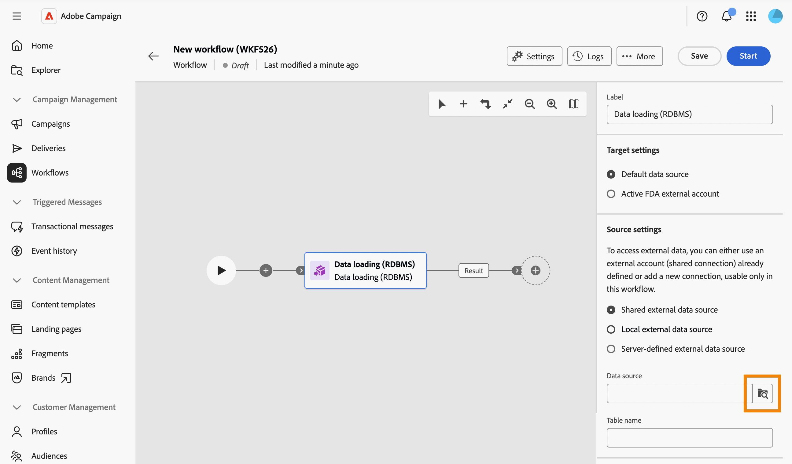
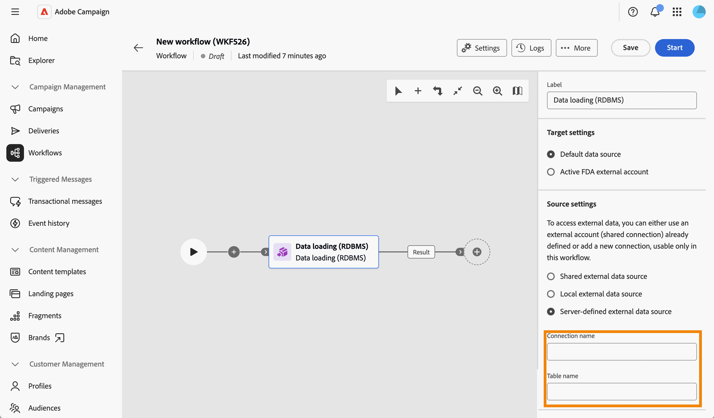
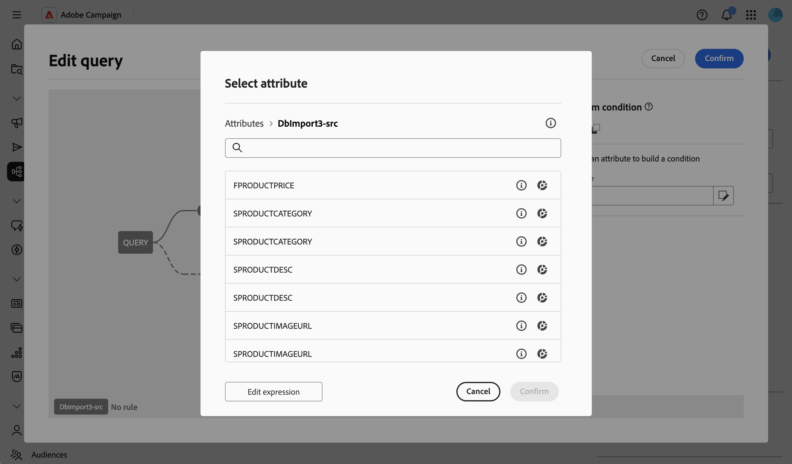

# Carregamento de dados (RDBMS) {#data-loading-rdbms}

>[!CONTEXTUALHELP]
>id="acw_orchestration_data_loading_rdbms"
>title="Atividade de carregamento de dados (RDBMS)"
>abstract="A atividade de **carregamento de dados (RDBMS)** é uma atividade de **gerenciamento de dados**. Use essa atividade para carregar dados diretamente de um banco de dados relacional externo em seu fluxo de trabalho. Os dados extraídos estão disponíveis em todo o fluxo de trabalho e podem ser usados para direcionamento, enriquecimento ou processamento de dados adicional."

A atividade de **carregamento de dados (RDBMS)** é uma atividade de **gerenciamento de dados**. Use essa atividade para carregar dados diretamente de um banco de dados relacional externo em seu fluxo de trabalho. Os dados extraídos estão disponíveis em todo o fluxo de trabalho e podem ser usados para direcionamento, enriquecimento ou processamento de dados adicional.

<!--
This activity relies on the [Federated Data Access (FDA)](https://experienceleague.adobe.com/docs/campaign/campaign-v8/connect/fda.html){target="_blank"} option, which lets Adobe Campaign process information stored in one or more external databases without changing the structure of the Adobe Campaign data.
-->

>[!NOTE]
>
>Para melhorar o desempenho, considere usar uma atividade **[!UICONTROL Criar público-alvo]** (tipo de consulta) com dados externos, quando a quantidade de dados a serem coletados do banco de dados externo permitir.
>
>Uma atividade de **[!UICONTROL carregamento de dados (RDBMS)]** deve ser a primeira atividade de uma ramificação de fluxo de trabalho. Ele não pode ser adicionado após outra atividade na tela.

Primeiro, adicione uma atividade **Data loading (RDBMS)** como a primeira atividade de uma ramificação de fluxo de trabalho.

A atividade é dividida em quatro seções:

* **[!UICONTROL Configurações de destino]**: escolha onde os dados carregados serão armazenados. [Saiba mais](#target-settings)
* **[!UICONTROL configurações do Source]**: escolha como acessar o banco de dados externo que contém os dados a serem carregados. [Saiba mais](#source-settings)
* **[!UICONTROL Informações coletadas]**: defina quais colunas são coletadas da tabela externa. [Saiba mais](#information-collected)
* **[!UICONTROL Filtragem de Source]**: defina um filtro para coletar apenas parte dos dados da tabela externa. [Saiba mais](#filter)

Observe que as duas últimas seções só aparecem quando as **[!UICONTROL configurações do Source]** são definidas.

## Configurações de destino {#target-settings}

Na seção **[!UICONTROL Configurações de destino]**, escolha onde os dados carregados serão armazenados. Duas opções estão disponíveis: **[!UICONTROL Fonte de dados padrão]** e **[!UICONTROL Conta externa FDA ativa]**.

### Fonte de dados padrão {#default-data-source}

Essa opção é selecionada por padrão. Ele permite armazenar os dados carregados no banco de dados padrão do Campaign. Basta selecionar a opção.

### Conta externa do FDA ativa {#active-fda-external-account}

Essa opção permite armazenar os dados carregados em uma conta externa.

1. Clique no botão localizado no lado direito do campo **[!UICONTROL Fonte de dados]**.
1. Selecione a conta a ser usada.

   

## Configurações da origem {#source-settings}

Na seção **[!UICONTROL Configurações do Source]**, escolha como acessar o banco de dados externo que contém os dados a serem carregados. Três opções estão disponíveis: **[!UICONTROL Fonte de dados externa compartilhada]**, **[!UICONTROL Fonte de dados externa local]** e **[!UICONTROL Fonte de dados externa definida pelo servidor]**.

### Fonte de dados externa compartilhada {#shared-data-source}

Essa opção é selecionada por padrão. Ele permite usar uma conta externa já configurada por um administrador do Campaign. [Saiba como configurar uma conta externa](../../administration/create-external-account.md).

1. Clique no botão localizado no lado direito do campo **[!UICONTROL Fonte de dados]** e selecione a conta a ser usada.

   

1. Clique no botão **[!UICONTROL Procurar]** ao lado do campo **[!UICONTROL Nome da tabela]** e selecione a tabela que contém os dados que você deseja carregar.

   

### Fonte de dados externa local {#local-external-data-source}

Essa opção permite definir uma conexão com um banco de dados externo diretamente na atividade, para uso temporário somente nesse workflow. Essa conexão não é salva como uma conta externa.

1. Clique no botão **[!UICONTROL Definir a fonte de dados]** e selecione o mecanismo de banco de dados ao qual se conectar.

   

1. Preencha os campos de conexão exibidos para o mecanismo selecionado.

   

<!--
1. Click **[!UICONTROL Ok]** to confirm. The button is then relabeled **[!UICONTROL Edit data source]**, allowing you to open the dialog again to change the connection settings.
-->

1. Insira o nome da tabela a ser carregada no campo **[!UICONTROL Nome da tabela]**.

### Fonte de dados externa definida pelo servidor {#server-defined-external-data-source}

Essa opção permite usar uma conexão de banco de dados já definida no nível do servidor.

1. Insira o nome da conexão a ser usada no campo **[!UICONTROL Nome da conexão]**.
1. Insira o nome da tabela a ser carregada no campo **[!UICONTROL Nome da tabela]**.

   

## Informações coletadas {#information-collected}

Depois que a tabela é definida, a seção **[!UICONTROL Informações coletadas]** permite definir quais colunas são coletadas da tabela externa:

1. Marque a opção **[!UICONTROL Manter todos os dados de origem]** (padrão) se precisar coletar cada coluna da tabela selecionada.
1. Clique em **[!UICONTROL Adicionar coluna para extrair]** para coletar colunas específicas, ou além disso.

   

<!--
In the **[!UICONTROL Select attribute]** dialog, scoped to the schema of the selected table, pick an attribute and confirm. [Learn how to select attributes and add them to favorites](../../get-started/attributes.md)
-->

1. Selecione um atributo e confirme. O atributo é adicionado como uma linha com um campo **[!UICONTROL Coluna]** e um campo **[!UICONTROL Rótulo]** editável. Use o ícone de exclusão para removê-lo.

   

<!--
## Link to another table (optional) {#link}

NOT CONFIRMED — restore and verify before publishing.

Source: transcript of the ACC Web UI - Handsoff 12-06 demo (Herve Phulpin, ~20:49-21:04 mark). At the time of that demo, this part of the activity was explicitly described as unfinished: "the next part is not yet available", "this part is missing", "we are not able to add a link condition". No screenshot of a completed, working flow for this section has been captured since. Two related sub-bugs were still open against NEO-95826 at last check: NEO-97147 ("DBMS activity transition results not shown") and NEO-97148 ("local external data table name is not a picker").

If you need to reconcile the loaded data with an existing table, such as the Recipients table, add a link:

1. Click **Add link**.
1. Select the table to link to. You can browse tables from the Campaign database or from the external data source.
1. Define the join condition between the loaded table and the target table:
   * Simple join: Select the attributes to match between the two tables.
   * Advanced join: Use the query modeler to build the join condition.

[Learn more about link definitions in the Enrichment activity](enrichment.md#create-links).
-->

## Filtragem do Source (opcional) {#filter}

Para coletar apenas parte dos dados da tabela externa, é possível definir um filtro:

1. Na seção **[!UICONTROL Filtragem do Source]**, clique em **[!UICONTROL Editar consulta]**.

   

1. O modelador de consultas é aberto em uma tela dedicada, com escopo para o esquema da tabela selecionada. Use-a para criar uma condição nos atributos da tabela. [Saiba como trabalhar com o modelador de consultas](../../query/query-modeler-overview.md)

   

<!--
>[!NOTE]
>
>Some advanced options available for this activity in the client console, such as computing the table name from the inbound transition, are not yet exposed in the Campaign Web User Interface.
-->