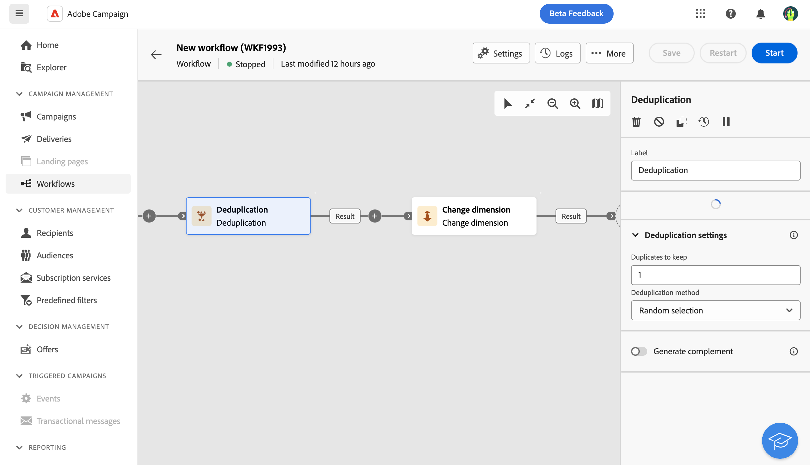

# Desduplicação {#deduplication}

>[!CONTEXTUALHELP]
>id="acw_orchestration_deduplication_fields"
>title="Campos para identificar duplicatas"
>abstract="Na seção **Campos para identificar duplicatas**, clique em **Adicionar atributo** para especificar os campos nos quais os valores idênticos permitem a identificação de duplicatas, como: endereço de email, nome, sobrenome, etc. A ordem dos campos especifica os que devem ser processados primeiro."

>[!CONTEXTUALHELP]
>id="acw_orchestration_deduplication"
>title="Atividade de desduplicação"
>abstract="A atividade de **desduplicação** exclui duplicatas dos resultados das atividades de entrada. Ela é usada principalmente após atividades de direcionamento e antes de atividades que usam dados direcionados."

>[!CONTEXTUALHELP]
>id="acw_orchestration_deduplication_complement"
>title="Gerar um complemento"
>abstract="É possível gerar uma transição de saída adicional com a população restante, que foi excluída como duplicata. Para fazer isso, ative a opção **Gerar complemento**."

>[!CONTEXTUALHELP]
>id="acw_orchestration_deduplication_settings"
>title="Configurações de desduplicação"
>abstract="Para excluir duplicatas nos dados recebidos, defina o método de desduplicação nos campos abaixo. Por padrão, somente um registro é mantido. Selecione o modo de desduplicação com base em uma expressão ou um atributo. Por padrão, o registro a ser mantido fora das duplicatas é selecionado aleatoriamente."

A atividade **Deduplication** é uma atividade **Targeting**. Essa atividade exclui duplicatas nos resultados das atividades de entrada, como perfis duplicados na lista de recipients. A atividade **Deduplication** geralmente é usada após as atividades de direcionamento e antes das atividades que usam dados direcionados.

## Configurar a atividade de desduplicação {#deduplication-configuration}

Siga estas etapas para configurar a atividade **Desduplicação**:

1. Adicione uma atividade **Deduplication** ao seu fluxo de trabalho.

1. Na seção **Campos para identificar duplicatas**, clique em **Adicionar atributo** para especificar os campos nos quais os valores idênticos permitem a identificação de duplicatas, como: endereço de email, nome, sobrenome, etc. A ordem dos campos especifica os que devem ser processados primeiro. [Saiba como selecionar atributos e adicioná-los aos favoritos](../../get-started/attributes.md).

1. Na seção **Configurações de desduplicação**, selecione o número de **Duplicatas exclusivas a serem mantidas**. O valor padrão para esse campo é 1. O valor 0 mantém todas as duplicatas.

   Por exemplo, se os registros A e B forem considerados duplicatas do registro Y, e o registro C for considerado uma duplicata do registro Z:

   * Se o valor do campo for 1: somente os registros Y e Z são mantidos.
   * Se o valor do campo for 0: todos os registros são mantidos.
   * Se o valor do campo for 2: os registros C e Z são mantidos, e dois registros de A, B e Y são mantidos por acaso ou dependendo do método de desduplicação selecionado.

1. Selecione o **Método de desduplicação** a ser usado:

   * **Seleção aleatória**: seleciona aleatoriamente o registro a ser mantido fora das duplicatas.
   * **Usando uma expressão**: mantém os registros nos quais o valor da expressão inserida é o menor ou o maior.
   * **Valores não vazios**: mantém os registros para os quais a expressão não está vazia.
   * **Seguindo uma lista de valores**: define uma prioridade de valor para um ou mais campos. Para definir os valores, clique em **Atributo** para selecionar um campo ou criar uma expressão e, em seguida, adicione os valores à tabela apropriada. Para definir um novo campo, clique no botão **Add** localizado acima da lista de valores.

1. Marque a opção **Generate complement** para explorar a população restante. O complemento consiste de todas as duplicatas. Em seguida, uma transição adicional é adicionada à atividade.

## Exemplo {#deduplication-example}

No exemplo a seguir, use uma atividade de desduplicação para excluir duplicatas do target antes de enviar um delivery. Os perfis duplicados identificados são adicionados a um público-alvo dedicado que pode ser reutilizado se necessário. Escolha o endereço de **Email** para identificar as duplicatas. Mantenha 1 entrada e selecione o método de desduplicação **Aleatório**.

