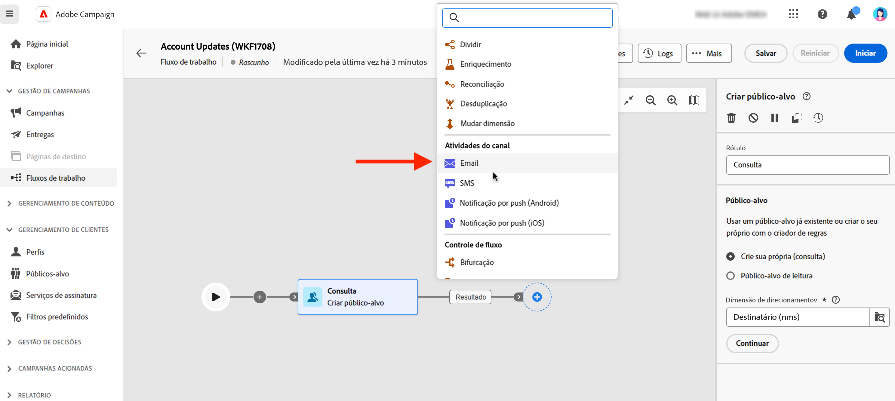

# Email, SMS, Push {#email}

O Adobe Campaign Web permite automatizar e executar campanhas de marketing em vários canais, como email, SMS ou push. Você pode combinar atividades de canal na tela para criar workflows entre canais que podem acionar ações com base no comportamento do cliente.

Por exemplo, você pode criar uma campanha de email de boas-vindas que inclui uma série de mensagens em diferentes canais, como email, SMS e push. Você também pode enviar um email de acompanhamento depois que um cliente concluir uma compra ou enviar uma mensagem de aniversário personalizada para um cliente por SMS.

Usando atividades de canal, você pode criar campanhas abrangentes e personalizadas que envolvem clientes em vários pontos de contato e geram conversões.

Estas são as etapas para adicionar um **Canal** atividade em um workflow:

1. Verifique se você adicionou um **Criar público-alvo** atividade. O público-alvo é o principal alvo do delivery: os recipients que recebem as mensagens. Ao enviar mensagens no contexto de um workflow de campanha, o público-alvo da mensagem não é definido na atividade de canal, mas no **Criar público-alvo** atividade. Consulte [esta seção](build-audience.md).

   

1. Selecione uma atividade de delivery: **[!UICONTROL E-mail]**, **[!UICONTROL SMS]**, **[!UICONTROL Notificação por push (Android)]** ou **[!UICONTROL Notificação por push (iOS)]**.

1. Selecione um **Modelo**. Os templates são configurações de entrega predefinidas salvas para uso futuro. [Saiba mais](../../msg/delivery-template.md)

1. Clique em **Criar entrega** e definir sua mensagem da mesma maneira que cria um delivery independente. [Saiba mais](../../msg/gs-messages.md)

1. Inicie o fluxo de trabalho e verifique os logs.

<!--
description, which use case you can perform (common other activities that you can link before of after the activity)

how to add and configure the activity

example of a configured activity within a workflow
The Email delivery activity allows you to configure the sending an email in a workflow. 

-->

<!-- Scheduled emails available?

This can be a single send email and sent just once, or it can be a recurring email.
* Single send emails are standard emails, sent once.
* Recurring emails allow you to send the same email multiple times to different targets over a defined period. You can aggregate the deliveries per period in order to get reports that correspond to your needs.

When linked to a scheduler, you can define recurring emails.-->

Os destinatários de email são definidos no sentido upstream da atividade, no mesmo fluxo de trabalho, por meio de uma atividade de direcionamento de Público-alvo.

<!--The message preparation is triggered according to the workflow execution parameters. From the message dashboard, you can select whether to request or not a manual confirmation to send the message (required by default). You can start the workflow manually or place a scheduler activity in the workflow to automate execution.-->
