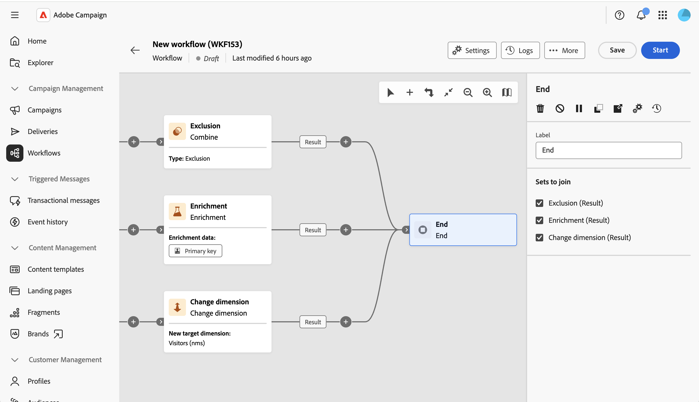

# Fim {#end}

>[!CONTEXTUALHELP]
>id="acw_orchestration_end"
>title="Finalizar atividade"
>abstract="A atividade **Fim** permite marcar graficamente o final de um fluxo de trabalho. Quando mais de uma transição de entrada estiver disponível, use a seção **Conjuntos para unificação** para selecionar quais transições se conectar à atividade."

>[!CONTEXTUALHELP]
>id="acw_orchestration_end_sets"
>title="Conjuntos para unificação"
>abstract="Verifique as atividades anteriores que deseja conectar como transições de entrada da atividade **Fim**. As atividades selecionadas são conectadas ao **Fim**. Esta seção é exibida somente quando mais de uma transição de entrada está disponível para ser conectada à atividade."

>[!CONTEXTUALHELP]
>id="acw_orchestration_signal"
>title="Sinal externo"
>abstract="Espaço reservado da seção de sinais externos nos parâmetros da atividade final. Disponível somente para campanhas orquestradas. NÃO EXCLUIR"

A atividade **End** é uma atividade **Flow control**. Ela permite marcar graficamente o final de um workflow. Essa atividade é opcional.

A atividade oferece suporte a várias transições de entrada quando mais de uma transição de entrada está disponível.

Na seção **Conjuntos para ingressar**, marque as atividades anteriores que você deseja conectar como transições de entrada da atividade **Fim**. As atividades selecionadas são vinculadas ao **End** na tela de fluxo de trabalho.

