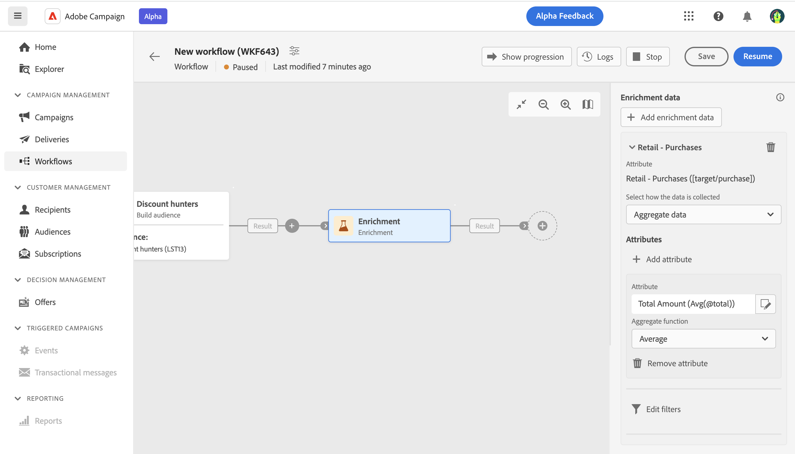

# Atividade de  {#enrichment}

>[!CONTEXTUALHELP]
>id="acw_orchestration_enrichment"
>title="Atividade de enriquecimento"
>abstract="A variável **Enriquecimento** A atividade de permite aprimorar os dados direcionados com informações adicionais do banco de dados. Normalmente, ela é usada em um fluxo de trabalho após atividades de segmentação."

>[!CONTEXTUALHELP]
>id="acw_orchestration_enrichment_data"
>title="Atividade de enriquecimento"
>abstract="Depois que os dados de enriquecimento tiverem sido adicionados ao fluxo de trabalho, eles poderão ser usados nas atividades adicionadas após a atividade de Enriquecimento para segmentar clientes em grupos distintos com base em seus comportamentos, preferências e necessidades, ou para criar mensagens e campanhas de marketing personalizadas que tenham mais probabilidade de ser relevante para seu público-alvo."

>[!CONTEXTUALHELP]
>id="acw_targetdata_personalization_enrichmentdata"
>title="Dados de enriquecimento"
>abstract="Selecione os dados a serem usados para enriquecer seu fluxo de trabalho. Você pode selecionar dois tipos de dados de enriquecimento: um único atributo de enriquecimento da target dimension ou um link de coleção, que é um link com uma cardinalidade 1-N entre as tabelas."

A atividade **Enriquecimento** é uma atividade de **Direcionamento**. Ela permite aprimorar os dados direcionados com informações adicionais do banco de dados. Normalmente, ela é usada em um fluxo de trabalho após atividades de segmentação.

Os dados de Enriquecimento podem vir:

* **Da mesma tabela de trabalho** como o direcionado para o seu fluxo de trabalho:

  *Direcione um grupo de clientes e adicione o campo &quot;Data de nascimento&quot; à tabela de trabalho atual*

* **De outra tabela de trabalho**:

  *Direcione um grupo de clientes e adicione os campos &quot;Quantidade&quot; e &quot;Tipo de produto&quot; da tabela &quot;Compra&quot;*.

Depois que os dados de enriquecimento tiverem sido adicionados ao fluxo de trabalho, eles poderão ser usados nas atividades adicionadas após a atividade de **Enriquecimento** para segmentar clientes em grupos distintos com base em seus comportamentos, preferências e necessidades, ou para criar mensagens de marketing personalizadas e campanhas que tenham mais probabilidade de ser relevante para o público-alvo.

Por exemplo, você pode adicionar à tabela de trabalho do fluxo de trabalho as informações relacionadas às compras dos clientes e usar esses dados para personalizar emails com a compra mais recente ou a quantidade gasta nessas compras.

## Configuração geral {#general}

Siga estas etapas para configurar a atividade **Enriquecimento**:

1. Adicione atividades como **Criar público-alvo** e **Combinar**.
1. Adicione uma atividade **Enriquecimento**
1. Clique em **Adicionar dados de enriquecimento**.

É possível selecionar dois tipos de dados de enriquecimento: um [atributo único de enriquecimento](#single-attribute) na dimensão de público-alvo ou um [link de coleção](#collection-link).

## Atributo único de enriquecimento {#single-attribute}

Nesse caso, estamos apenas adicionando um atributo único de enriquecimento, por exemplo, a data de nascimento. Siga estas etapas:

1. Clique no campo **Atributo**.
1. Selecione um campo simples da dimensão de direcionamento (data de nascimento, em nosso exemplo).
1. Clique em **Confirmar**.

## Link de coleção {#collection-link}

Neste caso de uso mais complexo, selecionaremos um link de coleção, que é um link com uma cardinalidade 1-N entre tabelas. Vamos recuperar as três compras mais recentes que custam menos de US$ 100. Para isso, é necessário definir:

* um atributo de enriquecimento: o campo **Valor total**
* o número de linhas a serem recuperadas: 3
* um filtro: filtrar itens que custam mais de US$ 100
* uma classificação: classificação decrescente no campo **Data do pedido**.

### Adicionar o atributo

É aqui que você seleciona o link de coleção para usar como dados de enriquecimento.

1. Clique no campo **Atributo**.
1. Clique em **Exibir atributos avançados**.
1. Selecione o campo **Valor total** na tabela **Compras**.

### Definir as configurações de coleção

Em seguida, defina como os dados são coletados e o número de registros a serem recuperados.

1. Selecione **Coletar dados** no menu suspenso **Selecione como os dados são coletados**.
1. Digite &quot;3&quot; no campo **Linhas a serem recuperadas (Colunas a serem criadas)**.

Se quiser, por exemplo, obter o valor médio das compras de um cliente, selecione **Dados agregados** em vez disso, e depois selecione **Média** no menu suspenso **Função de agregação**.

### Definir os filtros

Aqui, definimos o valor máximo do atributo de enriquecimento. Filtramos itens que custam mais de US$ 100.

1. Clique em **Editar filtros**.
1. Adicione os dois filtros a seguir: **Valor total** existe E **Valor total** é menor que 100. O primeiro filtra os valores NULL, pois seriam exibidos como o maior valor.
1. Clique em **Confirmar**.

### Definir a classificação

Agora precisamos aplicar a classificação para recuperar as três compras **mais recentes**.

1. Ative a opção **Habilitar classificação**.
1. Clique no campo **Atributo**.
1. Selecione o campo **Data do pedido**.
1. Clique em **Confirmar**.
1. Selecione **Decrescente** no menu suspenso **Classificar**.

<!--

Add other fields
use it in delivery

cardinality between the tables (1-N)
1. select attribute to use as enrichment data

    display advanced fields option
    i button

    note: attributes from the target dimension

1. Select how the data is collected
1. number of records to retrieve if want to retrieve a collection of multiple records
1. Apply filters and build rule

    select an existing filter
    save the filter for reuse
    view results of the filter visually or in code view

1. sort records using an attribute

leverage enrichment data in campaign

where we can use the enrichment data: personalize email, other use cases?

## Example

-->