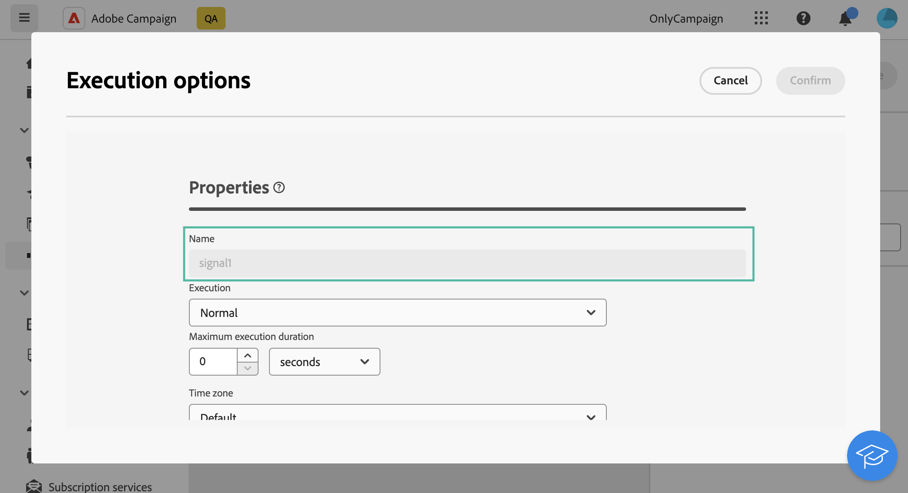

# Sinal externo {#external-signal}

<!--External Signal End-->

>[!CONTEXTUALHELP]
>id="acw_orchestration_externalsignal"
>title="Sinal externo"
>abstract="A atividade **Sinal externo** permite acionar a execução de um fluxo de trabalho a partir de outro fluxo de trabalho ou de uma chamada de API."

>[!CONTEXTUALHELP]
>id="acw_orchestration_externalsignal_parameters"
>title="Parâmetros do sinal externo"
>abstract="Parâmetros do sinal externo"

>[!CONTEXTUALHELP]
>id="acw_orchestration_end_trigger"
>title="Acionadores de término"
>abstract="Acionadores de término"

A atividade **Sinal externo** é uma atividade **Controle de fluxo**. Ele permite acionar a execução de um workflow a partir de outro workflow ou de uma chamada à API.

>[!NOTE]
>
>Esta página explica as etapas principais para configurar uma atividade **[!UICONTROL Sinal externo]** na interface de usuário da Web do Campaign e acioná-la a partir de outro fluxo de trabalho ou de uma chamada de API. Informações detalhadas sobre como acionar um fluxo de trabalho, práticas recomendadas e como trabalhar com APIs do Campaign estão disponíveis na [documentação do Campaign v8 (console do cliente)](https://experienceleague.adobe.com/pt-br/docs/campaign/automation/workflows/advanced-management/javascript-in-workflows#trigger-example).

Siga estas etapas para configurar a atividade **Sinal externo** e acionar sua execução:

1. Adicione uma atividade **Sinal externo** ao seu fluxo de trabalho.

1. Conclua a configuração do workflow e inicie sua execução. A atividade **[!UICONTROL Sinal Externo]** é exibida como &quot;Pendente&quot;, aguardando para ser acionada.

   

1. Recupere as seguintes informações:

   * O nome interno **do fluxo de trabalho**, que é exibido ao lado de seu rótulo.

     +++Exibir exemplo

     

     +++

   * O **nome da atividade de sinal externo**, que é exibido nas **[!UICONTROL Opções de execução]** do fluxo de trabalho.

     +++Exibir exemplo

     

     +++

1. Para acionar o fluxo de trabalho, execute a função JavaScript `PostEvent`. Essa função permite transmitir variáveis com os valores de sua escolha e usá-los no workflow acionado.

   A função `PostEvent` pode ser executada de outro fluxo de trabalho ou de uma chamada à API.

   * Para acionar uma atividade **[!UICONTROL Sinal externo]** de um fluxo de trabalho, execute a função PostEvent a partir do painel **[!UICONTROL Script de inicialização]**, acessível a partir das **[!UICONTROL Opções de execução]** da atividade. Para a atividade **[!UICONTROL JavaScript code]**, execute a função do script da atividade.

     A sintaxe é a seguinte:

     ```
     xtk.workflow.PostEvent("<workflow-internal-name>","<signal-activity-name>","",<variables <variable-name>="<value>"/>, false);
     ```

   +++Exibir exemplo

   Neste exemplo, a atividade de sinal externo &quot;signal1&quot; é acionada. Ele foi adicionado ao workflow cujo nome interno é &quot;WKF12345&quot;. Uma variável chamada &quot;customID&quot; é transmitida com o valor &quot;123456&quot;.

   

   +++

   * Para acionar uma atividade **[!UICONTROL Sinal externo]** a partir de uma chamada à API, siga as etapas detalhadas na documentação da API do Campaign. [Saiba como usar o método estático `PostEvent`](https://experienceleague.adobe.com/developer/campaign-api/api/sm-workflow-PostEvent.html?lang=pt-BR).