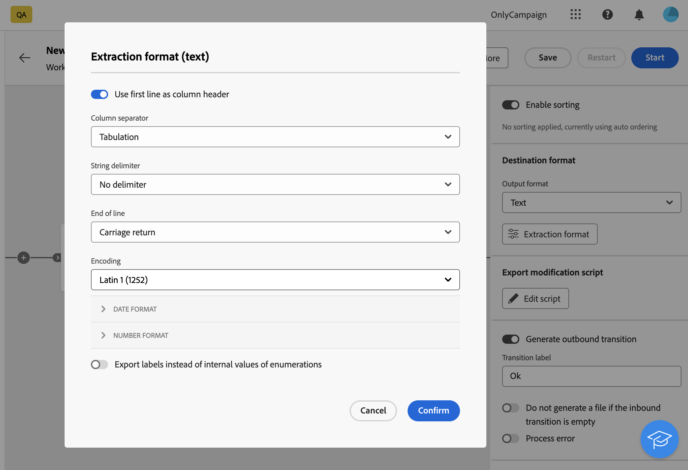
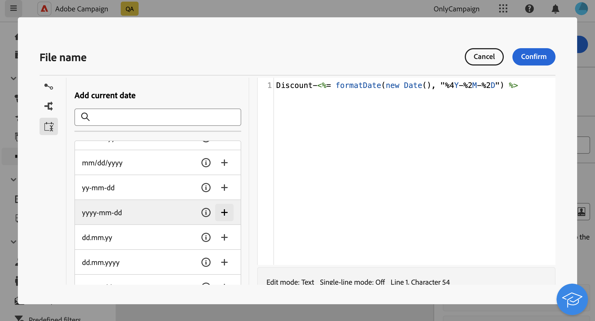

# Extrair arquivo {#extract-file}

>[!CONTEXTUALHELP]
>id="acw_orchestration_extractfile"
>title="Extrair arquivo"
>abstract="A atividade **Extrair arquivo** permite exportar dados do Adobe Campaign como um arquivo externo. Os dados podem ser exportados para um local de servidor, como SFTP, armazenamento na nuvem ou servidor de campanha, usando uma atividade Transferir arquivo."

A variável **Extrair arquivo** a atividade é um **Gestão de dados** atividade. Use esta atividade para exportar dados do Adobe Campaign na forma de um arquivo externo. Os dados podem ser exportados para um local de servidor, como SFTP, armazenamento na nuvem ou servidor de campanha, usando uma atividade Transferir arquivo.

Para configurar o **Extrair arquivo** atividade, adicionar um **Extrair arquivo** atividade no seu workflow, siga as etapas abaixo.

## Configurar o arquivo a ser extraído {#extract-configuration}

>[!CONTEXTUALHELP]
>id="acw_orchestration_extractfile_file"
>title="Arquivo a ser extraído"
>abstract="Selecione o arquivo a ser extraído."

A variável **[!UICONTROL Arquivo a extrair]** permite configurar as propriedades do arquivo e os dados a serem incluídos.

1. No **[!UICONTROL Nome do arquivo]** insira o nome desejado para o arquivo a ser extraído.

   Você pode personalizar o nome do arquivo usando variáveis de evento, condições e funções de data/hora. Para fazer isso, clique no link **[!UICONTROL Abrir caixa de diálogo de personalização]** ícone para abrir o editor de expressão. [Saiba como trabalhar com variáveis de evento e o editor de expressão](../event-variables.md)

1. Especifique as colunas a serem apresentadas no arquivo extraído. Para fazer isso, siga estes passos:

   1. Clique em **[!UICONTROL Adicionar coluna de saída]**.
   1. Escolha o atributo a ser exibido na coluna e confirme. Os atributos disponíveis dependem do targeting dimension do fluxo de trabalho.
   1. Depois que a coluna for adicionada, você poderá alterar sua **[!UICONTROL Rótulo]** e modificar os relatórios associados **[!UICONTROL Atributo]**.
   1. Para aplicar uma transformação aos valores da coluna, selecione-a na lista suspensa. Por exemplo, você pode alternar todos os valores na coluna selecionada para letras maiúsculas.

1. Repita essas etapas para adicionar quantas colunas forem necessárias no arquivo de extração. Para alterar a posição de uma coluna, use as setas para cima e para baixo.

1. Para remover todas as linhas duplicadas do arquivo extraído, alterne no **[!UICONTROL Remover linhas duplicadas (Listagem)]** opção.

1. Para classificar o arquivo extraído com base em um atributo, alterne no **[!UICONTROL Ativar classificação]** em seguida, escolha o atributo pelo qual deseja classificar o arquivo, juntamente com o método de classificação desejado (crescente ou decrescente). Você pode classificar qualquer atributo da targeting dimension atual, independentemente de ele ter sido adicionado às colunas do arquivo ou não.

## Configurar o formato de arquivo extraído {#file}

>[!CONTEXTUALHELP]
>id="acw_orchestration_extractfile_destinationformat"
>title="Formato de destino"
>abstract="Selecione as diferentes opções para configurar a formatação do arquivo extraído."

A variável **[!UICONTROL Destino]** formatar seção permite configurar como o arquivo extraído é formatado.

1. Escolha o **[!UICONTROL Formato de saída]** para o arquivo extraído: **Texto**, **Texto usando fixo com colunas**, **CSV (Excel)** ou **XML**.

1. Clique em **[!UICONTROL Formato de extração]** botão para acessar opções específicas relacionadas ao formato selecionado. Expanda a seção abaixo para obter mais informações.

+++ Opções de formato de extração disponíveis

   * **[!UICONTROL Usar a primeira linha como cabeçalho da coluna]** (Formato de texto / CSV (Excel)): ative essa opção para usar a primeira coluna como cabeçalho.
   * **[!UICONTROL Separador de colunas]** (Formato de texto): especifique o caractere a ser usado como separador de coluna no arquivo de saída.
   * **[!UICONTROL Delimitador de cadeia de caracteres]** (Formato de texto): especifique como delimitar strings no arquivo de saída.
   * **[!UICONTROL Fim da linha]** (Formato de texto): especifique como delimitar o final das linhas no arquivo de saída.
   * **[!UICONTROL Codificação]**: escolha a codificação do arquivo de saída.
   * **[!UICONTROL Formato de data e separadores]**: especifique como as datas devem ser formatadas no arquivo de saída.
   * **[!UICONTROL Formato de número]**: especifique como os números devem ser formatados no arquivo de saída.
   * **[!UICONTROL Exportar rótulos em vez de valores internos de enumerações]**: ative essa opção caso exporte valores de uma lista discriminada e deseje recuperar rótulos de colunas, que são mais fáceis de entender, em vez de IDs internas.

+++

   

## Adicionar um estágio de pré-processamento {#script}

>[!CONTEXTUALHELP]
>id="acw_orchestration_extractfile_postprocessing"
>title="Pós-processamento"
>abstract="Defina uma etapa de pós-processamento a ser aplicada, como compactação ou criptografia."

A variável **[!UICONTROL Exportar script de modificação]** permite aplicar um estágio de processamento para ser executado durante a extração de dados, como compactação ou criptografia. Para fazer isso, clique no link **[!UICONTROL Editar script]** botão.

O editor de expressão é aberto, permitindo inserir o comando a ser aplicado ao arquivo. O painel do lado esquerdo fornece sintaxes predefinidas que você pode utilizar para criar seu script. [Saiba como trabalhar com variáveis de evento e o editor de expressão](../event-variables.md)

## Opções adicionais {#additiona-options}

>[!CONTEXTUALHELP]
>id="acw_orchestration_extractfile_outbound"
>title="Transição de saída"
>abstract="Ative a opção **Gerar uma transição de saída** para adicionar uma transição de saída após a atividade atual."

>[!CONTEXTUALHELP]
>id="acw_orchestration_extractfile_error"
>title="Processar erros"
>abstract="Ative a opção **Processar erros** para adicionar uma transição de saída que contém erros."

Depois que a extração do arquivo de saída tiver sido configurada, opções adicionais relacionadas às transições e ao gerenciamento de erros estarão disponíveis:

* **[!UICONTROL Gerar transição de saída]**: ative essa opção para adicionar uma transição de saída e configurar seu rótulo.
* **[!UICONTROL Não gere um arquivo se a transição de entrada estiver vazia]**: ative essa opção para ignorar a extração de arquivo se a transição de entrada não contiver dados.
* **[!UICONTROL Erro de processo]**: ative essa opção para adicionar uma transição de saída se qualquer erro for encontrado durante a extração do arquivo.

## Exemplo {#example}

No exemplo a seguir, estamos usando uma variável **Criar público-alvo** atividade seguida de um **Extrair arquivo** atividade para extrair todos os perfis segmentados em um arquivo CSV.

* A variável **[!UICONTROL Nome do arquivo]** está configurado para incluir a data da extração.

  

* As colunas são adicionadas para exibir o nome e o sobrenome dos perfis, as IDs do cliente e as datas de criação no banco de dados.

  
