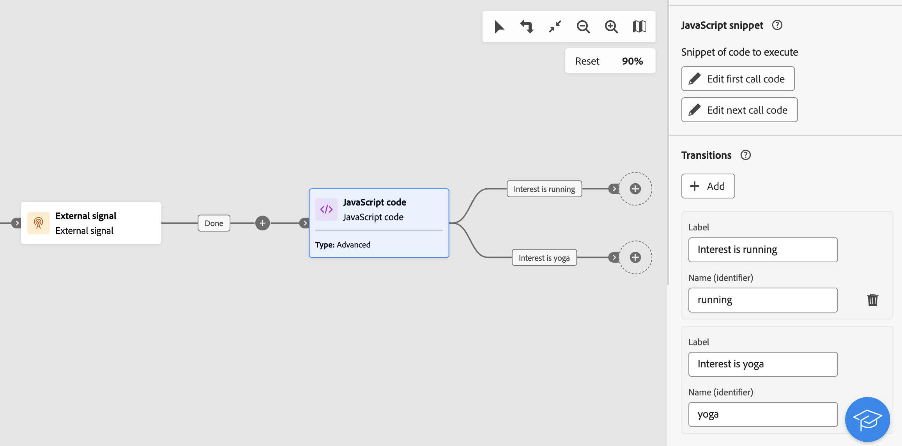

# Código JavaScript {#javascript-code}

>[!CONTEXTUALHELP]
>id="acw_orchestration_javascript"
>title="Código JavaScript"
>abstract="A atividade **Código JavaScript** permite executar um código JavaScript no contexto de um fluxo de trabalho. Isso permite realizar ações ou coletar informações do banco de dados. Use atividades de código JavaScript **simples** para executar um trecho de código na execução do fluxo de trabalho. As atividades de código JavaScript **Avançadas** permitem realizar operações mais complexas, executando dois trechos de código diferentes sequencialmente. Na primeira vez que o fluxo de trabalho é iniciado, a primeira chamada é executada. Cada vez que o fluxo de trabalho é executado novamente, o código definido na segunda chamada é executado."

>[!CONTEXTUALHELP]
>id="acw_orchestration_javascript_snippet"
>title="Trecho de JavaScript"
>abstract="Defina o script a ser executado durante a execução da atividade. Se estiver configurando uma atividade JavaScript **Avançada**, edite dois trechos de código: o primeiro código de chamada a ser executado durante a primeira execução do fluxo de trabalho e o próximo código de chamada a ser executado durante as execuções subsequentes do fluxo de trabalho."

>[!CONTEXTUALHELP]
>id="acw_orchestration_javascript_execution"
>title="Execução de JavaScript"
>abstract="Configure o atraso de execução para interromper a atividade após um período de execução. Por padrão, a fase de execução não pode exceder 1 hora. Após esse atraso, o processo será interrompido com uma mensagem de erro e a execução da atividade falhará. Para ignorar esse limite, defina o valor como 0."

>[!CONTEXTUALHELP]
>id="acw_orchestration_javascript_transition"
>title="Transição de JavaScript"
>abstract="Para adicionar uma ou várias transições de saída, clique no botão **[!UICONTROL Adicionar transições]** e especifique um rótulo e um nome interno para cada transição."

>[!CONTEXTUALHELP]
>id="acw_orchestration_javascript_processerrors"
>title="Processar erros"
>abstract="Ative a opção **[!UICONTROL Processar erros]** para manter os erros que ocorrem durante a execução do script em uma transição de saída adicional."

A atividade do **código JavaScript** é uma atividade de **gerenciamento de dados**. Use esta atividade para executar um script JavaScript no contexto de um workflow. Isso permite coletar informações do banco de dados ou executar outras operações complexas.

## Configurar a atividade do código JavaScript {#javascript-code-configuration}

Siga estas etapas para configurar a atividade **código JavaScript**:

1. Adicione uma atividade **JavaScript code** no seu fluxo de trabalho.

1. Escolha o tipo de atividade a ser criada:

   * **Simples**: execute um trecho de código.
   * **Avançado**: execute operações mais avançadas executando dois trechos de código diferentes. [Saiba como configurar uma atividade avançada do JavaScript](#advanced)

   >[!NOTE]
   >
   >Com a interface do usuário da Web do Campaign, duas atividades foram consolidadas em uma única, mesclando as funcionalidades de código do JavaScript **Simple** e **Advanced**. Essa consolidação não afeta a funcionalidade da atividade.

1. Confirme e clique no botão **[!UICONTROL Editar código]** para abrir o editor de expressão. O painel esquerdo fornece sintaxes predefinidas que você pode usar para criar seu código, incluindo variáveis de evento. [Saiba como trabalhar com variáveis de evento e o editor de expressão](../event-variables.md).

   

1. Na seção **[!UICONTROL Execution]**, configure o atraso para interromper a atividade após um período de execução. Por padrão, a fase de execução não pode exceder 1 hora. Após esse atraso, o processo será interrompido com uma mensagem de erro e a execução da atividade falhará. Para ignorar esse limite, defina o valor como 0.

   

1. Ative a opção **[!UICONTROL Processar erros]** para manter os erros que ocorrem durante a execução do script em uma transição de saída adicional.

## Atividades avançadas de código do JavaScript {#advanced}

As atividades avançadas do JavaScript permitem executar operações complexas. Essas atividades permitem:

* Execute dois trechos de código diferentes. O primeiro trecho de código é executado na primeira vez que o workflow é iniciado. Cada vez que o workflow é executado novamente, o trecho de código definido na segunda chamada é executado.
* Adicione várias transições de saída com as quais você pode interagir dinamicamente usando um script.

Para configurar uma atividade de código JavaScript avançada, siga estas etapas:

1. Selecione o tipo **Avançado** e configure os trechos de código a serem executados:

   * Clique em **[!UICONTROL Editar código da primeira chamada]** para definir o script a ser executado durante a primeira chamada.
   * Clique em **[!UICONTROL Editar código da próxima chamada]** para definir o script a ser executado durante as chamadas subsequentes do fluxo de trabalho. (opcional)

1. Para adicionar uma ou várias transições de saída, clique no botão **[!UICONTROL Adicionar transições]** e especifique um rótulo e um nome interno para cada transição.

   Neste exemplo, duas transições são configuradas e ativadas pelo script no trecho de código com base em condições específicas.

   

1. Conclua a configuração da atividade e inicie o workflow.

## Exemplo {#javascript-code-example}

### Inicializar variáveis com base na população recebida {#example1}

Este exemplo mostra como inicializar uma variável com base no número de perfis direcionados por um fluxo de trabalho.


Neste exemplo, os perfis do VIP do banco de dados são direcionados. Uma variável chamada &quot;canal&quot; é criada com um valor que depende do número de perfis direcionados pela atividade Criar público-alvo:

* Se mais de 1000 perfis forem direcionados, inicialize a variável com o valor &quot;email&quot;.
* Caso contrário, inicialize-o com o valor &quot;sms&quot;.

Para isso, siga estas etapas:

1. Adicione uma atividade **JavaScript code** com o tipo **Simple** após a atividade **Build audience**.

1. Clique em **Editar código** e configure o trecho de código conforme mostrado abaixo:

   ```
   if (vars.recCount > 1000)
       vars.channel = "email";
   else
       vars.channel = "sms";
   ```

1. Inicie o workflow. A variável &quot;channel&quot; é criada com o valor &quot;email&quot; ou &quot;sms&quot;, dependendo do número de perfis direcionados pela atividade **Criar público-alvo**.

### Acione transições com base no valor de uma variável {#example2}

Este exemplo mostra como acionar uma transição com base no valor de uma variável.



Neste exemplo, o fluxo de trabalho começa com uma atividade **Sinal externo**, para a qual uma variável (`interest`) é passada de outro fluxo de trabalho. O valor da variável é &quot;running&quot; ou &quot;yoga&quot;, dependendo das operações de filtragem executadas no workflow inicial.

Transições diferentes no fluxo de trabalho são acionadas com base no valor da variável.

Para isso, siga estas etapas:

1. Adicione uma atividade **JavaScript code** após a atividade de sinal externo com o tipo **Advanced**.

1. Adicione duas transições: uma para cada valor variável possível (&quot;running&quot;, &quot;yoga&quot;).

1. Clique em **Editar o primeiro código de chamada** e configure o trecho de código conforme mostrado abaixo:

   ```
   if (vars.interest == "running")
       task.postEvent(task.transitionByName("running"));
   else
       task.postEvent(task.transitionByName("yoga"));
   ```

1. Conclua a configuração de cada transição para atender às suas necessidades e, em seguida, inicie o workflow. Uma das duas transições de saída é ativada com base no valor da variável `interest` transmitido pela atividade **Sinal externo**.