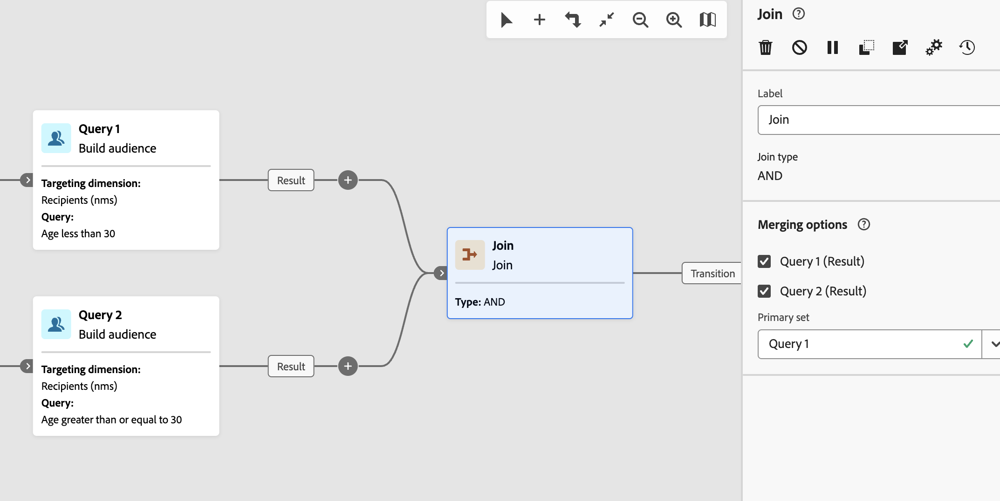

# Associar-se {#join}

>[!CONTEXTUALHELP]
>id="acw_homepage_welcome_rn5"
>title="Várias ramificações de fluxo de trabalho e Atividade de junção"
>abstract="Agora há suporte para várias ramificações. Em vez de usar uma bifurcação, clique em Adicionar ramificação na barra de ferramentas. A atividade AND-join também foi aprimorada. Agora é uma atividade Join genérica que permite escolher entre as opções de join AND e OR."
>additional-url="https://experienceleague.adobe.com/docs/campaign-web/v8/release-notes/release-notes.html?lang=pt-BR" text="Consulte as notas de versão"

>[!CONTEXTUALHELP]
>id="acw_orchestration_and-join"
>title="Atividade AND-join"
>abstract="A atividade **AND-join** permite sincronizar várias ramificações de execução de um fluxo de trabalho. Ela é acionada quando todas as atividades anteriores forem concluídas. Isso garante que determinadas atividades sejam concluídas antes de continuar a executar o fluxo de trabalho."

>[!CONTEXTUALHELP]
>id="acw_orchestration_join"
>title="Atividade de ingresso"
>abstract="A atividade **Ingressar** permite mesclar várias transições de entrada. Escolha se deseja continuar quando todas as transições de entrada estiverem concluídas (E) ou quando qualquer transição de entrada estiver concluída (OU)."

A atividade de **Ingresso** é uma atividade de **Controle de fluxo**. Ele sincroniza várias ramificações de execução de um fluxo de trabalho.
Você pode escolher como as transições de entrada são avaliadas:

* **AND**: continua somente depois que todas as transições de entrada selecionadas são ativadas.
* **OR**: continua assim que uma transição de entrada selecionada é ativada.

Quando **AND** é selecionado, essa atividade dispara sua transição de saída somente após todas as transições de entrada serem ativadas. Em outras palavras, é ativado depois que todas as atividades anteriores são concluídas. Isso garante que determinadas atividades sejam concluídas antes de continuar a executar o workflow.

Quando **OR** é selecionado, a execução continua assim que uma das transições de entrada selecionadas é ativada. Ele não espera por cada ramificação.

## Configurar a atividade de associação {#join-configuration}

>[!CONTEXTUALHELP]
>id="acw_orchestration_and-join_merging"
>title="Opções de mesclagem"
>abstract="Selecione de quais atividades deseja juntar. No menu suspenso **Conjunto principal**, escolha a população de transição de entrada que deseja manter."

Siga estas etapas para configurar a atividade **Ingressar**:

1. Adicione várias atividades, como atividades de canal, para formar pelo menos duas ramificações de execução diferentes. Você pode usar uma **Bifurcação** ou adicionar uma ramificação separada usando o botão da barra de ferramentas **Adicionar ramificação** (+). Consulte [Orquestrar atividades](../orchestrate-activities.md#toolbar).

   

1. Adicione uma atividade **Join** a qualquer uma das ramificações.

   

1. Nas opções de associação, escolha **E** ou **OU** e clique em **Continuar**.
1. Na seção **Opções de mesclagem**, marque todas as atividades anteriores nas quais deseja ingressar.
1. No menu suspenso **Conjunto principal**, escolha a população de transição de entrada a ser mantida. A transição de saída só pode conter uma das populações de transição de entrada.

   >[!NOTE]
   >
   >O campo **Conjunto Primário** só está disponível para a opção de junção **AND**.

   

## Exemplo {#join-example}

O exemplo a seguir mostra duas ramificações de fluxo de trabalho com uma entrega de SMS e email. A atividade **Ingressar**, definida como **AND**, será acionada quando ambas as transições de entrada estiverem habilitadas. As notificações por push são enviadas somente após a conclusão de ambos os deliveries. Se você definir a opção de associação como **OR**, as mensagens de push serão enviadas assim que a primeira atividade de entrega de entrada for concluída.

{zoomable="yes"}