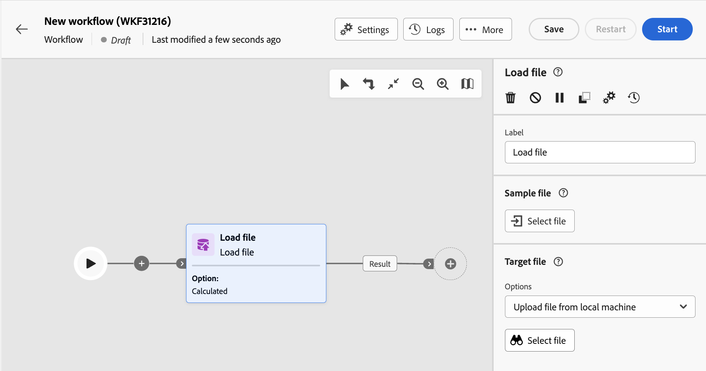

# Carregar arquivo {#load-file}

>[!CONTEXTUALHELP]
>id="acw_orchestration_loadfile"
>title="Atividade Carregar arquivo"
>abstract="A atividade **Carregar arquivo** é uma atividade de **gerenciamento de dados**. Use esta atividade para trabalhar com dados armazenados em um arquivo externo. Perfis e dados não são adicionados ao banco de dados, mas todos os campos no arquivo de entrada estão disponíveis para personalização ou para atualizar perfis ou qualquer outra tabela. "

>[!CONTEXTUALHELP]
>id="acw_orchestration_loadfile_outboundtransition"
>title="Transição de saída do gerenciamento de rejeições"
>abstract="Transição de saída do gerenciamento de rejeições"

>[!CONTEXTUALHELP]
>id="acw_orchestration_loadfile_outboundtransition_reject"
>title="Transição de saída do gerenciamento de rejeições para recusas"
>abstract="Transição de saída do gerenciamento de rejeições para recusas"

A atividade **Carregar arquivo** é uma atividade de **gerenciamento de dados**. Use esta atividade para trabalhar com perfis e dados armazenados em um arquivo externo. Perfis e dados não são adicionados ao banco de dados, mas todos os campos no arquivo de entrada estão disponíveis para [personalização](../../personalization/gs-personalization.md), ou para atualizar perfis ou qualquer outra tabela.

>[!NOTE]
>Os formatos de arquivo compatíveis são: texto (TXT) e valor separado por vírgula (CSV). É possível carregar arquivos com um tamanho máximo de 50 MB.

Esta atividade pode ser usada com um [Reconciliação](reconciliation.md) atividade para vincular dados não identificados aos recursos existentes. Por exemplo, a variável **Carregar arquivo** A atividade pode ser colocada antes de um **Reconciliação** atividade se você importar dados não padrão para o banco de dados.

## Configurar a atividade de carregamento de arquivo {#load-configuration}

A variável **Carregar arquivo** a configuração da atividade envolve duas etapas. Primeiro, é necessário definir a estrutura de arquivo esperada fazendo upload de um arquivo de amostra. Depois disso, você poderá especificar a origem do arquivo cujos dados serão importados. Siga as etapas abaixo para configurar a atividade.

### Configurar o arquivo de amostra {#sample}

>[!AVAILABILITY]
>
>Esse recurso está na disponibilidade limitada (DL). Ela é restrita aos clientes em execução em um servidor do Campaign v8.7 e não pode ser implantada em nenhum outro ambiente.

>[!CONTEXTUALHELP]
>id="acw_orchestration_loadfile_samplefile"
>title="Arquivo de amostra"
>abstract="Selecione a estrutura de arquivo esperada fazendo upload de um arquivo de amostra."

>[!CONTEXTUALHELP]
>id="acw_orchestration_loadfile_formatting"
>title="Formatação da atividade Carregar arquivo"
>abstract="No **Formatação** especifique como o arquivo está formatado para garantir que os dados sejam importados corretamente."

>[!CONTEXTUALHELP]
>id="acw_orchestration_loadfile_valueremapping"
>title="Remapeamento de valor da atividade Carregar arquivo"
>abstract="Use essa opção para mapear valores específicos dos arquivos carregados com novos valores. Por exemplo, se a coluna contiver valores &quot;Verdadeiro&quot;/&quot;Falso&quot;, você poderá adicionar um mapeamento para substituir automaticamente esses valores por caracteres &quot;0&quot;/&quot;1&quot;."

Siga estas etapas para configurar o arquivo de amostra usado para definir a estrutura de arquivo esperada:

1. Adicionar um **Carregar arquivo** atividade no seu workflow.

1. Selecione o arquivo de amostra a ser usado para definir a estrutura de arquivo esperada. Para fazer isso, clique no link **Selecionar arquivo** botão na caixa **[!UICONTROL Arquivo de exemplo]** e selecione o arquivo local a ser usado.

   >[!NOTE]
   >
   >Os dados do arquivo de amostra são usados para configurar a atividade, mas não são importados. Recomendamos usar um arquivo de amostra com poucos dados. O formato de arquivo deve estar alinhado com este [arquivo de amostra](../../audience/file-audience.md#sample-file).

1. Uma pré-visualização do arquivo de amostra é mostrada, exibindo no máximo 30 linhas.

1. No **[!UICONTROL Tipo de arquivo]** especifique se o arquivo está usando colunas delimitadas ou colunas de largura fixa.

   

1. Para tipos de arquivo de colunas delimitadas, use o **Colunas** seção para configurar as propriedades de cada coluna.

   +++Opções disponíveis para colunas de arquivo

   * **[!UICONTROL Rótulo]**: Rótulo a ser exibido para a coluna.
   * **[!UICONTROL Tipo de dados]**: Tipo de dados contidos na coluna.
   * **[!UICONTROL Largura]** (tipo de dados string): número máximo de caracteres a serem exibidos na coluna.
   * **[!UICONTROL Transformação de dados]** (tipo de dados string): aplique a transformação aos valores contidos na coluna.
   * **[!UICONTROL Gerenciamento de espaço em branco]** (tipo de dados string): especifique como gerenciar os espaços contidos na coluna.
   * **[!UICONTROL Separadores]** (tipos de dados data, hora, número inteiro e número)*: especifique os caracteres a serem usados como separadores.
   * **[!UICONTROL Permitir NULLs]**: especifique como gerenciar valores vazios na coluna. A opção &quot;Adobe Campaign default&quot; gerará um erro se um valor vazio estiver presente.
   * **[!UICONTROL Processamento de erros]** (tipo de dados string): especifique o comportamento no caso de erros em uma das linhas.
   * **[!UICONTROL Remapeamento de valor]**: essa opção permite mapear valores específicos com novos. Por exemplo, se a coluna contiver valores &quot;Verdadeiro&quot;/&quot;Falso&quot;, você poderá adicionar um mapeamento para substituir automaticamente esses valores por caracteres &quot;0&quot;/&quot;1&quot;.

+++

1. No **Formatação** especifique como o arquivo está formatado para garantir que os dados sejam importados corretamente.

### Definir o arquivo de destino para upload {#target}

>[!CONTEXTUALHELP]
>id="acw_orchestration_loadfile_targetfile"
>title="Arquivo de destino da atividade Carregar arquivo"
>abstract="No **[!UICONTROL Arquivo de destino]** especifique como recuperar o arquivo para upload no servidor."

>[!CONTEXTUALHELP]
>id="acw_orchestration_loadfile_nameofthefile"
>title="Nome do arquivo"
>abstract="Especifique o nome do campo a ser carregado no servidor. Clique em **[!UICONTROL Abrir caixa de diálogo de personalização]** ícone para aproveitar o editor de expressão, incluindo variáveis de evento, para calcular o nome do arquivo."

>[!CONTEXTUALHELP]
>id="acw_orchestration_loadfile_targetdb"
>title="Banco de dados de públicos-alvo"
>abstract="Se você estiver acessando um **[!UICONTROL Carregar arquivo]** atividade que já foi configurada no console do cliente, uma atividade adicional **[!UICONTROL Banco de dados de destino]** estará disponível se você tiver configurado a atividade para fazer upload do arquivo para um banco de dados externo."

>[!CONTEXTUALHELP]
>id="acw_orchestration_loadfile_command"
>title="Comando Carregar arquivo"
>abstract="Permitir comandos arbitrários para pré-processamento é uma vulnerabilidade de segurança. Desabilite a opção de segurança XtkSecurity_Disable_Preproc para forçar o uso de uma lista predefinida de comandos."

>[!CAUTION]
>
>Antes de carregar o arquivo de destino, verifique se ele segue à formatação do arquivo de amostra. Qualquer discrepância no formato de arquivo, na estrutura da coluna ou no número de colunas pode levar a erros durante a execução do workflow.

1. No **[!UICONTROL Arquivo de destino]** especifique a ação a ser executada ao recuperar o arquivo a ser carregado no servidor.

   * **[!UICONTROL Fazer upload de arquivo do computador local]**: selecione o arquivo a ser carregado da sua máquina.

   * **[!UICONTROL Especificado na transição]**: Faça upload do arquivo especificado na transição de entrada futura de uma atividade anterior, como **[!UICONTROL Transferir arquivo]**.

   * **[!UICONTROL Pré-processar o arquivo]**: carregue o arquivo especificado na transição anterior e aplique um comando de pré-processamento, como **[!UICONTROL Descompactação]** ou **[!UICONTROL Descriptografar]**.

   * **[!UICONTROL Calculado]**: Faça upload do arquivo cujo nome é especificado no **[!UICONTROL Nome do arquivo]** campo. Clique em **[!UICONTROL Abrir caixa de diálogo de personalização]** ícone para aproveitar o editor de expressão, incluindo variáveis de evento, para calcular o nome do arquivo.

   

   >[!NOTE]
   >
   >Se você estiver acessando um **[!UICONTROL Carregar arquivo]** atividade que já foi configurada no console do cliente, uma atividade adicional **[!UICONTROL Banco de dados de destino]** é exibida se você tiver configurado a atividade para fazer upload do arquivo para um banco de dados externo. Ele permite especificar se você deseja fazer upload do arquivo no servidor do Campaign ou no banco de dados externo.

### Opções adicionais {#options}

>[!CONTEXTUALHELP]
>id="acw_orchestration_loadfile_rejectmgt"
>title="Gerenciamento de rejeições da atividade Carregar arquivo"
>abstract="No **Rejeitar gerenciamento** especifique como a atividade deve se comportar em caso de erros. Você pode definir o número máximo de erros permitidos e alternar a variável **[!UICONTROL Manter as rejeições em um arquivo]** opção para baixar no servidor um arquivo contendo os erros que ocorreram durante a importação."

>[!CONTEXTUALHELP]
>id="acw_orchestration_loadfile_delete"
>title="Excluir arquivo após importação"
>abstract="Ative a opção **Excluir arquivo após importação** para excluir o arquivo original do servidor após a importação."

>[!AVAILABILITY]
>
>Essas opções estão em Disponibilidade Limitada (DL). Eles são restritos aos clientes em execução em um servidor do Campaign v8.7 e não podem ser implantados em nenhum outro ambiente.

1. No **Rejeitar gerenciamento** especifique como a atividade deve se comportar em caso de erros:

   * No **[!UICONTROL Excluir]** especifique o número máximo de erros que são autorizados ao processar o arquivo a ser carregado. Por exemplo, se o valor for definido como &quot;20&quot;, a execução do workflow falhará se houver mais de 20 erros ao carregar o arquivo.

   * Para manter os erros que ocorreram ao carregar o arquivo, alterne a variável **[!UICONTROL Manter as rejeições em um arquivo]** e especifique o nome desejado para o arquivo no campo **[!UICONTROL Arquivo de Rejeição]** campo.

     Após ativar essa opção, uma transição de saída adicional chamada &quot;Complement&quot; é adicionada após a atividade. Qualquer erro que ocorrer durante a importação será armazenado no arquivo especificado no servidor.

1. Para excluir o arquivo carregado do servidor após a execução do fluxo de trabalho, alterne o **[!UICONTROL Excluir arquivo após importação]** opção.

   

1. Clique em **Confirmar** assim que as configurações estiverem corretas.

## Exemplo {#load-example}

Uma amostra de carregamento de arquivo externo usada com o **Reconciliação** a atividade está disponível em [nesta seção](reconciliation.md#reconciliation-example).
