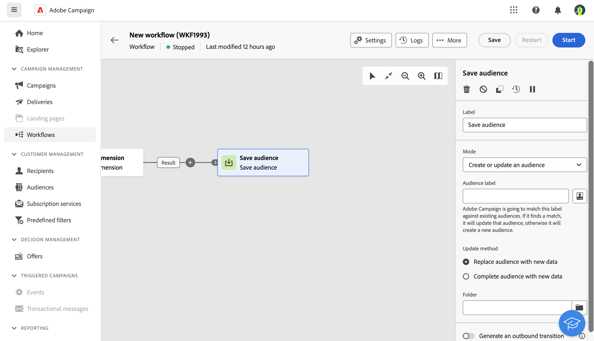

# Salvar público-alvo {#save-audience}

>[!CONTEXTUALHELP]
>id="acw_orchestration_save_audience"
>title="Salvar um público-alvo"
>abstract="Use esta atividade para atualizar um público-alvo já existente ou criar um novo a partir da população calculada upstream em um fluxo de trabalho. Os públicos-alvo criados são adicionados à lista de públicos-alvo e disponibilizados no menu **Públicos-alvo**."

A variável **Salvar público-alvo** a atividade é um **Direcionamento** atividade. Esta atividade permite atualizar um público-alvo ou criar um novo público-alvo a partir da população computada upstream em um fluxo de trabalho. Os públicos-alvo criados são adicionados à lista de públicos-alvo do aplicativo e disponibilizados por meio do **Públicos-alvo** menu.

Essa atividade é usada essencialmente para manter os grupos de populações computados no mesmo fluxo de trabalho, convertendo-os em públicos-alvo reutilizáveis. Conecte-a a outras atividades de direcionamento, como uma **Criar público-alvo** ou um **Combinar** atividade.

## Configurar a atividade Save audience{#save-audience-configuration}

Siga estas etapas para configurar o **Salvar público-alvo** atividade:

1. Adicionar um **Salvar público-alvo** atividade ao seu fluxo de trabalho.

1. No **Modo** selecione a ação que deseja executar:

   * **Criar ou atualizar um público existente**: definir um **Rótulo de público**. Se o público-alvo já existir, ele será atualizado, caso contrário, um novo público-alvo será criado.

   * **Atualizar um público existente**: escolha a variável **Público** você deseja atualizar na lista de públicos-alvo existentes.

1. Selecione o **Modo de atualização** que se aplicarão aos públicos-alvo existentes:

   * **Substituir o conteúdo do público-alvo por novos dados**: todo o conteúdo do público-alvo é substituído. Os dados antigos são perdidos. Somente os dados da transição de entrada da atividade Save audience são mantidos. Essa opção apaga o tipo de público-alvo e o targeting dimension do público-alvo atualizado.

   * **Público-alvo completo com novos dados**: o conteúdo antigo do público-alvo é mantido e os dados da transição de entrada da atividade Save audience são adicionados a ele.

1. Verifique a **Gerar uma transição de saída** se desejar adicionar uma transição após a variável **Salvar público-alvo** atividade.

O conteúdo do público-alvo salvo ficará disponível na visualização detalhada do público-alvo, que pode ser acessada no **Públicos-alvo** menu. As colunas disponíveis nessa visualização correspondem às da transição de entrada do fluxo de trabalho **Salvar público-alvo** atividade.

## Exemplo{#save-audience-example}

O exemplo a seguir ilustra uma simples atualização de público-alvo do direcionamento. Um scheduler é adicionado para executar o workflow uma vez por mês. Uma consulta recupera todos os perfis que fizeram assinatura nos diferentes serviços de aplicativo disponíveis. A variável **Salvar público-alvo** A atividade atualiza o público-alvo excluindo os perfis que cancelaram a assinatura do serviço desde a última execução do fluxo de trabalho e adicionando os perfis que fizeram assinatura recentemente.
