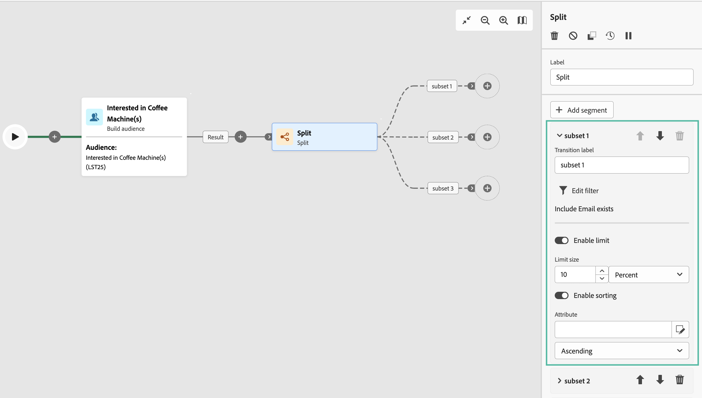

# Divisão {#split}

A variável **Split** a atividade é um **Direcionamento** Atividade que permite segmentar as populações recebidas em vários subconjuntos com base em diferentes critérios de seleção, como regras de filtragem ou tamanho da população.

## Configuração {#general}

Siga estas etapas para configurar o **Split** atividade:

1. Adicionar um **Split** atividade ao seu fluxo de trabalho.

1. O painel de configuração da atividade é aberto com um subconjunto padrão. Clique em **Adicionar segmento** botão para adicionar quantos subconjuntos desejar para segmentar a população recebida.

   

   >[!IMPORTANT]
   >
   >Quando a atividade Split é executada, a população é segmentada nos diferentes subconjuntos na ordem em que são adicionados à atividade. Por exemplo, se o primeiro subconjunto recuperar 70% da população inicial, o próximo subconjunto adicionado aplicará seus critérios de seleção somente aos 30% restantes e assim por diante.
   >
   > Antes de configurar os subconjuntos, verifique se eles foram adicionados na ordem correta, pois sua posição não pode ser alterada.

1. Depois que subconjuntos são adicionados, a atividade mostra quantas transições de saída houver subconjuntos. Recomendamos alterar o rótulo de cada subconjunto para identificá-los facilmente na tela do workflow.

1. Configure como cada subconjunto deve filtrar a população recebida. Para fazer isso, siga estes passos:

   1. Abra o subconjunto para exibir suas propriedades.

   1. Para aplicar uma condição de filtragem ao subconjunto, clique em **[!UICONTROL Criar filtro]** e configure a regra de filtragem desejada. Por exemplo, inclua perfis da população recebida cujo endereço de email exista no banco de dados.

   1. Para limitar o número de perfis selecionados pelo subconjunto, alterne a opção **[!UICONTROL Habilitar limite]** e especifique o número ou as porcentagens da população a serem incluídas.

      >[!NOTE]
      >
      >Ao definir um limite de população para um subconjunto, você pode classificar os perfis selecionados com base em um atributo de perfil específico, em ordem crescente ou decrescente. Para fazer isso, alterne no **[!UICONTROL Ativar classificação]** opção. Por exemplo, é possível restringir um subconjunto para incluir apenas os 50 perfis principais com o valor de compra mais alto.

   

1. Após configurar todos os subconjuntos, é possível selecionar a população restante que não correspondeu a nenhum dos subconjuntos e incluí-los em uma transição de saída adicional. Para fazer isso, alterne no **[!UICONTROL Gerar complemento]** opção.

   

A atividade está configurada agora. Na execução do workflow, a população será segmentada nos diferentes subconjuntos, na ordem em que foram adicionados à atividade.

## Exemplo

No exemplo a seguir, a variável **[!UICONTROL Split]** A atividade é usada para segmentar um público em subconjuntos distintos com base no canal de comunicação que queremos usar:

* **Subconjunto 1 &quot;push&quot;**: esse subconjunto inclui todos os perfis que instalaram nosso aplicativo móvel.
* **Subconjunto 2 &quot;sms&quot;**: Usuários de celular: para a população restante que não se enquadrava no Subconjunto 1, o subconjunto 2 aplica uma regra de filtragem para selecionar perfis com telefones celulares no banco de dados.
* **Transição de complemento**: essa transição captura todos os perfis restantes que não corresponderam ao Subconjunto 1 ou ao Subconjunto 2. Especificamente, inclui perfis que não instalaram o aplicativo móvel nem têm um telefone celular, como usuários que não instalaram o aplicativo móvel ou que não têm um número de celular registrado.

