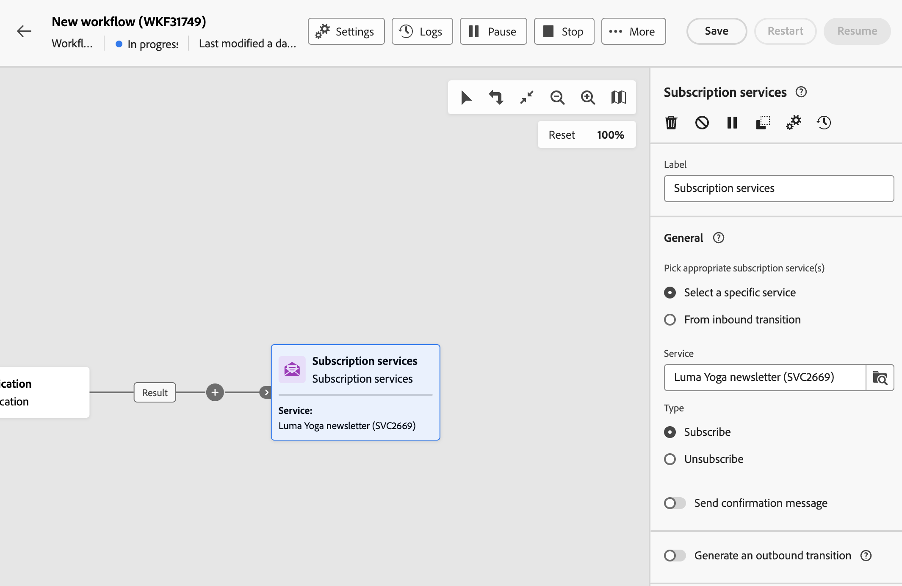
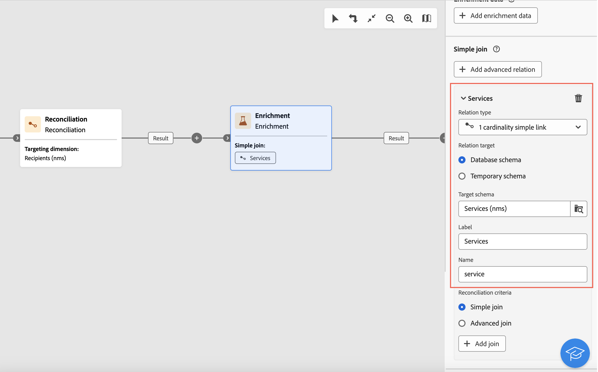

# Serviços de assinatura {#subscriptipon-services}

>[!CONTEXTUALHELP]
>id="acw_orchestration_subscription"
>title="Atividade Serviços de assinatura"
>abstract="A atividade Serviços de assinatura permite que vários perfis sejam inscritos ou removidos de um serviço em uma única ação."

>[!CONTEXTUALHELP]
>id="acw_orchestration_subscription_general"
>title="Parâmetros gerais do serviço de assinatura"
>abstract="Escolha o serviço desejado e escolha a ação a ser executada (assinatura ou cancelamento de assinatura). Ative a opção **Enviar mensagem de confirmação** para notificar a população sobre sua assinatura ou sobre o cancelamento da mesma no serviço selecionado."

>[!CONTEXTUALHELP]
>id="acw_orchestration_subscription_outboundtransition"
>title="Gerar uma transição de saída"
>abstract="Ative a opção **Gerar uma transição de saída** para adicionar uma transição após a atividade."

A variável **Serviços de assinatura** a atividade é um **Gerenciamento de dados** atividade. Ele permite criar ou excluir uma subscrição para um serviço de informações para a população especificada na transição.

## Configurar a atividade de serviços de assinatura {#subscription-services-configuration}

Siga estas etapas para configurar o **Serviços de assinatura** atividade:

1. Adicionar um **Serviços de assinatura** atividade no seu workflow. Você pode usar essa atividade após direcionar perfis ou importar um arquivo com dados identificados.

1. Selecione o serviço para o qual deseja gerenciar as assinaturas usando uma das seguintes opções:

   * **[!UICONTROL Selecionar um serviço específico]**: selecione manualmente um serviço usando o **[!UICONTROL Serviço]** campo.

   * **[!UICONTROL Da transição de entrada]**: use o serviço especificado na transição de entrada. Por exemplo, é possível importar um arquivo que especifica o serviço a ser gerenciado para cada linha. O serviço no qual executar a operação é então selecionado dinamicamente para cada perfil.

   

1. Selecione a operação a ser executada: **Assinar** ou **Cancelar inscrição**.

   Se o serviço for definido na transição de entrada, você poderá escolher como recuperar essa operação:

   * **Selecionar um tipo de operação específico**: selecione manualmente a operação a ser executada (**Assinar** ou **Cancelar inscrição**)

   * **Selecione um tipo de operação em um caminho de transição de entrada**: selecione a coluna dos dados de entrada que especifica a operação a ser executada para cada registro. Por exemplo, você pode importar um arquivo que especifica a operação a ser executada para cada linha em uma coluna &quot;operação&quot;.

     >[!NOTE]
     >
     >Somente campos booleanos ou inteiros podem ser selecionados aqui. Verifique se os dados que contêm a operação a ser executada correspondem a esse formato. Por exemplo, se você estiver carregando dados de uma atividade Load file, verifique se definiu corretamente o formato da coluna que contém a operação na variável **[!UICONTROL Carregar arquivo]** atividade. Um exemplo é apresentado em [nesta seção](#uc2).

   

1. Para notificar os destinatários que a subscrição do serviço selecionado foi realizada ou cancelada, alterne o **[!UICONTROL Enviar uma mensagem de confirmação]** opção ativada. O conteúdo dessa notificação é definido em um template do delivery associado ao serviço de informação.

1. Se estiver usando dados de uma transição de entrada, uma variável **[!UICONTROL Informações adicionais]** é exibida, permitindo especificar os dados e a origem da assinatura para cada registro. Você pode deixar essa seção vazia, nesse caso, nenhuma data ou origem será definida ao executar o workflow.

   * Se os dados de entrada tiverem uma coluna indicando a data de assinatura do perfil para o serviço, você poderá selecioná-la na **[!UICONTROL Data]** campo.

   * No **[!UICONTROL Caminho de origem]** defina a origem da assinatura. Você pode defini-la como um dos campos dos dados de entrada ou como um valor constante de sua escolha, marcando a opção **[!UICONTROL Definir uma constante como origem]** opção.

   

1. Para adicionar uma transição de saída após a atividade, alterne a variável **[!UICONTROL Gerar uma transição de saída]** opção ativada.

## Exemplos {#example}

### Subscrever um público-alvo a um serviço específico {#uc1}

Este fluxo de trabalho abaixo mostra como assinar um público-alvo para um serviço existente.


* A **[!UICONTROL Criar público-alvo]** A atividade segmenta um público-alvo existente.

* A **[!UICONTROL Serviços de assinatura]** A atividade permite selecionar o serviço para o qual os perfis devem ser inscritos.

<!--
### Updating multiple subscription statuses from a file {#uc2}

The workflow below shows how to import a file containing profiles and update their subscription to several services specified in the file.


* A **[!UICONTROL Load file]** activity loads a CSV file containing the data and defines the structure of the imported columns. The "service" and "operation" columns specify the service to update and the operation to perform (subscription or unsubscription).

  ```
  Lastname,firstname,city,birthdate,email,service,operation
  Smith,Hayden,Paris,23/05/1985,hayden.smith@example.com,yoga,sub
  Mars,Daniel,London,17/11/1999,danny.mars@example.com,running,sub
  Smith,Clara,Roma,08/02/1979,clara.smith@example.com,running,unsub
  Durance,Allison,San Francisco,15/12/2000,allison.durance@example.com,yoga,sub
  Durance,Alison,San Francisco,15/12/2000,allison.durance@example.com,running,unsub
  ```

  As you may have noticed, the operation is specified in the file as "sub" or "unsub". The system expects a **Boolean** or **Integer** value to recognize the operation to perform: "0" to unsubscribe and "1" to subscribe. To match this requirement, a remapping of values must be performed in the detail of the "operation" column in the sample file configuration screen.

  

  If your file already uses "0" and "1" to identify the operation, you don't need to remap those values. Only make sure that the column is processed as a **Boolean** or **Integer** in the sample file columns.

* A **[!UICONTROL Reconciliation]** activity identifies the data from the file as belonging to the profile dimension of the Adobe Campaign database. The **email** field of the file is matched to the **email** field of the profile resource.

  

* An **[!UICONTROL Enrichment]** activity creates a link to the "Services (nms)" table and creates a simple join between the "service" column of the uploaded file, and the services "internal name" field in the database.

    

* A **[!UICONTROL Deduplication]** based on the **email** field identifies duplicates. It is important to eliminate duplicates since the subscription to a service will fail for all data in case of duplicates.

  
  
* A **[!UICONTROL Subscription Services]** identifies the services to update as coming from the transition, through the link created in the **[!UICONTROL Reconciliation]** activity.

  The **[!UICONTROL Operation type]** is identified as coming from the **operation** field of the file. Only Boolean or Integer fields can be selected here. If the column of your file that contains the operation to perform does not appear in the list, make sure that you have correctly set your column format in the **[!UICONTROL Load file]** activity, as explained earlier in this example.

  -->
