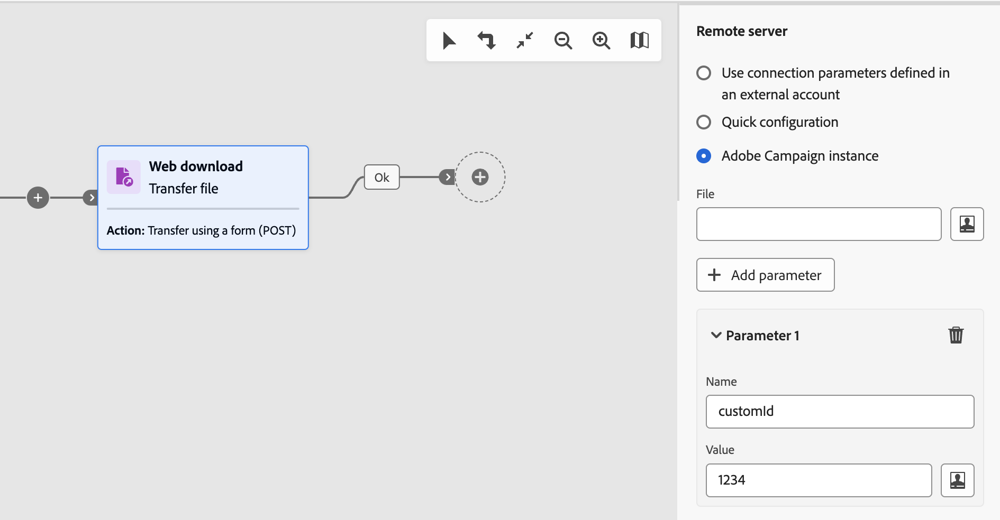

# Transferir arquivo {#transfer-file}

>[!CONTEXTUALHELP]
>id="acw_orchestration_transferfile"
>title="Transferir arquivo"
>abstract="A atividade **Transferir arquivo** permite receber ou enviar arquivos, testar a presença de arquivos ou listar arquivos em um servidor. O protocolo usado pode ser o protocolo servidor para servidor ou o protocolo HTTP."

>[!CONTEXTUALHELP]
>id="acw_orchestration_transferfile_options"
>title="Transferir opções do arquivo"
>abstract="Transferir opções do arquivo"

>[!CONTEXTUALHELP]
>id="acw_orchestration_transferfile_activity"
>title="Transferir atividade do arquivo"
>abstract="Transferir atividade do arquivo"

>[!CONTEXTUALHELP]
>id="acw_orchestration_transferfile_remoteserver"
>title="Transferir servidor remoto do arquivo"
>abstract="Especifique o servidor ao qual deseja se conectar."

>[!CONTEXTUALHELP]
>id="acw_orchestration_transferfile_source"
>title="Transferir origem do arquivo"
>abstract="Insira o nome do arquivo desejado."

>[!CONTEXTUALHELP]
>id="acw_orchestration_transferfile_advancedoptions_delete_file"
>title="Excluir os arquivos de origem após a transferência"
>abstract="Apague os arquivos de origem após uma transferência bem-sucedida."

>[!CONTEXTUALHELP]
>id="acw_orchestration_transferfile_advancedoptions_display_logs"
>title="Exibir os logs de sessão"
>abstract="Exibe as informações relacionadas à operação de transferência nos logs do fluxo de trabalho."

>[!CONTEXTUALHELP]
>id="acw_orchestration_transferfile_advancedoptions_list_files"
>title="Listar todos os arquivos"
>abstract="Essa opção indexa todos os arquivos presentes no servidor na variável de evento **vars.filenames**."

>[!CONTEXTUALHELP]
>id="acw_orchestration_transferfile_historization"
>title="Historização de arquivos"
>abstract="Historização de arquivos"

>[!CONTEXTUALHELP]
>id="acw_orchestration_transferfile_process_missing_file"
>title="Processar arquivos ausentes"
>abstract="Essa opção permite ativar uma transição de saída **Nenhum arquivo** após a atividade."

>[!CONTEXTUALHELP]
>id="acw_orchestration_transferfile_process_errors"
>title="Processar erros"
>abstract="Essa opção permite ativar uma transição de saída **Erro** após a atividade."

A variável **Transferir arquivo** a atividade é um **Gerenciamento de dados** atividade. Ele permite receber ou enviar arquivos, testar a presença de arquivos ou listar arquivos em um servidor. O protocolo usado pode ser o protocolo servidor para servidor ou o protocolo HTTP.

>[!NOTE]
>
>Com a interface do usuário da Web do Campaign, consolidamos duas atividades em uma unindo ambas **Transferência de arquivo** e **Download da Web** recursos. Essa consolidação não afeta a funcionalidade da atividade de forma alguma.

Siga as etapas detalhadas abaixo para configurar o **Transferir arquivo** atividade.

## Escolher o protocolo e a operação de transferência {#protocol}

1. Adicionar um **Transferir arquivo** no workflow, especifique o tipo de transferência a ser executada dependendo do protocolo que deseja usar:

   * Para protocolo HTTP, selecione **[!UICONTROL Download da Web]**. Isso permite executar um download de GET ou POST em um URL explícito, uma conta externa ou uma instância do Adobe Campaign.
   * Para outros protocolos servidor a servidor e ações relacionadas, selecione **[!UICONTROL Transferência de arquivo]**.

1. Selecione a ação a ser executada com a atividade. As ações disponíveis dependem do tipo de transferência que você selecionou. Expanda as seções abaixo para obter mais informações.

   +++Ações disponíveis com **Transferência de arquivo** atividades do tipo

   * **[!UICONTROL Download de arquivo]**: baixe um arquivo do servidor.
   * **[!UICONTROL Upload de arquivo]**: carregue um arquivo no servidor.
   * **[!UICONTROL Teste para ver se o arquivo existe]**: verifique se um determinado arquivo está presente no servidor. Gera duas transições de saída após a atividade: &quot;File exists&quot; e &quot;File does not exist&quot;.
   * **[!UICONTROL Listagem de arquivos]**: lista todos os arquivos disponíveis no servidor.

+++

   +++Ações disponíveis com **Download da Web** atividades do tipo

   * **[!UICONTROL Transferência simples (GET)]**: recupere um arquivo.
   * **[!UICONTROL Transferir usando um formulário (POST)]**: Fazer upload de um arquivo e de parâmetros adicionais.

+++

   

1. Por padrão, para ações de upload de arquivo, a atividade usa o arquivo especificado na atividade anterior. Para usar um arquivo diferente, alterne a variável **[!UICONTROL Usar arquivo da atividade anterior]** e clique no botão **[!UICONTROL Adicionar arquivo]** botão.

   No **[!UICONTROL Origem]** insira o nome de arquivo desejado ou use o editor de expressão para calcular o nome do arquivo usando variáveis de evento. [Saiba como trabalhar com variáveis de evento e o editor de expressão](../event-variables.md). Repita a operação para adicionar quantos arquivos forem necessários.

## Definir o destino da transferência {#destination}

1. No **[!UICONTROL Servidor remoto]** especifique o servidor a ser conectado usando um destes métodos:

   * **[!UICONTROL Usar parâmetros de conexão definidos em uma conta externa]**: conecte-se a um servidor usando os parâmetros de conexão de uma conta externa. No **[!UICONTROL Pasta do servidor]** especifique o caminho para o arquivo (ou para a pasta para ações de listagem de arquivos).
   * **[!UICONTROL Configuração rápida]**: digite o URL do arquivo (ou pasta para ações de listagem de arquivos).
   * **[!UICONTROL Instância do Adobe Campaign]** (Atividades do tipo download da Web): baixar um arquivo de um servidor de instâncias do Adobe Campaign.

   

1. Para ações POST de download da Web, você pode passar parâmetros adicionais com a operação. Para fazer isso, clique no link **[!UICONTROL Adicionar parâmetro]** e especifique o nome e o valor dos parâmetros. Você pode adicionar quantos parâmetros forem necessários.

1. Por padrão, para o upload de arquivos, os arquivos carregados em um servidor são salvos automaticamente. Se não quiser manter esse histórico, alterne a opção **[!UICONTROL Manter histórico de arquivos enviados]** opção desativada.

## Configurações de histórico {#historization}

Toda vez que um **[!UICONTROL Transferir arquivo]** for executada, ela armazenará os arquivos carregados ou baixados em uma pasta dedicada. Uma pasta é criada para cada atividade Transfer file de um workflow. Por padrão, os arquivos são salvos no diretório de armazenamento padrão da pasta de instalação do Adobe Campaign (`/vars`) antes de ser processado. Para usar uma pasta específica, alterne a variável **[!UICONTROL Usar um diretório de armazenamento padrão]** e digite o caminho do diretório.

É importante poder limitar o tamanho dessa pasta para preservar o espaço físico no servidor. Para fazer isso, é possível definir um número máximo de arquivos ou o tamanho total da pasta da atividade. Por padrão, 100 arquivos e 50 MB são autorizados.

Toda vez que a atividade é executada, a pasta é verificada da seguinte maneira:

* Somente os arquivos criados mais de 24 horas antes da execução da atividade são considerados.
* Se o número de arquivos considerados for maior que o valor de **[!UICONTROL Número de arquivos]** , os arquivos mais antigos são excluídos até que o número máximo de arquivos permitidos seja atingido.
* Se o tamanho total dos arquivos considerados for maior que o valor de **[!UICONTROL Tamanho máximo (em MB)]** , os arquivos mais antigos são excluídos até que o tamanho máximo (em MB) permitido seja atingido.

>[!CAUTION]
>
>Se a atividade não for executada novamente, a pasta correspondente não será verificada nem eliminada. Por isso, tenha cuidado ao transferir arquivos grandes.

## Opções avançadas de gerenciamento de &amp; erros {#advanced}

1. No **[!UICONTROL Opções avançadas]**, opções adicionais estão disponíveis com base no tipo de atividade que você está configurando. Expanda as seções abaixo para obter mais informações.

   +++Opções adicionais para **[!UICONTROL Transferência de arquivo]** atividades do tipo

   * **[!UICONTROL Excluir os arquivos de origem após a transferência]**: apague os arquivos de origem após uma transferência bem-sucedida.
   * **[!UICONTROL Exibir os logs de sessão]**: quando essa opção é ativada, as informações relacionadas à operação de transferência são exibidas nos logs do workflow após a execução do workflow.
   * **[!UICONTROL Listar todos os arquivos]** (Ações de listagem de arquivos): essa opção indexa todos os arquivos presentes no servidor na `vars.filenames` variável de evento, na qual os nomes de arquivo são separados pelo `n` caracteres. [Saiba como trabalhar com variáveis de evento](../event-variables.md)

+++

   +++Opções adicionais para **[!UICONTROL Download da Web]** atividades do tipo

   * **[!UICONTROL Seguir redirecionamentos]**: o redirecionamento de arquivo permite que você use substituições para direcionar a entrada ou saída de dados para um dispositivo de um tipo diferente.
   * **[!UICONTROL Adicionar os cabeçalhos HTTP ao arquivo]**: em alguns casos, talvez você queira adicionar outros cabeçalhos HTTP a um arquivo. Normalmente, esses cabeçalhos serão usados para fornecer informações adicionais para fins de solução de problemas, para [Compartilhamento de recursos entre origens (CORS)](https://developer.mozilla.org/docs/Web/HTTP/CORS) ou para definir diretivas específicas de armazenamento em cache.
   * **[!UICONTROL Ignorar o código de retorno HTTP]**: os códigos de retorno HTTP, também conhecidos como códigos de status HTTP, indicam o resultado de uma solicitação HTTP.

1. A variável **[!UICONTROL Processar erros]** permite ativar uma transição de saída &quot;Erro&quot; após a atividade se qualquer erro ocorrer durante a transferência.

   Além disso, para **Transferência de arquivo** atividades do tipo, a variável **[!UICONTROL Processo de arquivo ausente]** permite ativar uma transição de saída &quot;Nenhum arquivo&quot; após a atividade se o arquivo não estiver disponível no caminho especificado.
