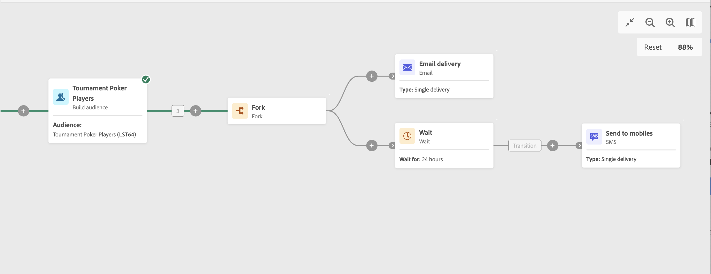

# Aguardar {#wait}

>[!CONTEXTUALHELP]
>id="acw_orchestration_wait"
>title="Atividade de espera"
>abstract="A Atividade **aguardar** é usada para atrasar a transição de uma atividade para outra."

A atividade **Aguardar** é uma atividade de **Controle de fluxo**. Ele permite que um determinado período transcorra entre a execução de duas atividades. Por exemplo, ele pode ser usado para aguardar vários dias após uma atividade de delivery de email e depois analisar as aberturas e os cliques gerados durante esse período antes de executar operações de acompanhamento, como enviar um email de lembrete ou criar um público-alvo.

## Configuração {#wait-configuration}

Siga estas etapas para configurar a atividade **Aguardar**:

1. Adicione uma atividade **Aguardar** ao seu fluxo de trabalho.

1. Especifique a **Duração** da espera entre as transições de entrada e saída.

1. Selecione a unidade de tempo no campo **Períodos**: segundos, minutos, horas ou dias.

## Exemplo {#wait-example}

O exemplo a seguir ilustra a atividade **Aguardar** em um caso de uso comum. Um convite é enviado por email para um evento. Após 24 horas, um delivery de SMS é enviado para a mesma população.

