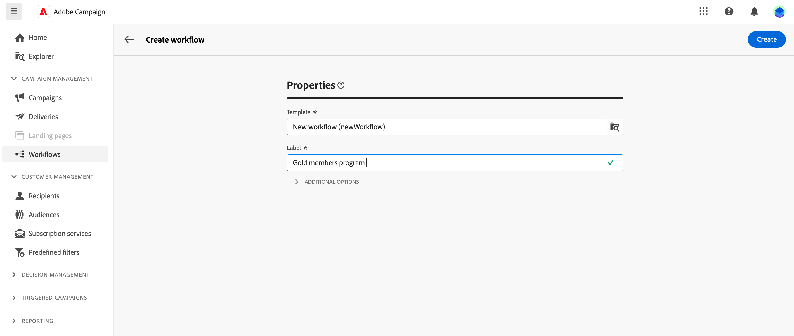

# Criar o workflow {#create-first-workflow}

>[!CONTEXTUALHELP]
>id="acw_campaign_creation_workflow"
>title="Lista de fluxos de trabalho na campanha"
>abstract="A guia **Fluxos de trabalho** lista todos os fluxos de trabalho vinculados à campanha atual. Clique no nome de um fluxo de trabalho para editar. Use o botão **Criar fluxo de trabalho** para adicionar um novo fluxo de trabalho à campanha."

Você pode criar workflows independentes ou dentro de uma campanha. A primeira etapa é selecionar um template e definir suas propriedades gerais. Em seguida, você pode definir configurações adicionais, conforme necessário.

Para fazer isso, siga estes passos:

1. Para criar um **fluxo de trabalho autônomo**, navegue até o menu **Fluxos de trabalho**. Para criar um **fluxo de trabalho de campanha**, navegue até o menu **Campanhas** e abra a campanha para a qual deseja criar um novo fluxo de trabalho.

1. Clique no botão **[!UICONTROL Criar fluxo de trabalho]** no canto superior direito da tela.

   {zoomable="yes"}

1. Na caixa de diálogo **Propriedades** do fluxo de trabalho, selecione o modelo a ser usado para criar o fluxo de trabalho (você também pode usar o modelo interno padrão). [Saiba mais sobre modelos de fluxo de trabalho](#workflow-templates).

1. Insira um rótulo para o fluxo de trabalho. Além disso, recomendamos que você adicione uma descrição ao fluxo de trabalho, no campo dedicado da seção **[!UICONTROL Opções adicionais]** da tela.

1. Expanda a seção **[!UICONTROL Opções adicionais]** para definir mais configurações para o fluxo de trabalho. Saiba como configurar as propriedades de fluxo de trabalho em [esta página](workflow-settings.md#properties)

   {zoomable="yes"}

1. Clique no botão **[!UICONTROL Criar fluxo de trabalho]** para confirmar a criação do fluxo de trabalho.

Seu workflow agora é criado e está disponível na lista de workflows. Agora é possível acessar a tela visual e começar a adicionar, configurar e orquestrar as tarefas que serão executadas. [Saiba como organizar atividades de fluxo de trabalho](orchestrate-activities.md).

## Trabalhar com modelos de fluxo de trabalho {#workflow-templates}

>[!CONTEXTUALHELP]
>id="acw_workflow_template_for_campaign"
>title="Templates de workflow"
>abstract="Os modelos de fluxo de trabalho contêm configurações e atividades predefinidas que podem ser reutilizadas para criar novos fluxos de trabalho."

>[!CONTEXTUALHELP]
>id="acw_workflow_template_creation_properties"
>title="Propriedades do fluxo de trabalho"
>abstract="Os modelos de fluxo de trabalho contêm configurações e atividades predefinidas que podem ser reutilizadas para criar novos fluxos de trabalho. Nesta tela, insira o rótulo do modelo de fluxo de trabalho e defina suas configurações, como nome interno, pasta e pastas de execução, fuso horário e grupo de supervisores."

Os modelos de fluxo de trabalho contêm configurações e atividades predefinidas que podem ser reutilizadas para criar novos fluxos de trabalho. É possível selecionar o template do workflow nas propriedades do workflow, ao criar um workflow. Um template vazio é fornecido por padrão.

Você pode criar um modelo a partir de um fluxo de trabalho existente ou criar um novo modelo do zero. Ambos os métodos são detalhados abaixo.

>[!BEGINTABS]

>[!TAB Criar um modelo a partir de um fluxo de trabalho existente]

Para criar um template de workflow a partir de um workflow existente, siga estas etapas:

1. Abra o menu **Fluxos de trabalho** e navegue até o fluxo de trabalho para salvá-lo como modelo.
1. Clique nos três pontos à direita do nome do fluxo de trabalho e escolha **Copiar como modelo**.

   {zoomable="yes"}

1. Na janela pop-up, confirme a criação do template.
1. Na tela do modelo de fluxo de trabalho, marque, adicione e configure as atividades conforme necessário.
1. Navegue até as configurações, no botão **Configurações**, para alterar o nome do modelo de fluxo de trabalho e insira uma descrição.
1. Selecione a **pasta** e a **pasta de execução** do modelo. A pasta é o local onde o modelo de fluxo de trabalho é salvo. A pasta de execução é a pasta onde os workflows criados com base nesse template são salvos.

   {zoomable="yes"}

   As outras propriedades são comuns a workflows. Saiba mais [nesta página](workflow-settings.md#properties)

1. Salve as alterações.

O template de workflow agora está disponível na lista de templates. Você pode criar um workflow com base nesse template. Esse workflow será pré-configurado com as configurações e atividades definidas no template.

>[!TAB Criar um modelo do zero]

Para criar um template de workflow do zero, siga estas etapas:

1. Abra o menu **Fluxos de trabalho** e navegue até a guia **Modelos**. Você pode ver a lista de modelos de workflow disponíveis.
1. Clique no botão **[!UICONTROL Criar modelo]** no canto superior direito da tela.
1. Insira o rótulo e abra as opções adicionais para inserir uma descrição do template de workflow.
1. Selecione a pasta e a pasta de execução do modelo. A pasta é o local onde o modelo de fluxo de trabalho é salvo. A pasta de execução é a pasta onde os workflows criados com base nesse template são salvos.

   {zoomable="yes"}

   As outras propriedades são comuns a workflows. Saiba mais [nesta página](workflow-settings.md#properties)

1. Clique no botão **Criar** para confirmar suas configurações.
1. Na tela do modelo de fluxo de trabalho, adicione e configure as atividades conforme necessário.

   {zoomable="yes"}

1. Salve as alterações.

O template de workflow agora está disponível na lista de templates. Você pode criar um workflow com base nesse template. Esse workflow será pré-configurado com as configurações e atividades definidas no template.

>[!ENDTABS]
