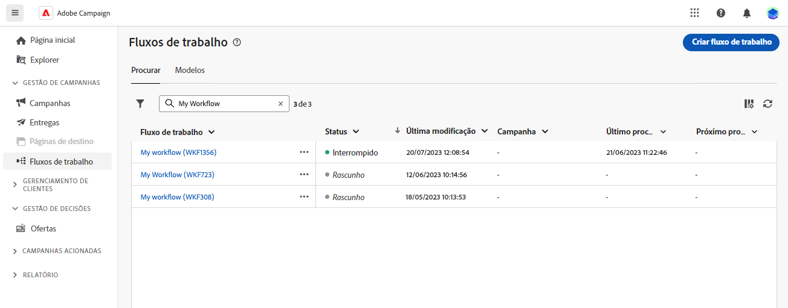
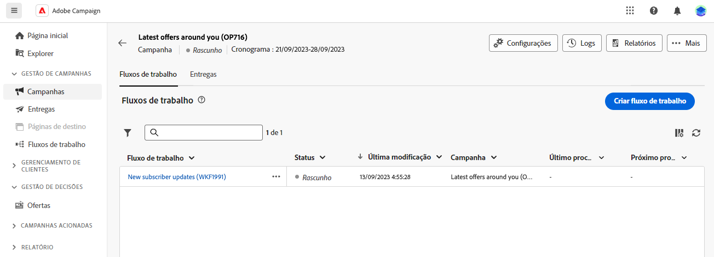

# Princípios básicos da criação de workflows {#gs-workflow-creation}

Com o Campaign v8 Web, é possível criar workflows em uma tela visual para projetar processos entre canais, como segmentação, execução de campanha e processamento de arquivos.

## O que há dentro de um workflow? {#gs-workflow-inside}

O diagrama de workflow é uma representação do que deveria acontecer. Ele descreve as várias tarefas a serem executadas e como elas estão vinculadas.

Cada workflow contém:

* **Activities**: uma atividade é uma tarefa a ser executada. As várias atividades são representadas no diagrama por ícones. Cada atividade tem propriedades específicas e outras propriedades que são comuns a todas as atividades.

  Em um diagrama de workflow, uma dada atividade pode produzir várias tarefas, principalmente quando houver ações de loop ou recorrentes.

* **Transições**: as transições vinculam uma atividade de origem a uma atividade de destino e definem sua sequência.

* **Tabelas de trabalho**: as tabelas de trabalho contêm todas as informações transportadas pela transição. Cada fluxo de trabalho usa várias tabelas de trabalho. Os dados transmitidos nessas tabelas podem ser usados durante o ciclo de vida do workflow.

## Etapas principais para criar um fluxo de trabalho {#gs-workflow-steps}

Campanhas oferecem duas maneiras de criar um fluxo de trabalho:

1. Os workflows podem ser criados como workflows independentes, a partir do **Fluxos de trabalho** menu.

   

1. Os workflows podem ser criados diretamente em uma campanha, a partir da **Fluxo de trabalho** da campanha. Quando incluído em uma campanha, o fluxo de trabalho é executado junto com todos os outros fluxos de trabalho da campanha e as métricas de relatório são agrupadas no nível da campanha.

   

As principais etapas para criar workflows são as seguintes:

Essas etapas estão detalhadas na seguinte seção:

1. [Criar o fluxo de trabalho e definir suas propriedades](create-workflow.md)
1. [Orquestrar e configurar atividades](orchestrate-activities.md)
1. [Definir as configurações avançadas de fluxo de trabalho](workflow-settings.md)
1. [Inicie o fluxo de trabalho e monitore sua execução](start-monitor-workflows.md)

