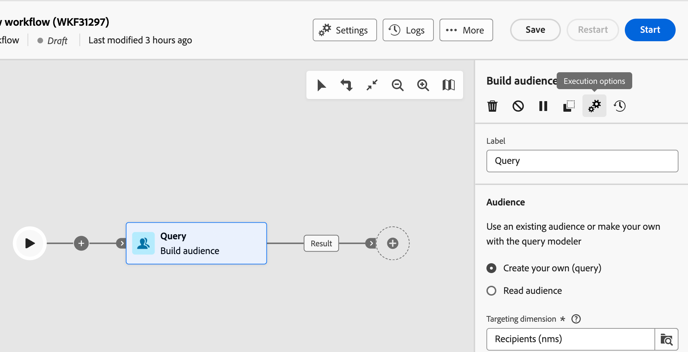

# Orquestrar atividades {#orchestrate}

Depois de [criar um fluxo de trabalho](create-workflow.md), seja no menu de fluxo de trabalho ou em uma campanha, você pode começar a orquestrar as diferentes tarefas que ele realiza. Para fazer isso, uma tela visual é fornecida, permitindo que você crie um diagrama de workflow. Neste diagrama, é possível adicionar várias atividades e conectá-las em ordem sequencial.

## Adicionar atividades {#add}

Nessa etapa da configuração, o diagrama é exibido com um ícone de início, representando o início do workflow. Para adicionar sua primeira atividade, clique no botão **+** conectado ao ícone de início.

Uma lista de atividades que podem ser adicionadas ao diagrama é exibida. As atividades disponíveis dependem da sua posição no diagrama de workflow. Por exemplo, ao adicionar sua primeira atividade, você pode iniciar seu fluxo de trabalho direcionando um público-alvo, dividindo o caminho do fluxo de trabalho ou definindo uma atividade **Wait** para atrasar a execução do fluxo de trabalho. Depois de uma atividade **Criar público-alvo**, você pode refinar seu público-alvo com atividades de direcionamento, enviar uma entrega para ele com atividades de canal ou organizar o processo de fluxo de trabalho com atividades de controle de fluxo.

{zoomable="yes"}

Depois que uma atividade é adicionada ao diagrama, um painel direito é exibido, permitindo configurar a atividade recém-adicionada com configurações específicas. Informações detalhadas sobre como configurar cada atividade estão disponíveis em [esta seção](activities/about-activities.md).

{zoomable="yes"}

Repita esse processo para adicionar quantas atividades forem necessárias, dependendo das tarefas que seu workflow realiza. Você também pode inserir uma nova atividade entre duas atividades. Para fazer isso, clique no botão **+** na transição entre as atividades, selecione a atividade desejada e a configure no painel direito.

Para remover uma atividade, selecione-a na tela e clique no ícone **Excluir** nas propriedades da atividade.

>[!TIP]
>
>Você pode personalizar o nome das transições entre cada atividade. Para fazer isso, selecione a transição e altere seu rótulo no painel direito.

## A barra de ferramentas {#toolbar}

A barra de ferramentas, localizada no canto superior direito da tela, fornece opções para manipular facilmente as atividades e navegar nela:

* **Modo de seleção múltipla**: selecione várias atividades para excluí-las todas de uma vez ou copie-as e cole-as. Consulte [esta seção](#copy).
* **Girar**: Alternar a tela verticalmente.
* **Ajustar à tela**: adapte o nível de zoom da tela à sua tela.
* **Menos zoom** / **Menos zoom**: Menos zoom ou mais zoom na tela.
* **Exibir mapa**: abra um instantâneo da tela mostrando sua localização.

{zoomable="yes"}{width="50%"}

## Gerenciar atividades {#manage}

Ao adicionar atividades, os botões de ação ficam disponíveis no painel de propriedades, permitindo que você execute várias operações.

{zoomable="yes"}

Você pode:

* **Excluir** a atividade da tela.
* **Desabilitar/Habilitar** a atividade. Quando o workflow é executado, as atividades desativadas e as atividades a seguir no mesmo caminho não são executadas e o workflow é interrompido.
* **Pausar/Retomar** a atividade. Quando o workflow é executado, ele é pausado na atividade pausada. A tarefa correspondente, bem como todas as que a seguem no mesmo caminho, não são executadas.
* **Copiar** a atividade. Consulte [esta seção](#copy).
* **Mover** uma atividade e todos os seus nós filhos para outra transição. Consulte [esta seção](#move).
* Acesse as **Opções de execução** da atividade.
* Acesse os **Logs e tarefas** da atividade.

Várias atividades de **Direcionamento**, como **Combinar** ou **Desduplicação**, permitem processar a população restante e incluí-la em uma transição de saída adicional. Por exemplo, se você estiver usando uma atividade **Split**, o complemento consiste na população que não corresponde a nenhum dos subconjuntos definidos anteriormente. Para usar este recurso, ative a opção **Gerar complemento**.

## Mover ou copiar atividades {#move-copy}

### Atividades de copiar e colar {#copy}

Você pode copiar atividades de workflow e colá-las em qualquer workflow. O workflow de destino pode estar em uma guia do navegador diferente.

Para copiar atividades, você tem duas opções:

* Copie uma atividade usando o botão de ação.

  {zoomable="yes"}{width="70%"}

* Copie várias atividades usando o botão da barra de ferramentas.

  {zoomable="yes"}{width="70%"}

Para colar as atividades copiadas, clique no botão **+** em uma transição e selecione &quot;Colar atividade X&quot;.

{zoomable="yes"}{width="50%"}

### Mover atividades e seus nós filhos {#move}

O Journey Optimizer permite mover uma atividade, juntamente com todo o conteúdo dos nós secundários (incluindo todas as transições e atividades dentro dela), para o final de outra transição no mesmo fluxo de trabalho.

Esse processo desconecta a atividade e tudo o que está em sua transição de saída do local inicial, movendo-a para a nova transição de destino.

Para mover uma atividade:

1. Selecione a atividade que deseja mover.
1. No painel de propriedades da atividade, clique no botão **Mover**.
1. Selecione a transição em que deseja colocar a atividade e sua transição de saída e, em seguida, confirme.

## Opções de execução {#execution}

Todas as atividades permitem gerenciar as opções de execução. Selecione uma atividade e clique no botão **Opções de execução**. Isso permite definir o modo de execução e o comportamento da atividade em caso de erros.

{zoomable="yes"}{width="70%"}

### Propriedades {#properties}

>[!CONTEXTUALHELP]
>id="acw_workflow_activity_execution_options_properties"
>title="Propriedades da atividade"
>abstract="Esta seção permite definir as configurações de execução de uma atividade, incluindo a ação a ser executada, a duração máxima, o fuso horário, a afinidade da máquina e o comportamento assíncrono."

O campo **Execution** permite que você defina a ação a ser executada quando a tarefa for iniciada.

O campo **Duração máxima da execução** permite especificar uma duração como &quot;30s&quot; ou &quot;1h&quot;. Se a atividade não for concluída após a duração especificada, um alerta será acionado. Isso não afeta o funcionamento do fluxo de trabalho.

O campo **Fuso horário** permite selecionar o fuso horário da atividade. O Adobe Campaign gerencia as diferenças de tempo entre vários países na mesma instância. A configuração aplicada é definida quando a instância é criada.

O campo **Afinidade** permite forçar a execução de um fluxo de trabalho ou de uma atividade de fluxo de trabalho em uma máquina específica. Para fazer isso, especifique uma ou várias afinidades para o workflow ou atividade em questão.

O campo **Behavior** permite definir o procedimento a ser seguido se tarefas assíncronas forem usadas.

### Gerenciamento de erros {#execution-options}

>[!CONTEXTUALHELP]
>id="acw_workflow_activity_execution_options_error"
>title="Script de inicialização"
>abstract="Esta seção permite definir o que acontece se uma atividade falhar. Você pode escolher ações como interromper o fluxo de trabalho, ir para a próxima atividade ou acionar um processo personalizado de tratamento de erros."

O campo **Em caso de erro** permite especificar a ação a ser executada se a atividade encontrar um erro. Consulte esta [seção](workflow-settings.md#error-settings).

### Script de inicialização {#initialization-options}

>[!CONTEXTUALHELP]
>id="acw_workflow_activity_execution_options_initialization"
>title="Script de inicialização"
>abstract="Esta seção permite que você adicione o JavaScript que é executado quando a atividade começa. Use-a para inicializar variáveis, definir parâmetros ou preparar dados específicos para a execução dessa atividade."

O **script de Inicialização** permite inicializar variáveis ou modificar propriedades da atividade. Clique no botão **Editar código** e digite o trecho de código a ser executado. O script é chamado quando a atividade é executada. Consulte a seção relacionada a [variáveis de evento](../workflows/event-variables.md).

## Exemplo {#example}

Este é um exemplo de fluxo de trabalho criado para enviar um email a todos os clientes (exceto clientes do VIP) com um email interessados em máquinas de café.

{zoomable="yes"}

Para isso, foram adicionadas as seguintes atividades:

* Uma atividade **[!UICONTROL Fork]** que divide o fluxo de trabalho em três caminhos (um para cada conjunto de clientes),
* **[!UICONTROL Crie atividades de público-alvo]** para direcionar os três conjuntos de clientes:
   * Clientes com um email,
   * Clientes pertencentes ao público-alvo pré-existente &quot;Interessado em máquinas de café&quot;,
   * Clientes pertencentes ao público-alvo pré-existente &quot;VIP para premiar&quot;.
* Uma atividade **[!UICONTROL Combine]** que agrupa clientes com um email e aqueles interessados em máquinas de café,
* Uma atividade **[!UICONTROL Combine]** que exclui clientes do VIP,
* Uma atividade de **[!UICONTROL Entrega de email]** que envia um email para os clientes resultantes.

Após concluir o fluxo de trabalho, adicione uma atividade **[!UICONTROL End]** ao final do diagrama. Esta atividade marca visualmente o final de um workflow e não tem impacto funcional.

Depois de criar o diagrama de workflow com êxito, execute o workflow e acompanhe o progresso de suas várias tarefas. [Saiba como iniciar um fluxo de trabalho e monitorar sua execução](start-monitor-workflows.md).