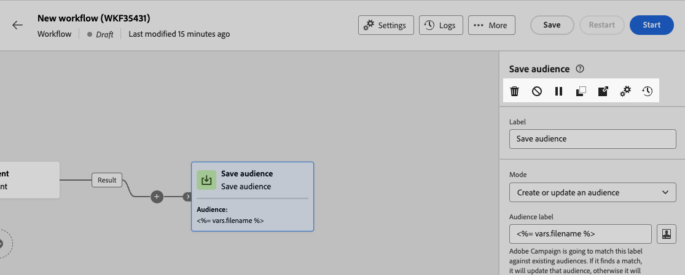

# Orquestrar atividades {#orchestrate}

Depois que você tiver [criou um workflow](create-workflow.md), seja no menu de workflow ou em uma campanha, você pode começar a orquestrar as diferentes tarefas que ele executará. Para fazer isso, uma tela visual é fornecida, permitindo que você crie um diagrama de workflow. Neste diagrama, é possível adicionar várias atividades e conectá-las em ordem sequencial.

## Adicionar atividades {#add}

Nessa etapa da configuração, o diagrama é exibido com um ícone de início, representando o início do workflow. Para adicionar sua primeira atividade, clique no link **+** botão conectado ao ícone iniciar.

Uma lista de atividades que podem ser adicionadas ao diagrama é exibida. As atividades disponíveis dependem da sua posição no diagrama de workflow. Por exemplo, ao adicionar sua primeira atividade, você pode iniciar seu fluxo de trabalho direcionando um público-alvo, dividindo o caminho do fluxo de trabalho ou definindo um **Aguardar** atividade para atrasar a execução do workflow. Por outro lado, depois de uma **Criar público-alvo** você pode refinar seu público-alvo com atividades de direcionamento, enviar um delivery para seu público-alvo com atividades de canal ou organizar o processo de fluxo de trabalho com atividades de controle de fluxo.

{zoomable=&quot;yes&quot;}

Depois que uma atividade é adicionada ao diagrama, um painel direito é exibido, permitindo configurar a atividade recém-adicionada com configurações específicas. Informações detalhadas sobre como configurar cada atividade estão disponíveis em [nesta seção](activities/about-activities.md).

{zoomable=&quot;yes&quot;}

Repita esse processo para adicionar quantas atividades desejar, dependendo das tarefas que deseja que seu workflow execute. Observe que você também pode inserir uma nova atividade entre duas atividades. Para fazer isso, clique no link **+** na transição entre as atividades, selecione a atividade desejada e a configure no painel direito.

Para remover uma atividade, selecione-a na tela e clique no link **Excluir** nas propriedades da atividade.

>[!TIP]
>
>Você tem a opção de personalizar o nome das transições entre cada atividade. Para fazer isso, selecione a transição e altere seu rótulo no painel direito.

## A barra de ferramentas {#toolbar}

A barra de ferramentas localizada no canto superior direito da tela fornece opções para manipular facilmente as atividades e navegar na tela:

* **Modo de seleção múltipla**: selecione várias atividades para excluir todas de uma vez ou copie e cole as atividades. Consulte [esta seção](#copy).
* **Girar**: Alterne a tela de desenho verticalmente.
* **Ajustar à tela**: adapte o nível de zoom da tela de desenho à sua tela.
* **Menos zoom** / **Mais zoom**: Reduza ou na tela de desenho.
* **Exibir mapa**: abre um instantâneo da tela mostrando que você está localizado.

{zoomable=&quot;yes&quot;}{width="50%"}

## Gerenciar atividades {#manage}

Ao adicionar atividades, os botões de ação ficam disponíveis no painel de propriedades, permitindo que você execute várias operações. Você pode:

* **Excluir** a atividade da tela.
* **Desativar/Ativar** a atividade. Quando o workflow é executado, as atividades desativadas e as atividades a seguir no mesmo caminho não são executadas e o workflow é interrompido.
* **Copiar** a atividade. Consulte [esta seção](#copy).
* Acessar o da atividade **Logs e tarefas**.
* **Pausar/Retomar** a atividade. Quando o workflow é executado, ele é pausado na atividade pausada. A tarefa correspondente, bem como todas as que a seguem no mesmo caminho, não são executadas.

{zoomable=&quot;yes&quot;}{width="50%"}

Vários **Direcionamento** atividades, como **Combinar** ou **Desduplicação**, permitem processar a população restante e incluí-la em uma transição de saída adicional. Por exemplo, se você estiver usando um **Split** atividade, o complemento consiste na população que não correspondeu a nenhum dos subconjuntos definidos anteriormente. Para usar esse recurso, ative o **Gerar complemento** opção.

## Copiar atividades {#copy}

Você pode copiar atividades de workflow e colá-las em qualquer workflow. O workflow de destino pode estar em uma guia do navegador diferente.

Para copiar atividades, você tem duas opções:

* copie uma atividade usando o botão de ação.

  {zoomable=&quot;yes&quot;}{width="70%"}

* copie várias atividades usando o botão da barra de ferramentas.

  {zoomable=&quot;yes&quot;}{width="70%"}

Para colar as atividades copiadas, clique no link **+** em uma transição e selecione &quot;Colar atividade X&quot;.

{zoomable=&quot;yes&quot;}{width="50%"}

## Opções de execução {#execution}

Todas as atividades permitem gerenciar as opções de execução. Selecione uma atividade e clique no botão **Opções de execução** botão. Isso permite definir o modo de execução e o comportamento da atividade em caso de erros.

{zoomable=&quot;yes&quot;}{width="70%"}

### Propriedades

A variável **Execução** permite definir a ação a ser executada quando a tarefa for iniciada.

A variável **Duração máxima da execução** permite especificar uma duração, como &quot;30s&quot; ou &quot;1h&quot;. Se a atividade não for concluída após o término da duração especificada, um alerta será acionado. Isso não afeta o funcionamento do fluxo de trabalho.

A variável **Fuso horário** permite selecionar o fuso horário da atividade. O Adobe Campaign permite gerenciar as diferenças de tempo entre vários países na mesma instância. A configuração aplicada é definida quando a instância é criada.

**A afinidade** permite forçar a execução de um workflow ou de uma atividade de workflow em uma máquina específica. Para fazer isso, é necessário especificar uma ou várias afinidades para o workflow ou atividade em questão.

A variável **Comportamento** permite definir o procedimento a ser seguido se tarefas assíncronas forem usadas.

### Gerenciamento de erros

A variável **Em caso de erro** permite especificar a ação a ser executada caso a atividade encontre um erro.

### Script de inicialização

A variável **Script de inicialização** permite inicializar variáveis ou modificar propriedades da atividade. Clique em **Editar código** e digite o trecho de código a ser executado. O script é chamado quando a atividade é executada. Consulte a seção relacionada ao [variáveis de evento](../workflows/event-variables.md).

## Exemplo {#example}

Este é um exemplo de fluxo de trabalho criado para enviar um email a todos os clientes (exceto clientes do VIP) com um email interessados em máquinas de café.

{zoomable=&quot;yes&quot;}{zoomable=&quot;yes&quot;}

Para isso, as atividades abaixo foram adicionadas:

* A **[!UICONTROL Bifurcar]** atividade que divide o fluxo de trabalho em três caminhos (um para cada conjunto de clientes),
* **[!UICONTROL Criar público-alvo]** atividades para direcionar os três conjuntos de clientes:

   * Clientes com um email,
   * Clientes pertencentes ao público-alvo pré-existente &quot;Interessado em máquina(s) de café&quot;,
   * Clientes pertencentes ao público &quot;VIP ou recompensa&quot; pré-existente.

* A **[!UICONTROL Combinar]** atividade que agrupa clientes com um email e aqueles interessados em máquinas de café,
* A **[!UICONTROL Combinar]** atividade que exclui clientes VIP,
* Um **[!UICONTROL Entrega de email]** atividade que envia um email para os clientes resultantes.

Após concluir o workflow, adicione en **[!UICONTROL Fim]** atividade no final do diagrama. Essa atividade permite marcar visualmente o final de um fluxo de trabalho e não tem impacto funcional.

Depois de criar o diagrama de workflow com êxito, você pode executá-lo e acompanhar o progresso de suas várias tarefas. [Saiba como iniciar um workflow e monitorar sua execução](start-monitor-workflows.md)
