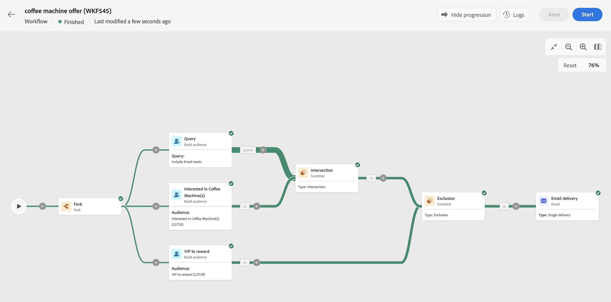

# Iniciar e monitorar fluxos de trabalho {#start-monitor}

Depois de criar o fluxo de trabalho e projetar as tarefas a serem executadas na tela, é possível iniciá-lo e monitorar como ele é executado.

## Iniciar o fluxo de trabalho {#start}

Para iniciar o fluxo de trabalho, navegue até o menu **[!UICONTROL Fluxos de trabalho]** ou para a campanha associada e clique no botão **[!UICONTROL Iniciar]**, no canto superior direito da tela.

Quando o fluxo de trabalho estiver em execução, cada atividade na tela será executada sequencialmente até que o final do fluxo de trabalho seja atingido.

Você pode acompanhar o progresso de perfis direcionados em tempo real usando um fluxo visual. Isso permite identificar rapidamente o status de cada atividade e o número de perfis em transição entre elas.

{zoomable="yes"}

## Transições de fluxo de trabalho {#transitions}

Nos workflows, os dados transportados de uma atividade para outra por meio de transições são armazenados em uma tabela de trabalho temporária. Esses dados podem ser exibidos para cada transição. Para exibir os dados, selecione uma transição para abrir as propriedades no lado direito da tela.

* Clique em **[!UICONTROL Visualizar esquema]** para exibir o esquema da tabela de trabalho.
* Clique em **[!UICONTROL Visualizar resultados]** para exibir os dados transportados na transição selecionada.

{zoomable="yes"}

## Monitorar execução da atividade {#activities}

Os indicadores visuais no canto superior direito de cada caixa de atividade permitem verificar o status de execução:

| Indicador visual | Descrição |
|------------------|-------------|
| {zoomable="yes"}{width="70%"} | A atividade está sendo executada no momento. |
| {zoomable="yes"}{width="70%"} | A atividade requer sua atenção. Isso pode envolver a confirmação do envio de um delivery ou a tomada de uma ação necessária. |
| {zoomable="yes"}{width="70%"} | A atividade encontrou um erro. Para resolver o problema, abra os logs do fluxo de trabalho para obter mais informações. |
| {zoomable="yes"}{width="70%"} | A atividade foi executada com sucesso. |

## Monitorar logs e tarefas {#logs-tasks}

O monitoramento de logs e tarefas de fluxos de trabalho é uma etapa essencial para analisar seus fluxos de trabalho e garantir que eles estejam sendo executados corretamente. Logs e tarefas podem ser acessados pelo ícone **[!UICONTROL Logs]**, que está disponível na barra de ferramentas de ações e no painel de propriedades de cada atividade.

O menu **[!UICONTROL Logs and tasks]** fornece um histórico da execução do fluxo de trabalho, registrando todas as ações do usuário e erros encontrados. Este histórico é salvo pela duração especificada nas [opções de execução](workflow-settings.md) do fluxo de trabalho. Durante essa duração, todas as mensagens são salvas, mesmo após uma reinicialização do workflow. Para não salvar mensagens de uma execução anterior, clique no botão **[!UICONTROL Limpar histórico]**.

{zoomable="yes"}

Dois tipos de informações estão disponíveis:

* A guia **[!UICONTROL Log]** contém o histórico de execução de todas as atividades de fluxo de trabalho. Ele indexa as operações realizadas e os erros de execução em ordem cronológica.
* A guia **[!UICONTROL Tasks]** detalha a sequência de execução das atividades.

Em ambas as guias, você pode escolher as colunas exibidas e sua ordem, aplicar filtros e usar o campo de pesquisa para localizar rapidamente as informações desejadas.

## Comandos de execução de workflow {#execution-commands}

A barra de ação no canto superior direito fornece comandos para gerenciar a execução do workflow. Você pode:

* **[!UICONTROL Iniciar]** / **[!UICONTROL Retomar]** a execução do fluxo de trabalho. Se o workflow estava pausado, ele é retomado. Caso contrário, ele é iniciado e as atividades iniciais são ativadas.
* **[!UICONTROL Pausar]** a execução do fluxo de trabalho. O workflow então assume o status Pausado. Nenhuma atividade nova é ativada até que seja retomada, mas as operações em andamento não são suspensas.
* **[!UICONTROL Parar]** um fluxo de trabalho que está sendo executado. O workflow então assume o status Finished. Se possível, as operações em andamento são interrompidas. Não é possível retomar o fluxo de trabalho do mesmo ponto em que ele foi interrompido.